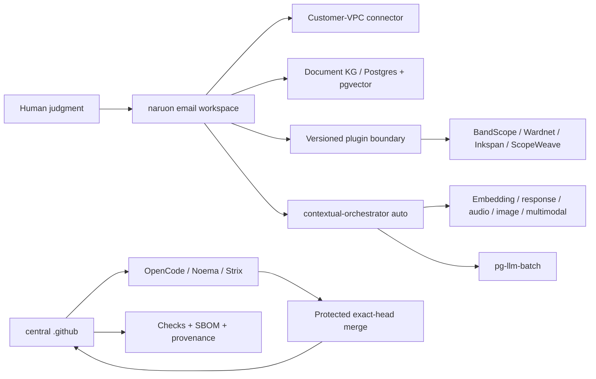

Warning: truncated output (original token count: 80697)
Total output lines: 3356

# Product and Technical Gap Baseline

작성 기준일: **2026-08-26 10:35 KST**
대상: **ContextualWisdomLab/.github** 중앙 거버넌스·자동화 레포지터리와 이를 소비하는 naruon 생태계
현재 보호된 `main`: `826b92394c63deb6981c3a8d16a724d71f85a0d7`
현재 열린 PR 수: **107** (아래 표에 이 스냅샷의 전체 목록 포함; live API 재수집)

이 문서는 제품·기술·운영 Gap을 현재 문서와 현재 GitHub 상태에 묶어 두는 기준선이다. 새 작업은 먼저 이 문서의 Gap ID를 PR 설명과 테스트 증거에 연결하고, PR의 정확한 exact HEAD·Checks·리뷰를 다시 수집한 뒤 구현한다. 표의 상태는 작성 시점의 관측값이므로, 병합 판단에는 재사용하지 않는다. 이 인벤토리는 스냅샷이며 merge authorization이 아니다.

## 1. 근거와 범위

### 1.1 우선순위가 높은 근거

1. [CWL Master Context](CWL-MASTER-CONTEXT.md): naruon의 이메일 우선 플랫폼 경계, DIKW, no-ask 자동 해결, 다층·다중소속·시간·프라이버시 원칙.
2. [naruon #974](https://github.com/ContextualWisdomLab/naruon/pull/974): `docs/planning/naruon-platform-plan.md`를 추가한 병합된 제품/IA/User Story/Use Case/Architecture 기준. 이슈 트래커의 Phase 항목은 ContextualWisdomLab/naruon#975–#980.
3. [GitHub Project #1](https://github.com/orgs/ContextualWisdomLab/projects/1): 로드맵의 live source of truth. 이 문서는 live project board의 상태를 반영하며, 세부 항목 수는 project에서 직접 확인한다.
4. 중앙 ADR·doctoring·계약 문서: [ADR-0002](adr/0002-product-technical-gap-baseline.md), [hourly NVIDIA NIM autofix](doctoring/hourly-nvidia-nim-autofix.md), [Strix cryptography override](../requirements-strix-ci-overrides.txt), [trusted uv lock materialization](doctoring/trusted-uv-lock-materialization.md), [product-technical gap doctoring](doctoring/product-technical-gap-baseline.md).

### 1.2 제품 경계

구매자가 사는 핵심 결과는 “흩어진 enterprise context를 판단 가능한 구조로 만들고, 사람이 다음 행동을 승인할 수 있게 하는 것”이다. naruon은 이메일 호스트나 전자결재 시스템이 아니라 고객 소유 데이터에 연결되는 이메일 workspace/platform이다. 중앙 `.github`은 제품 기능을 대신 소유하지 않고, 정확한 HEAD·리뷰·Checks·증거·변경권한을 보장하는 control plane이다.

핵심 구매 여정은 다음과 같다.

1. 여러 계정·언어의 이메일에서 한 사건의 thread와 sender 의미를 찾는다.
2. 변경된 일정의 최신 truth, 변경 이력, commitment status와 충돌을 계산한다.
3. work/personal/project/band 등 겹치는 norm group을 선택하고, 관계·권한·유효기간을 고려한다.
4. 다른 context에는 필요한 결과(예: unavailable)만 consent·audit 기반으로 공개한다.
5. 사람은 근거·confidence·다음 행동을 보고 예외만 수정하며, 외부 writeback은 승인한다.

### 1.3 Same-session open/close delta

스냅샷은 작성 시점의 open/close delta만 기록한다. 병합 판단에는 재사용하지 않는다.

## 2. PRD / TRD / UML 기준

### 2.1 PRD acceptance

| ID | 구매자가 확인할 결과 | 수용 증거 |
|---|---|---|
| PRD-01 | “이 메일/보낸 사람이 왜 중요한가”를 찾는다 | hybrid retrieval, sender ontology, source segment provenance |
| PRD-02 | 일정 이동과 RSVP/commitment 충돌을 놓치지 않는다 | temporal event history, confirmed > tentative > desired weighting, conflict test |
| PRD-03 | 같은 사람이 여러 조직·팀·밴드에 소속되어도 권한을 뒤섞지 않는다 | reified relationship, multi-membership/norm-group resolution, ecological-fallacy test |
| PRD-04 | private reason을 노출하지 않고 필요한 consequence만 공유한다 | consented minimal-disclosure bridge, audit trail, revocation test |
| PRD-05 | 사용자가 모델 선택을 관리하지 않아도 품질을 우선해 자동 라우팅한다 | contextual-orchestrator `auto`, capability-before-cost, unpriced-is-not-free evidence |
| PRD-06 | 결과를 독립 제품 또는 naruon plugin으로 동일하게 쓴다 | versioned manifest/API, connector contract, standalone/submodule integration test |

### 2.2 TRD target

- **Platform plane:** naruon web/API, customer-VPC connector, Postgres/pgvector document KG, plugin registry, versioned extension points.
- **Evidence/control plane:** central `.github`, OpenCode/Noema/Strix, exact-source and exact-head binding, bounded hourly loops, no credential fallback, protected merge.
- **AI plane:** contextual-orchestrator adaptive routing; role별 reasoning effort, workflow depth, recursion, decomposition, verifier/synthesis를 quality evidence에 따라 배분. Fugu, Conductor, TRINITY를 근거로 단일 모델 라우팅과 심층 다중 에이전트 오케스트레이션 사이에서 계산량을 배분한다. 속도는 최적화 목표가 아니다.
- **Compute plane:** 수리과학·psychometrics의 계산 레이어와 속도·안정성·보안이 핵심인 hot path는 Rust 경계를 우선 검토하며, GPU/CPU multithreading과 낮은 context switching을 benchmark로 입증한다. Python/JS는 orchestration/API adapter로 제한한다.
- **Data plane:** 모든 영속 객체는 두 단어 이상 `snake_case`를 기본으로 하고 3NF를 지키며, 관계·evidence·confidence·validity·disclosure를 별도 정규화한다. Hot partition 대비를 스키마에 둔다.
- **UX plane:** UI 제품만 Figma/Storybook/design token을 사용한다. 중앙 `.github`는 UI 없는 인프라 레포지터리이므로 Figma File ID는 **N/A (UI scope 없음)**이며, UI PR은 별도 ADR에 실제 File ID를 기록한다. UI-owning 저장소는 Storybook scene/edge-case event, Accessibility, Touch & Interaction, Performance, Style Selection, Layout & Responsive, Typography & Color, Animation, Forms & Feedback, Navigation Patterns, Charts & Data를 정의·검토·반영·적용·감사한다.

### 2.3 UML-level dependency

## 3. Gap register

우선순위는 구매자 체감, 보안/증거 위험, 선행 의존성 순서다.

| Gap ID | 현재 관측 | 구매자 영향 | 우선 구현/검증 |
|---|---|---|---|
| GAP-DRAFT-RUNNER-ADMISSION | 같은 exact head의 Draft push가 다섯 required workflow runner lane을 먼저 점유하고, Ready 전환이 그 generation을 취소한 뒤 새 generation을 만들었다. | 검토할 수 없는 Proposed 변경이 scarce runner capacity를 소모해 merge-ready PR의 보안·품질 evidence를 지연한다. | 최초 heavy job에서 Draft를 job-level skip하고 `ready_for_review`에서 fresh exact-head Checks를 생성한다. mixed-event workflow의 push/schedule/dispatch는 유지한다. Proposed successor에서 RED→GREEN 및 hosted evidence를 검증한다. |
| G-01 | 열린 PR은 107개다. metadata 상태는 BLOCKED=17, BEHIND=16, DIRTY=74, draft 13개다. 상태는 independent exact-head approval과 terminal required Checks를 자동으로 의미하지 않는다 | 안전하게 출시할 변경과 대기 중인 변경을 구별할 수 없다 | PR마다 current head, reviews, threads, required Checks, merge-result tree를 재수집하고 보호 조건 미충족이면 merge하지 않는다 |
| G-02 | protected `main`은 `826b92394c63deb6981c3a8d16a724d71f85a0d7`이며, BEHIND/stacked PR의 predecessor evidence를 current-head approval로 승격할 수 없다 | 리뷰가 호출돼도 승인 증거가 생성되지 않아 자동화가 멈춘다 | current-head quality와 OpenCode/Noema/Strix를 재실행하고, exact SHA·run ID·review commit SHA를 한 receipt에 묶는다 |
| G-03 | #1297은 Strix per-repository serialization과 scoped close cleanup을, #1345/#1347은 normalizer/web-E2E 안전성을 다룬다. 각 PR의 provider failure와 source/control-plane failure를 구분해야 한다 | 취약점 0건이어도 CI 인프라 결함이 보안 결과처럼 보이고 큐가 막힌다 | D3 교착 증거를 별도 수집하고, vulnerability marker는 절대 neutralize하지 않으며, 정상 gate 복구 후 exact-head hosted evidence를 재생성한다 |
| G-04 | 107개 live PR 중 16개가 BEHIND, 74개가 DIRTY이고 caller/Strix PR이 제품 기능보다 앞서 쌓였다 | 제품 개발 속도가 queue hygiene에 소모되고 stacking 순서가 불명확하다 | product/ownership boundary별로 stack을 재정렬하고, 오래된 PR은 current main으로 normal restack 후 변경 범위를 검증한다 |
| G-05 | ecosystem contract/catalog PR은 존재하지만 naruon의 실제 plugin 소비·standalone 실행·connector round-trip 증거가 제한적이다 | 구매자는 “연결 가능” 문서와 실제 설치 가능한 제품을 구별할 수 없다 | manifest/version compatibility, command/event envelope, consumer smoke, rollback/upgrade contract를 조직 유관 레포에서 증명한다 |
| G-06 | ContextualWisdomLab/naruon#974와 Project #1은 제품 목표를 정의하지만 E1/E2/E3의 live implementation evidence가 이 중앙 레포에 없다 | 이메일 검색·일정 충돌이라는 killer workflow가 문서에만 머문다 | naruon에서 thread/sender ontology → temporal commitment/conflict → human correction slice를 독립 PR로 delivery한다. 소유 저장소는 naruon이다 |
| G-07 | multi-level/multi-membership/temporal 관계 원칙은 master context에 있으나 모든 소비 저장소의 schema/API가 동일한 reified relationship contract를 보장하는지는 미확인이다 | 개인 단위로 집계하거나 전역 권한을 적용하는 atomistic/ecological fallacy 위험이 남는다 | relationship, membership, norm_group, validity window, evidence, confidence, disclosure를 정규화하고 cross-context golden tests를 만든다 |
| G-08 | embedding·DOM·sender/receiver 의미 단위 chunking과 base64 image의 OCR/object/tag/position-index 설계가 ecosystem contract에 부분적으로만 반영됐다 | 검색은 되지만 실제 그림 위치와 의미를 회수하지 못해 편집·문서·메일 업무가 끊긴다 | semantic unit chunk schema와 image asset/region/ocr/tag embeddings를 별도 entity로 설계하고 source offset/DOM path를 보존한다 |
| G-09 | 100% coverage/docstring은 중앙 PR별로 증거가 있으나 조직 소비 레포의 frontend interaction/i18n/design-token/real-data accuracy 증거가 동일한지 미확인이다 | “green CI”가 실제 고객 시나리오 정확성을 보장하지 않는다 | domain-specific RMSE/reproducibility/audio/visual/browser acceptance와 edge matrix를 required evidence로 만든다 |
| G-10 | math/psychometrics의 Rust+GPU/CPU path와 시간·다층·다중소속 모델은 fast-mlsirm/psychometrics-commons 등 제품 레포의 책임이다 | 계산 정확도·성능·모델 해석 가능성을 Python glue만으로 보장할 수 없다 | Rust core, GPU/CPU benchmark, temporal/multilevel/multiple-membership fixtures, RMSE/recovery/ablation을 제품 PR에 묶는다 |
| G-11 | UI가 있는 제품의 Figma/Storybook inventory와 token/interaction/i18n 테스트는 중앙 control plane에서 소유할 수 없다. Figma File ID는 이 저장소 ADR에서 N/A다 | 제품 간 UI가 달라지고 운영자 onboarding이 일관되지 않는다 | 각 UI repo가 실제 Figma File ID ADR, Storybook inventory, shared token package, keyboard/edge/i18n tests를 소유한다 |
| G-12 | CSAP/SOC 2 통제 목표와 PII masking 대안은 doctoring에 흩어져 있으며 evidence-to-control mapping의 live completeness가 미확인이다 | PII를 마스킹하면 업무가 멈추고, 원문 접근을 허용하면 감사·유출 위험이 커진다 | consent/purpose/access lease, field-level encryption/tokenization, redaction-at-egress, audit/revocation와 CSAP/SOC 2 evidence map을 구현한다 |
| G-13 | hourly scheduler는 존재하지만 no-op/credential unavailable/queued Checks의 customer next action을 모든 caller가 동일한 receipt로 내는지 미확인이다 | 자동화가 실패해도 운영자가 무엇을 고쳐야 하는지 알 수 없다 | `skipped_credential_unavailable` receipt와 다음 행동 문구를 exact-head Checks로 검증하고, bounded receipt schema, retry floor, single-flight, no secret fallback을 모든 caller contract test로 고정한다 |
| G-14 | release/changelog/version 증거가 각 PR에 분산되고 현재 central repo 보호 main의 release candidate가 명확하지 않다 | 운영자는 어떤 기능이 supportable release인지 확인할 수 없다 | merge 후 release readiness ledger, CHANGELOG, semantic version/tag, rollback/operability evidence를 함께 갱신한다 |
| G-15 | 첨부파일 처리 경계가 제품별로 다르고, 1MB 상한은 업무 데이터와 맞지 않으며 미지원 MIME/컨테이너가 parser registry에서 명시적으로 pending/quarantine 되는지 확인되지 않았다. 현재 20MB 초과 파일 가능성과 PDF/HWP/HWPX·이미지·압축파일의 parse/sidecar 흐름을 하나의 exact contract로 묶지 못했다 | 큰 업무 첨부를 거부하거나 파싱 실패를 조용히 잃으면 고객의 메일·문서 업무가 중단된다 | naruon/newsdom-api 소유 PR에서 streaming upload, configurable bounded limit above 20MB, MIME sniffing, parser capability registry, quarantine/retry, source-position provenance, and ADR를 추가하고 size/unsupported-type/zip-bomb tests를 required evidence로 만든다 |
| G-16 | Required Pingora policy treated a changed documentation PNG screenshot as UTF-8 runtime evidence | Valid UI evidence blocked otherwise valid product PRs before policy evaluation | This branch verifies bounded PNG magic before exemption while runtime paths and malformed assets continue to fail closed; protected-main delivery remains the release gate |

## 4. 열린 PR live inventory

아래는 GitHub API가 2026-08-26 10:35 KST에 반환한 107개 열린 PR의 number/title/exact head/base/metadata/review 상태다. 이 표는 관측 스냅샷이며 merge authorization이 아니다. 모든 병합 판단은 각 PR의 exact head에서 required Checks, unresolved thread, 독립 승인과 merge-result tree를 다시 확인한다.

스냅샷 요약: total 107; BLOCKED=17, BEHIND=16, DIRTY=74; draft=13

| PR | title | exact head SHA | base | metadata | review | mode |
|---|---|---|---|---|---|---|
| #1347 | fix(security): isolate web E2E commands and readiness probes | `c50e26be529f473e6cdbce6dd9a7540cb750e7a0` | `main` | BLOCKED | REVIEW_REQUIRED | ready |
| #1345 | perf(normalize): scan verification labels once | `db50914fc274dc78e33e7882ca81c18ede6be2eb` | `main` | BLOCKED | REVIEW_REQUIRED | ready |
| #1343 | ci: add semantic-data-portal hourly review-repair caller | `b296a00aad13f6da7c1e25ac1083e732f8c8e1c2` | `main` | BLOCKED | REVIEW_REQUIRED | ready |
| #1341 | feat(inkspan): add protected hourly review-repair caller at minute 56 | `7d4440ca6c2e83fbb502b891125093a60385ce91` | `main` | BEHIND | REVIEW_REQUIRED | ready |
| #1338 | ci: add psychometrics-commons hourly review repair dispatch | `d1091841f67855bda40f093126b08e218c7b44e1` | `main` | BLOCKED | REVIEW_REQUIRED | ready |
| #1336 | fix(coverage): trust validated head-mutated pnpm locks via manifest record | `20c744fd96659896ee099dd1cec674e49643d415` | `main` | BLOCKED | REVIEW_REQUIRED | ready |
| #1326 | feat(hourly): onboard appguardrail + macos_utility_packs review-repair callers | `dfa980c3f019fe4ff8295fe509a27a08d571f519` | `main` | BEHIND | REVIEW_REQUIRED | ready |
| #1314 | fix(e2e): restrict readiness polling to loopback destinations | `0f0adf88d3675991d14f25b2c594a4a30d9b4679` | `main` | BLOCKED | CHANGES_REQUESTED | ready |
| #1310 | chore(deps): bump google/osv-scanner-action/.github/workflows/osv-scanner-reusable-pr.yml from 3a7550f43ba5b58905a821ce3a0ed24c4858b3f4 to ffa0a5f39214d80778c9b494822d94d0d9668458 | `da66ab78463702020c721f4b90955ca456370c60` | `main` | BEHIND | REVIEW_REQUIRED | ready |
| #1309 | chore(deps): bump google/osv-scanner-action/osv-reporter-action from 8dc09193bb540e09b23da07ad7e30bd33bf87018 to ffa0a5f39214d80778c9b494822d94d0d9668458 | `12bdd489c3d4160f5aa66be72e57724ad7e99b79` | `main` | BEHIND | REVIEW_REQUIRED | ready |
| #1308 | chore(deps): bump actions/download-artifact from 7.0.0 to 8.0.1 | `a09db618298ada330ff504707ce7f29d88c3a6d5` | `main` | BLOCKED | REVIEW_REQUIRED | ready |
| #1307 | chore(deps): bump github/codeql-action/upload-sarif from 4.37.4 to 4.37.8 | `f86dbd7d7ac7e609c4161c1779fb1d1cda85a2b3` | `main` | BEHIND | REVIEW_REQUIRED | ready |
| #1306 | chore(deps): bump github/codeql-action/analyze from 4.37.0 to 4.37.8 | `5f3140f8ba61fb69bcc2160d7b015332b870cdb4` | `main` | BEHIND | REVIEW_REQUIRED | ready |
| #1304 | chore(deps): bump google-cloud-storage from 3.12.1 to 3.13.1 | `2a1882bd2b3d89df4c8758fcd0f2db4313af2a8d` | `main` | BEHIND | REVIEW_REQUIRED | ready |
| #1303 | chore(deps): bump coverage from 7.14.3 to 7.15.4 | `500f264dcdca835aba1cf1ae7b84728953e7a120` | `main` | BLOCKED | CHANGES_REQUESTED | ready |
| #1298 | fix(strix): normalize direct fallback and redaction pass | `72fbf8a628533bcb8f6bf6eb0e7c9d98364f5a57` | `main` | DIRTY | CHANGES_REQUESTED | ready |
| #1297 | fix(strix): serialize scans per repository to stop shared-key rate-limit storms | `3d92db82540871c7bb5f5b4d9e26be8ad42e0f96` | `main` | BLOCKED | CHANGES_REQUESTED | ready |
| #1294 | docs: refresh live product-technical-gap-baseline | `efb3ad3d7dd1202f95849bcc23bf8027baeb3cd1` | `main` | BLOCKED | REVIEW_REQUIRED | ready |
| #1288 | ci: add LineageWeave hourly review-repair scheduler | `5cd507f8ffdfca13718e5dd44aaa02f4dcb3d6a4` | `main` | BLOCKED | CHANGES_REQUESTED | ready |
| #1280 | feat(ci): add a bounded subprocess primitive | `70ad61fd3e1f8aac64497bc6776f6a736de11ca6` | `main` | BEHIND | CHANGES_REQUESTED | ready |
| #1279 | fix(noema): fail closed at the credential egress boundary | `721a36f24616343029a291f02db32610f470a884` | `main` | DIRTY | CHANGES_REQUESTED | ready |
| #1276 | chore(security): unify OSV Action v2.5.1 | `26187df510898277f8bf6f0e98b7d5e53c41abd1` | `main` | DIRTY | CHANGES_REQUESTED | ready |
| #1275 | chore(security): unify Scorecard Action v2.4.4 | `dd545212c105b285ba7be548e0199828a8085782` | `main` | DIRTY | CHANGES_REQUESTED | ready |
| #1274 | chore(security): unify CodeQL Action v4.37.7 | `1da2fce5a10c5036cb4c305b60b63594b0a446fd` | `main` | DIRTY | CHANGES_REQUESTED | ready |
| #1273 | fix(opencode): retain adversarial fallback scope | `3ab55c3da0e9b05c6cc9e80fc3d5fe89a6f53b84` | `main` | DIRTY | CHANGES_REQUESTED | ready |
| #1272 | security(deploy-pages): enforce explicit caller contract | `b544d9c4433603a022df925809f3128ecefd5651` | `main` | DIRTY | CHANGES_REQUESTED | ready |
| #1271 | fix(scheduler): fail after summarized action errors | `8cb926fc31ca27e47192b37c968ea699fd9ecf2c` | `main` | DIRTY | CHANGES_REQUESTED | ready |
| #1270 | fix(scheduler): require independent exact-head approval | `ad01b4e69eae8a149560bc39e60bb693ab9028eb` | `main` | DIRTY | CHANGES_REQUESTED | ready |
| #1267 | feat(automation): repair Inkspan reviews hourly | `34efa03ecec7d815d8e6a4f7354767208fb1ce4a` | `main` | BEHIND | CHANGES_REQUESTED | ready |
| #1264 | perf(redaction): skip invalid key rescans without masking diagnostics | `a32e394af3effca5c93a759912ad9f112a50a079` | `main` | BEHIND | CHANGES_REQUESTED | ready |
| #1263 | fix(strix): make Azure and cross-provider fallbacks executable | `ab3d764547082e1b55b6257cc1cd9aa5d951fa30` | `main` | DIRTY | CHANGES_REQUESTED | ready |
| #1257 | fix(osv): keep base scan results across fork checkout | `20d72bc838d7f91b74ce01bb4de16d07144fa270` | `main` | DIRTY | CHANGES_REQUESTED | ready |
| #1246 | fix(opencode-review): accept int-typed run_id/run_attempt in control JSON | `f88499b708a90edb6a538aeb2c397e14304681ad` | `main` | DIRTY | CHANGES_REQUESTED | ready |
| #1245 | fix(scheduler): retry and gracefully defer shared installation rate limits | `7046ba98c2d8b243713aaec9b0bf9bd98d6c97b6` | `main` | DIRTY | CHANGES_REQUESTED | ready |
| #1242 | fix(security): preserve exact CI evidence while redacting provider secrets | `9bdfcbdaf4d079de3b346e1584dd505c5043afd3` | `main` | DIRTY | CHANGES_REQUESTED | ready |
| #1238 | fix(scheduler): stop repository_dispatch defaulting review/merge/branch flags off | `21b4c58577d54aed299cf0d2dc30a0ee80ff0902` | `main` | DIRTY | CHANGES_REQUESTED | ready |
| #1233 | fix(automation): restore hourly fleet coordination | `54ab5bb799bfa148ca1a8b0b760b7e4365597aaf` | `main` | BEHIND | CHANGES_REQUESTED | ready |
| #1231 | fix(scheduler): isolate central Actions inventory quota | `7b16617af04431a43f8f7528b8ac7db345e404a7` | `main` | DIRTY | CHANGES_REQUESTED | ready |
| #1227 | fix(opencode): use same-repo status credential | `5974bee1dbc2f28b33f69f1aab08066bdedaab70` | `main` | DIRTY | CHANGES_REQUESTED | ready |
| #1215 | fix(security): redact agent-mention credential diagnostics | `785401dc911e0a53ef301d1900c1825147f9524a` | `main` | DIRTY | CHANGES_REQUESTED | ready |
| #1198 | fix(security): repair pip audit and schedule orchestrator review | `27a8bd5f8bd60c9f3f70ec43ce2f2f62f7dc71ae` | `main` | BLOCKED | CHANGES_REQUESTED | ready |
| #1188 | fix: grant hourly callers reusable workflow OIDC scope | `1a0cc1f875db29492861006747ded2b6d9e93d09` | `main` | DIRTY | REVIEW_REQUIRED | ready |
| #1187 | fix(coverage): scope Rust evidence to changed packages | `0a88e24d9a1c92420f412d241f850aab8e72106e` | `main` | DIRTY | REVIEW_REQUIRED | ready |
| #1176 | fix(governance): preserve proposal branch create transition | `437ea84d1c4f7af7b02b001e9d20d9749d96df54` | `main` | BLOCKED | CHANGES_REQUESTED | ready |
| #1172 | fix(autofix): resolve live NVIDIA NIM models instead of a retired pin | `edab578feca63c223368aef17c175bb52ce22e5a` | `main` | DIRTY | REVIEW_REQUIRED | ready |
| #1170 | feat: route OpenCode reviews through contextual gateway | `199e655c242decd9bbbc6d28d3945dcc7af24804` | `main` | DIRTY | REVIEW_REQUIRED | ready |
| #1166 | fix(ci): recognize replacement tests in existing files | `7986334aacb2bc8e5d794d581202f47c91e4875e` | `main` | DIRTY | CHANGES_REQUESTED | ready |
| #1162 | fix: use review credentials for agent dispatch | `4a7031d7adbba759742605deb1c78d10aef16e7d` | `main` | BEHIND | REVIEW_REQUIRED | ready |
| #1161 | fix: make hourly coordinator credential absence auditable | `49bc5e4a59cd30550f87070b48b61e966ac480e1` | `main` | DIRTY | CHANGES_REQUESTED | ready |
| #1158 | fix(osv): preserve immutable direct-source provenance | `5addc9250488cbbb039e3f73f0fa58d7eafc0c61` | `main` | BEHIND | CHANGES_REQUESTED | ready |
| #1150 | feat: add read-only Actions queue health evidence | `efa7788bd14e3513221577566a768fc36f03ccff` | `main` | DIRTY | REVIEW_REQUIRED | ready |
| #1147 | feat(integration): add ecosystem capability catalogue | `113de5eb71ff9e06c00f4c272266662dcbd97392` | `main` | DIRTY | REVIEW_REQUIRED | ready |
| #1146 | fix(figma): retain style references and component sets | `8ffdf4d8150091957a79b5fc63c984e927d323b3` | `main` | DIRTY | REVIEW_REQUIRED | ready |
| #1143 | ci: schedule naruon hourly review repair | `9c2842ab1d49bb1ed74683bc52c0e213eb5d5bc7` | `main` | DIRTY | REVIEW_REQUIRED | ready |
| #1123 | feat(edge): standardize organization runtimes on Cloudflare Pingora | `251b16836164cfcfc0914a568d514cc7b6a9dd6d` | `main` | DIRTY | REVIEW_REQUIRED | ready |
| #1120 | Wire Noema to a same-job contextual-orchestrator sidecar | `101e6906cc3568beb99c19c28eaffb526bac335b` | `main` | DIRTY | REVIEW_REQUIRED | draft |
| #1114 | fix(strix): retry transient visibility API failures | `02f6e4fdb1990369574dfa99afdb5c086a97e70d` | `main` | DIRTY | REVIEW_REQUIRED | ready |
| #1112 | fix(storage): reject embedded IPv4 rebinding hosts | `dc7e39cf7dff80c2e2ed8d348090394ddc643142` | `main` | DIRTY | REVIEW_REQUIRED | draft |
| #1108 | feat(automation): run free-router hourly NVIDIA NIM review repair | `df5ae0b1fff42205627b4af556c7e95e87138b7a` | `main` | DIRTY | REVIEW_REQUIRED | ready |
| #1104 | chore(deps): bump charset-normalizer from 3.4.7 to 3.5.1 | `d90c8320bcce63269f1ab6368f1073841c157363` | `main` | BEHIND | REVIEW_REQUIRED | ready |
| #1103 | chore(deps): bump google-cloud-resource-manager from 1.17.0 to 1.18.0 | `6c8118cb46cbac9c974c9b7ffff53cbbc9ac3b19` | `main` | BEHIND | REVIEW_REQUIRED | ready |
| #1101 | feat(automation): run EmbedRelay hourly NVIDIA NIM review repair | `77557a9e35d6467a9b8fcbc25e7e73f90683383c` | `main` | DIRTY | REVIEW_REQUIRED | ready |
| #1100 | feat(automation): run RankWeave hourly NVIDIA NIM review repair | `e9ccfd21f1efd13da03e72664d0585dffc1dac00` | `main` | DIRTY | REVIEW_REQUIRED | ready |
| #1097 | feat(automation): run html4tree hourly NVIDIA NIM review repair | `627b7ade1a4875addb7e38c0726bd6fd82f01511` | `main` | DIRTY | CHANGES_REQUESTED | ready |
| #1095 | feat(automation): run mhtml-etl-gateway hourly NVIDIA NIM review repair | `715935b45cf2688235e40be6b44c595af45d27e1` | `main` | DIRTY | REVIEW_REQUIRED | ready |
| #1094 | feat(automation): run DiagramWeave hourly NVIDIA NIM review repair | `455f2e76f15c5d0e7040777fc22ea4994d850925` | `main` | DIRTY | REVIEW_REQUIRED | ready |
| #1092 | feat(automation): run psychometrics-commons hourly NVIDIA NIM review repair | `6c330dbfbede45acb41972f1d384ef586b83c2b8` | `main` | DIRTY | REVIEW_REQUIRED | ready |
| #1088 | feat(automation): run mightyETL hourly NVIDIA NIM review repair | `d955cb949329f3bc3726c440542f549fe2978209` | `main` | DIRTY | REVIEW_REQUIRED | ready |
| #1087 | feat(automation): run life-os hourly NVIDIA NIM review repair | `37377d0a19dfae9739ae2e0a845b8270303b38be` | `main` | DIRTY | REVIEW_REQUIRED | ready |
| #1085 | feat(automation): run kaefa hourly NVIDIA NIM review repair | `3e6c94603a6332b066e0be962aab23991987e094` | `main` | DIRTY | REVIEW_REQUIRED | ready |
| #1083 | feat(automation): run pg-llm-batch hourly NVIDIA NIM review repair | `584141341346b7882fded053b459a7d4c16477a2` | `main` | DIRTY | REVIEW_REQUIRED | ready |
| #1082 | feat(automation): run semantic-data-portal hourly NVIDIA NIM review repair | `dbfdbbf3547b4c84bb5c2a1760ecfda080751546` | `main` | DIRTY | CHANGES_REQUESTED | ready |
| #1080 | feat(automation): run newsdom-api hourly NVIDIA NIM review repair | `54f53fcad5a241de28aa272d5775e98bf0b9ca00` | `main` | DIRTY | REVIEW_REQUIRED | ready |
| #1079 | feat(automation): run Appguardrail hourly NVIDIA NIM review repair | `d13ff905cd0d4d814cc2e5f2b5e54dd3d1522f0c` | `main` | DIRTY | CHANGES_REQUESTED | ready |
| #1078 | feat(automation): run Scopeweave hourly NVIDIA NIM review repair | `26b684bc231bff24c19b71ddc8302e551f843ebf` | `main` | DIRTY | REVIEW_REQUIRED | ready |
| #1077 | feat(automation): run noema hourly NVIDIA NIM review repair | `a91c94f1c9d92430241e2cf1302286a83310fe37` | `main` | DIRTY | CHANGES_REQUESTED | ready |
| #1076 | feat(automation): run pg-erd-cloud hourly NVIDIA NIM review repair | `e280e2402e9d4fcd7a17e951e944c85bacd5bd61` | `main` | DIRTY | REVIEW_REQUIRED | ready |
| #1075 | feat(automation): run codec-carver hourly NVIDIA NIM review repair | `618813098dfd8e8186bc7e3277004d76e9ae5d56` | `main` | DIRTY | CHANGES_REQUESTED | ready |
| #1074 | feat(automation): run Keyverse hourly NVIDIA NIM review repair | `c70ff9369f9b49b3e961fe1f63d0204e713400f5` | `main` | DIRTY | REVIEW_REQUIRED | ready |
| #1070 | feat(automation): run Wardnet hourly NVIDIA NIM review repair | `9c752db19fa91b320a74da6c8bd0fbe6d03bce1e` | `main` | DIRTY | CHANGES_REQUESTED | ready |
| #1065 | fix(scheduler): fall back to REST when auto-rebase GraphQL transport fails | `ff661f115ae0c6f41e7a2fab304ace3e648b3988` | `main` | DIRTY | CHANGES_REQUESTED | ready |
| #1062 | fix(strix): map official modes without branch-selected dispatch | `74079e5bddd69bf7eac6d3b2492f25d598517905` | `main` | DIRTY | REVIEW_REQUIRED | draft |
| #1061 | fix(scheduler): ignore manual Strix dispatch as merge evidence | `03c087804eec7f4b520ffc3f61b49edba2dc8378` | `main` | DIRTY | REVIEW_REQUIRED | draft |
| #1060 | fix(opencode): prove asyncio coverage plugin without colliding #896 | `a27ae0ac907c04c300ed978e35538e26c094a682` | `main` | DIRTY | REVIEW_REQUIRED | draft |
| #1058 | fix(operability): reject impossible control-plane SLI counts | `0fd148a8fa2b7acc098eb9741b8d8cea92058ef1` | `main` | DIRTY | REVIEW_REQUIRED | draft |
| #1053 | fix(redaction): skip gh run view job/step prefixes | `15fa991d8a99743a640a26665d278bc159653065` | `main` | DIRTY | REVIEW_REQUIRED | draft |
| #1052 | fix(opencode): split review surfaces, give NIM two hours, and remove GitHub Models | `abf47ce275fd8c1efa8306d30f1d6afbadd989ab` | `main` | DIRTY | REVIEW_REQUIRED | ready |
| #1051 | fix(pip-audit): keep index-url locks hashed and reject symlink parents | `82629751751b82bee88d000ded32b6f141125849` | `main` | DIRTY | CHANGES_REQUESTED | ready |
| #1050 | fix(security): reject dot path components before dependency-review compare | `ee5c15711f0b0a346bb19a634288a49fcd981fab` | `main` | DIRTY | REVIEW_REQUIRED | draft |
| #1046 | fix(opencode): pass trusted visibility into the private free-model hook | `f053ba84ff7dc92c5dbdef2ca1597cd04372dd6b` | `main` | DIRTY | REVIEW_REQUIRED | draft |
| #1036 | fix(ci): bind stub-scan evidence and cap hourly fleet work at 12 | `d8205b139f8396c0452ecd4cc9b95caa45a56f42` | `main` | BEHIND | REVIEW_REQUIRED | draft |
| #1035 | docs(automation): retarget closed-unmerged #840 and #906 lineage | `cb5e2ee03b9f75857e2ce31690fc76de76ad9cc1` | `main` | DIRTY | REVIEW_REQUIRED | draft |
| #1027 | fix(automation): stop mention sweep on already-exceeded rate limits | `d046637834d6d9720852423c3cdb5ef79faa1fe3` | `main` | DIRTY | REVIEW_REQUIRED | draft |
| #1026 | feat(actions): inventory orphaned workflow identities | `1be76989887ab772e3ce0d2e0c7f22d3ca98dd94` | `main` | DIRTY | CHANGES_REQUESTED | ready |
| #1015 | fix(coverage): defer interpreter-specific wheel gaps | `ce28ffba511cb7e2a5135e6f862164834c0f874b` | `main` | BEHIND | CHANGES_REQUESTED | ready |
| #1009 | fix(strix): bind evidence to exact workflow artifacts | `99fee8b1b4ff4fc2219b98561cc4fea851c2f03a` | `main` | DIRTY | CHANGES_REQUESTED | ready |
| #991 | fix(automation): reuse review node_id for mention eyes | `b6303e081756b9598316cdf07f84c038924f0427` | `main` | DIRTY | REVIEW_REQUIRED | draft |
| #949 | fix(opencode-review): discover multi-line run: blocks in safe_pytest_command | `75c6dbdfde34ac7e729e83f44aa0261e76f475d4` | `main` | BEHIND | CHANGES_REQUESTED | ready |
| #941 | fix(semgrep): make the pinned image digest authoritative | `ce95934f7bbdd6d5022065f6ec01e3de46895618` | `main` | BEHIND | CHANGES_REQUESTED | ready |
| #939 | fix: keep cross-repo OpenCode evidence healthy | `2d267d48ab78b0cf8621604ff49839b6f795e610` | `main` | DIRTY | CHANGES_REQUESTED | ready |
| #933 | fix: retry Strix provider tool protocol failures | `b260fd3e17a0c6363d2584110314e44eaf1dfd11` | `main` | DIRTY | CHANGES_REQUESTED | ready |
| #932 | fix(sbom): preserve Markdown report integrity | `f8b94d0dfb02c64761df07ebdf658eb4e1d8abc5` | `main` | DIRTY | CHANGES_REQUESTED | ready |
| #897 | fix(security): fail closed on unavailable dependency review | `47fe3ddbaa46bcc50b090b5fd4bbe84830d6387c` | `main` | BLOCKED | CHANGES_REQUESTED | ready |
| #834 | fix(noema): validate stable OIDC exchange envelope | `1a202f9745e90280e3b1bbdead4f78320ba413fc` | `main` | DIRTY | CHANGES_REQUESTED | ready |
| #821 | fix(opencode): reap fatal provider process groups | `e1eb67926d9143730054c1fc9f1ef82dc5ef4a0c` | `main` | DIRTY | CHANGES_REQUESTED | ready |
| #790 | fix(coverage): retry transient trusted uv downloads | `463ddbad84ee40f56f2196af2aa41f1dd4100907` | `main` | DIRTY | CHANGES_REQUESTED | ready |
| #789 | feat(coverage): add bounded PyO3 peer-evidence gate | `3ffde3c5d3c98f0c840abcba151af08cf0255b46` | `main` | DIRTY | CHANGES_REQUESTED | ready

## 2026-08-25 central Strix fallback contract recheck

- `main` at `a724582a0768129d481385070bf8f05b2620dd2c` changed the direct-OpenAI
  fallback to `gpt-5.4`, but the required-workflow smoke script still required
  the retired `gpt-5.6-luna` string. The privileged OpenCode model pool also
  retained the retired candidate while its contract tests expected `gpt-5.4`.
- This exact mismatch caused consumer Strix checks to fail before scanning the
  target repository; it was observed on ContextualWisdomLab/disksage#247 at
  exact head `a9c868a6e9c8d68a9c6ea6de381e188740b8f5db`. The focused repair keeps
  provider errors and vulnerability findings fail-closed and only aligns the
  executable model and its assertions.

## 2026-08-27 contextual-orchestrator vendored sidecar (ZDR-first free pool)

- **Gap G-ORCH-027 (closed by this increment):** central review pinned direct
  provider endpoints and hard-coded model ids; no path used the org's five-key
  auto model discovery, the `orchestrator/free` fail-closed zero-cost pool, or
  ZDR-first selection. The 2026-08-18 org decision
  (`ContextualWisdomLab/contextual-orchestrator` AGENTS.md) migrated
  OpenCode/Noema/Strix to the gateway; this snapshot lands the org-repo half.
- `pr-review-autofix.yml` now provisions
  `scripts/ci/contextual_orchestrator_review_sidecar.sh` (snapshot pinned SHA
  `8d5924f8…`, same-process KV registration of `BYTEZ_API_KEY`,
  `NVIDIA_NIM_API_KEY`, `NVIDIA_NIM_API_KEY_SUB`, `OPENROUTER_API_KEY`,
  `OPENAI_API_KEY`, live auto model discovery, ZDR-prioritized free catalog),
  and the writer runs `--model contextual-orchestrator/orchestrator/free`.
  `opencode.jsonc` default route changes identically. Companions:
  `zdr_policy.py`, `contextual_orchestrator_review_policy.py`,
  `contextual_orchestrator_review_launcher.py`; records
  `docs/adr/0003-…`, `docs/doctoring/contextual-orchestrator-vendored-sidecar.md`.
- At the time of this 2026-08-27 snapshot, the remaining follow-up was the
  read-only dispatch pool, `noema-review.yml`, and `strix.yml` migration. This
  historical observation is superseded by the current-main evidence below.

## 2026-08-28 current-main routing and runtime recheck

- Current protected main is `8f84b661e468de451ba5c076dc938f342bf52d70`,
  the merge commit for #1373 (following #1370 at
  `24ee38b097dbfc1a895e1199ade48cff36431d05`). #1364 is merged at
  `f8823a544c3c4c046977f8511f683e85f83eb496`; #1360 is merged at
  `17052a7ca3c16db90932a4d6036b43165ddee418`.
- The current Required OpenCode dispatch, `noema-review.yml`, `strix.yml`,
  and write-capable `pr-review-autofix.yml` all provision the pinned
  `contextual-orchestrator` sidecar. Their model route is the
  `contextual-orchestrator/orchestrator/free` gateway, with the five provider
  secrets entering the sidecar KV and model discovery performed there. No
  `COPILOT_GITHUB_TOKEN` route is present.
- #1364 was merged by `seonghobae` while its terminal review decision remained
  `CHANGES_REQUESTED`; this is an observed merge event, not protected-main
  governance evidence. The required branch checks still include
  `noema-review` and `opencode-review`.
- Post-merge Strix run `33139957477` exposed a real sidecar runtime defect:
  `contextual_orchestrator.orchestrator.load_agents()` requires an
  `{"agents": [...]}` catalog envelope, while the launcher wrote a bare list.
  Follow-up #1370 fixes the launcher and the standalone policy catalog writer.
  Its exact head `0f40d415b112ca0055f5db5b2f434788b08f01f1` merged as
  `24ee38b097dbfc1a895e1199ade48cff36431d05`.
- #1370's earlier PR-target Noema run `33140830199` executed the pre-fix trusted
  base launcher and is retained only as bootstrap reproduction evidence. A
  fresh protected-main canary must start the corrected sidecar and reach the
  scanner before the runtime gap is closed; queued or cancelled jobs do not
  satisfy that acceptance boundary.
- Protected-main Strix run `33141468804` crossed the corrected catalog and
  sidecar boundary, then LiteLLM rejected the unqualified scanner child model
  `orchestrator/free` because the provider was not explicit. The follow-up maps
  only that child to `openai/orchestrator/free` when the API base is the pinned
  loopback gateway; the public gateway model remains
  `contextual-orchestrator/orchestrator/free`, and absent, empty, or non-pinned
  bases fail closed. This is reproduction evidence, not operational acceptance.
- #1370 merged with no `APPROVED` review; all recorded Reviews API verdicts are
  `COMMENTED`. That governance contradiction is tracked in #1340 and is not
  retrospective approval evidence for this runtime correction.
- #1373 merged the model qualification as `8f84b661…` but retained the raw
  bearer in `GITHUB_ENV`, so its log-exposure claim is contradicted by source.
  #1369 preserves the merged model behavior while moving cross-step credential
  transport to a validated mode-0600 file. Fresh protected-main Strix and Noema
  evidence is still required after that stronger boundary integrates.

## 2026-08-28 post-#1373 request-envelope recheck

- #1373 was merged by `seonghobae` at `8f84b661e468de451ba5c076dc938f342bf52d70`
  to exercise the post-merge runtime path. Main Strix run `33143805461`
  reached the contextual-orchestrator sidecar and sent the qualified
  `openai/orchestrator/free` request, then failed closed with HTTP 413
  `request_too_large` from the pinned gateway. This proves the earlier model
  qualification defect was repaired, but the review request envelope was
  still smaller than the Strix/Noema tool-and-source context.
- The fix is scoped to the review launcher: use an explicit bounded 8 MiB
  `SecurityConfig.max_body_bytes` for the sidecar while preserving the
  contextual-orchestrator library's generic 64 KiB default. Noema run
  `33143860315` was a successful `workflow_run` event handler but skipped
  because the push event had no associated pull request; it is not an LLM
  verdict.

## 2026-08-28 #1374 trusted-base runtime boundary

- Follow-up PR #1374 merged at head
  `3d7cf123ea7459b7f0082bb354280288866256db` with merge commit
  `7c55295ff2dd863d983822d991e67ba037e8f186`; its launcher sets the bounded
  8 MiB review envelope, and its sidecar boot check validates that keyword
  against the exact pinned orchestrator SHA before discovery. Its terminal
  review decision was not an independent `APPROVED`, so this remains an
  observed merge event rather than protected-main governance proof.
- PR-target Strix run `33145070402` used trusted workflow source SHA
  `8f84b661e468de451ba5c076dc938f342bf52d70`, not the PR launcher. It reached
  the pinned sidecar and then failed three bounded attempts with HTTP 413
  `request_too_large`; this is evidence of the pre-merge trusted-base path,
  not evidence that #1374's launcher setting failed.
- PR-target Noema run `33145070347` also reached the pinned sidecar and set
  `orchestrator/free`, then skipped before the LLM call because the current
  head had no primary OpenCode approval. Required OpenCode run `33145070315`
  failed closed for the same missing current-head verdict. Therefore the
  PR-target result was not an LLM verdict.
- Post-merge Strix run `33145807836` used trusted workflow source SHA
  `7c55295ff2dd863d983822d991e67ba037e8f186`, reached
  `openai/orchestrator/free`, …60697 tokens truncated…at `provider_transport.py` has) was a misreading — it looked only at the raw
DNS-pinning helper and missed that `_validate_provider` (`orchestrator.py:2766-2804`), the actual caller on
every live request path, already applies the identical conditional filtering (loopback-only for confirmed
local providers, public-only otherwise). No undocumented gap exists there.

**New finding from the correction pass: EgressWeave would close several genuine, previously-unverified gaps
in `ModelClient`'s own transport** — response size bounding (CWE-400) absent on the primary chat and
streaming paths (present elsewhere in the file via `_read_bounded_response`, just not wired to chat), no
outbound request size pre-flight bounding, no phase-split (connect/read/write) timeout enforcement, HTTP
method allowlisting enforced only as a source-code convention rather than at runtime, and redirect rejection
that is an emergent side effect of the transport choice rather than a stated, tested policy. One claim from
this pass is flagged as itself unverified rather than carried forward as settled: whether EgressWeave
actually enforces an "immutable" timeout ceiling was asserted from its feature list, not checked against its
timeout-handling source the way the SSRF/allowlist question was.

**Cross-reference.** The underlying lesson (verify org-wide state and target-repo code before declaring
something absent) held for the wardnet correction; the EgressWeave correction is a distinct, sharper lesson —
verifying "library X can't do Y" requires reading X's own policy/configuration surface, not just its
README/marketing feature list, before recommending against adoption. Saved to
`feedback_verify_org_wide_before_declaring_unstarted.md`.

## Org-wide audit: `code-scanning/default-setup` vs. a repository's own advanced-configuration CodeQL workflow — 2026-09-04

**Status:** Superseded by a staged central-CodeQL rollout contract. `contextual-orchestrator` was the only
confirmed live instance among the 11 Code Search candidates and repositories inspected directly; it was
already fixed in the same investigation that discovered it
(`contextual-orchestrator` PR #1028's failing "CodeQL analysis" check — `code-scanning/default-setup` was
`state: "configured"` while `.github/workflows/security.yml`'s `codeql_analysis` job also ran a real,
working `github/codeql-action/init` + `analyze` sequence; GitHub rejects that combination outright, failing
the SARIF upload with "CodeQL analyses from advanced configurations cannot be processed when the default
setup is enabled." Fixed with `gh api --method PATCH repos/ContextualWisdomLab/contextual-orchestrator/code-scanning/default-setup -f state=not-configured`,
since `security.yml` was the pre-existing, real coverage mechanism; a related suppression bug found in the
same pass — the whole "Security" workflow, id `300545778`, had been `disabled_manually`, hiding the failure
rather than fixing it — was reversed with `gh api --method PUT .../actions/workflows/300545778/enable`.)

**Why an org-wide audit was warranted.** The item-41 entry above records that its 2026-09-03 default-setup
rollout deliberately checked real coverage first via the `code-scanning/analyses` API before assigning
default-setup only to the 23 repositories with zero coverage from any source. `contextual-orchestrator`
having both mechanisms simultaneously raised the question of whether it was misclassified during that sweep,
or whether default-setup landed on it (and possibly others) through an unrelated path.

**Method.** Org-wide `gh api -X GET search/code -f q="codeql-action/analyze org:ContextualWisdomLab path:.github/workflows"` (content search, not a filename grep — the same lesson item-41 already applied, since `contextual-orchestrator`'s own coverage lives in an unexpectedly-named `security.yml` rather than a `codeql.yml`) returned 13 hits across 11 repositories with a local workflow file containing `github/codeql-action/init`/`analyze`: `newsdom-api`, `keyverse`, `ContextualWisdomLab.github.io`, `fast-mlsirm`, `scopeweave`, `bandscope`, `contextual-orchestrator`, `mightyETL`, `litellm-patched-proxy` (2 files), `pg-erd-cloud`, and `.github` itself (2 files — `codeql-scan-dispatch.yml`, the already-known central dispatch handler, and `scheduled-security-scan.yml`; expected, not investigated further as a "local repo" case). `gh api repos/ContextualWisdomLab/<repo>/code-scanning/default-setup --jq '.state'` was then checked for each of the other 10.

**Result: `default-setup=configured` alongside a local advanced-config workflow, beyond `contextual-orchestrator`, in exactly 3 repositories — none of which are in item-41's 23-repository rollout list, and none of which are a live conflict.**
- **`ContextualWisdomLab.github.io`** — false positive. Its `.github/workflows/codeql.yml` is named "CodeQL Default Setup Marker," triggers only on `workflow_dispatch` (never on push/PR), and its `analyze` step carries `if: ${{ false }}` (never executes) with an explicit preceding comment: *"Skipping github/codeql-action/analyze because central/default setup owns SARIF upload."* Deliberately engineered to expose `codeql-action` usage to Scorecard's static analysis without ever touching SARIF. No fix needed.
- **`fast-mlsirm`** — false positive. `.github/workflows/codeql.yml` runs two real jobs (`analyze-actions` on every PR, `analyze-python` gated to `workflow_dispatch` only), and **both** `analyze` steps carry `with: upload: never`, with comments stating *"Default setup remains the repository's code-scanning upload owner"* and *"Default setup already owns ordinary Python code-scanning uploads."* Confirmed via a live job log (run `33754939454`, job `100646992008`, `2026-09-04T00:45Z`): `upload: never` present in the action's resolved input dump, `Exported results to SARIF` followed by no upload call, job concluded `success`. Deliberately engineered the opposite way from `contextual-orchestrator`'s fix (default-setup keeps ownership, the local workflow stays silent) rather than the way `contextual-orchestrator` was fixed (local workflow keeps ownership, default-setup disabled) — both are valid resolutions of the same conflict; this repository already had one in place. No fix needed.
- **`scopeweave`** — no live conflict, but two dangling artifacts worth a light cleanup. The workflow with real `init`/`analyze` steps (`.github/workflows/codeql.yml`) is `disabled_manually`, so it never runs and cannot collide with default-setup today. A second, unrelated workflow entry — "CodeQL Required," id `335384625`, `.github/workflows/codeql-required.yml` — is registered `state: "active"` in the Actions API, but the file itself no longer exists on the `develop` default branch (`404` on direct content fetch); GitHub retains the workflow-run registration for a file that has since been deleted, so this entry can never actually trigger. Net effect: default-setup is the sole current CodeQL coverage source for this repository, matching item-41's own "zero coverage from any source" criterion at whatever point `codeql.yml` was disabled — not a misclassification, just a repository whose local workflow went inactive after (or independent of) the rollout. Not fixed in this pass: re-enabling the disabled `codeql.yml` would immediately recreate `contextual-orchestrator`'s exact conflict, so any future re-enable of that workflow must add `upload: never` (matching `fast-mlsirm`'s pattern) or disable default-setup first, whichever this repository's owner intends as the coverage source of record.

**The remaining 7 repositories** (`newsdom-api`, `keyverse`, `bandscope`, `mightyETL`, `litellm-patched-proxy`, `pg-erd-cloud`, `.github`) all returned `default-setup=not-configured` — no conflict is possible regardless of their local workflow's upload configuration.

**Conclusion.** `contextual-orchestrator`'s conflict was an isolated incident, not a symptom of a broader misclassification in item-41's rollout (none of the 3 repositories found here with `default-setup=configured` alongside a local workflow were among that rollout's 23 targets) and not evidence of an org policy silently re-enabling default-setup on repositories that already had real coverage. Two of the three already carry a deliberate, working design for this exact conflict (`if: false` / `upload: never`) that predates or is independent of this audit — worth keeping as the reference pattern if this conflict resurfaces elsewhere, in preference to `contextual-orchestrator`'s "disable default-setup" fix when the local workflow does not yet have established real-coverage precedence.

**Caveat.** This audit trusted GitHub's code-search index for the initial 11-repository candidate list rather than fetching and grepping all 74 repositories' workflow directories individually; code search can lag very recent pushes by a short window. The 10 non-`contextual-orchestrator` candidates it did surface were each verified directly against the live API/content, not from search snippets alone.

**2026-09-05 staged rollout correction.** The organization now requires the central
`.github/workflows/codeql-pr.yml` through ruleset `18156473`; keeping GitHub's generated
`dynamic/github-code-scanning/codeql` default setup on the same PR spends another CodeQL job set. Removal
must proceed one repository at a time. `scripts/ci/audit_codeql_default_setup_rollout.py` is the read-only
gate: it requires the inherited ruleset and central workflow, binds evidence to the exact PR head, blocks an
active advanced uploader/default-setup collision, and reports either `READY_DISABLE`, `VERIFIED`, `WAIT`,
`ROLLBACK`, or `BLOCK`. A repository advances only after exact-head central CodeQL succeeds. If central
CodeQL fails after default setup is disabled, re-enable default setup before continuing, but only when no
active advanced uploader would make that rollback invalid. `.github`, `noema`, and
`IRT-bibliography-set` are explicit ruleset exceptions and must remain `EXEMPT`, not silently counted as
rollout failures. Run the live collector as
`python3 scripts/ci/audit_codeql_default_setup_rollout.py --repository ContextualWisdomLab/<repo> --pr <number>`;
it uses only authenticated REST `GET` requests and re-reads the PR head after collection to reject a moving
snapshot.

The xtrmLLMBatchPython pilot is intentionally not yet proof of completion: default setup currently reports
`not-configured`, ruleset `18156473` requires central CodeQL, and PR #292 head
`5f4de312e72da5e1303c701d8e6f65cec7207409` has central run `33904225451`; that run is still `queued`.
The generated default-setup run `33904220801` for the same head was cancelled after the setting change.
No second repository may be changed until the central run reaches an explicit successful terminal state and
the detector reports `VERIFIED` for that exact head. GitHub documents the hard boundary: default setup blocks
CodeQL-generated SARIF uploads from advanced configuration, so rollback must never blindly enable it beside
an active uploader.
## 2026-09-04 org-wide open-PR sweep: severe central Actions capacity congestion confirmed, `noema_review_gate.py`/`strix.yml` confirmed as a multi-PR hot-file collision zone

**Status:** Investigated via direct read-only Actions API queries and scratch-clone merge attempts against
live `main`; not a code change. This is the 900+ open-PR sweep continuing the standing autonomous PR
review→fix→merge→develop loop; individual PR outcomes are recorded as comments on the affected PRs, not
duplicated here.

**Finding 1 — severe org-wide Actions capacity congestion, confirmed live, not the already-tracked
`QUEUE_SATURATION_CHICKEN_EGG`/floating-runner-image pattern.** `actions_list` (`list_workflow_runs`,
`status: queued`) returned **`total_count: 1719`** queued workflow runs at once, against **`total_count: 2`**
`in_progress`. Spot-checked several PRs' check runs directly: most jobs (`CodeQL`, `Bandit`, `pip-audit`,
`Semgrep`, `trivy-fs`, `scorecard`, `strix`, `noema-review`, `opencode-review`, the merge scheduler's own
`Required PR Review Merge Scheduler` runs) sat `queued` for anywhere from ~20 minutes to over 2.5 hours
(e.g. `#1817`'s own checks, still `queued` since `2026-09-03T22:53:57Z`, ~2.5h before this snapshot); a
minority of lightweight jobs (`Detect changed scope`, `gitleaks`, `validate`) did complete normally in the
same window. This is consistent with a hosted-runner concurrency ceiling being exhausted by simultaneous
demand from the now-100+-PR open queue on this repository alone, compounded across every sibling repository
the same central required workflows also run in. No fix attempted here — this is an Actions plan/concurrency
capacity condition, not a workflow or script defect; per the standing operating directive, a merely-queued
job is never re-run. Recorded so a future session does not mistake near-universal `queued` check state across
dozens of otherwise-healthy PRs for something wrong with those PRs.

**Finding 2 — `scripts/ci/noema_review_gate.py` and `.github/workflows/strix.yml`/`noema-review.yml` are
active multi-PR hot-file collision zones; at least 6 open PRs each carry a materially different, mutually
incompatible design for the same mechanism.** Attempted the standard `git merge --no-edit` conflict repair
against 8 `dirty`/stale-conflicting PRs this session; 2 succeeded cleanly (`#1187`, `#933`, `#1685` — ordinary
append-only doc/changelog drift or one confirmed-stale carried-forward test assertion, all pushed with full
green suites) and 6 could not be resolved without guessing on a required security gate:

- `#1198`, `#1606`, `#1589` each modify `scripts/ci/noema_review_gate.py`'s core verdict/response-format or
  `inspect_and_review()` control flow, and `origin/main` has independently evolved a *fourth*, different
  version of the same surface (`inspect_and_review(repo, number, expected_head)` +
  `require_expected_head()`, and separately `_noema_verdict_response_format()` / `_required_probe_count()` —
  neither of which any of the three PRs know about, and none of which the three PRs agree with each other
  on either).
- `#939`, `#1009` both modify `.github/workflows/strix.yml`'s provider/model-behavior-error retry
  classification, and `origin/main` has *already independently shipped* a materially more advanced version
  (bounded retry loop, `model_behavior_error_signal`, `is_model_behavior_error()` in
  `scripts/ci/strix_quick_gate.sh`) that appears to make significant parts of both PRs' own core
  contribution redundant — confirmed via direct `git show origin/main:... | grep`, not inferred from PR
  prose.
- `#1674`'s conflict footprint is a single ordinary doc hunk, but a full-suite run *after* the clean merge
  (before any push) surfaced 10 failing tests: `origin/main` independently added a
  `noema-review.yml` step ("Reject a stale trigger before credential or model setup", part of the same
  `expected_head` mechanism above) that this branch has no knowledge of, and git's 3-way text merge silently
  dropped it with **no conflict marker at all** rather than flagging a collision — a strictly more dangerous
  failure mode than a marked conflict, since a naive merge-and-push here would have shipped a workflow
  missing a real fail-closed check with a clean-looking `git merge` exit code.
- `#1158` shows the same shape one layer down in `.github/workflows/security-scan.yml`: this branch replaced
  the third-party `google/osv-scanner-action` invocation with a self-controlled `run-osv-scanner.sh` script
  plus result-completeness classification at all four OSV call sites; `origin/main` has not adopted that
  redesign at all (the script doesn't exist anywhere on `main`) and has continued evolving the
  action-based path independently. `#1257` (small, `mergeable_state: blocked`, main-architecture-compatible)
  may already close the actual underlying bug (OSV results lost across fork checkout) this branch was opened
  for, without needing the larger rewrite reconciled at all.

**Why this matters beyond the 6 individual PRs.** These are not isolated stale branches — they are 6+
independent lines of development racing on the same 3 files (`noema_review_gate.py`, `strix.yml`,
`security-scan.yml`) simultaneously, each written by a different agent/session across roughly 2-4 weeks,
each with its own extensive TDD/evidence narrative, and none aware of the others' now-already-merged (or
also-still-open) changes to the same functions. Per-PR comments with the specific evidence were left on each
(`#1198`, `#1606`, `#1589`, `#939`, `#1009`, `#1674`, `#1158`) rather than guessing a text-level resolution
on a required security gate, consistent with this loop's existing standard for `#1279`/`#1280`/`#1382`. The
actionable follow-up is a design-aware reconciliation pass — deciding, per hot file, which in-flight PR (if
any) should become the surviving lineage and which should be closed/rebased against it — not another
automated merge-conflict sweep; a ninth or tenth independently-conflict-resolved branch on the same 3 files
would only add another incompatible lineage to reconcile later.

**Corroborating context already on this loop's radar.** `#1661` (currently open, `mergeable_state: blocked`,
141 commits) documents having *already* fixed one instance of this exact class in `noema-review.yml`
(the "Cancel superseded Noema runs after live-head validation" concurrency-deadlock extraction) — i.e. the
pattern of multiple sessions independently repairing the same hot file is already a known, recurring shape
in this specific workflow, not a one-off.

## 2026-09-04 follow-up: 4 more PRs confirmed in the hot-file collision zone (`strix.yml`, `pr_review_merge_scheduler.py`, `noema_review_gate.py`); one genuine pre-existing test bug found and fixed elsewhere

Continuing the same round's PR sweep, four additional open PRs hit real merge conflicts whose root cause is
the same class documented above — main has independently evolved a materially different, incompatible
design for the same mechanism since each branch's last sync — rather than a resolvable text collision.
Evidence-based comments were left on each; no guessed resolution was pushed on any of them.

- **`#1065`** (`fix(scheduler): fall back to REST when auto-rebase GraphQL transport fails`) conflicts in
  `.github/workflows/strix.yml`: its branch still has the older neutral-skip design (a backend-unavailable
  signal with no reported vulnerability prints a warning and `exit 0`), while `origin/main` has since landed
  a stricter fail-closed `STRIX_PROVIDER_UNAVAILABLE` design (new `strix_neutralization_scope_log` log-tail
  isolation, a new `model_behavior_error_signal` classification, `exit "$strix_rc"` instead of a neutral
  pass). A text merge here would either silently downgrade the since-hardened gate back to a neutral skip,
  or require guessing which parts of two designs to keep.
- **`#1271`** (`fix(scheduler): fail after summarized action errors`) and **`#1231`**
  (`fix(scheduler): isolate central Actions inventory quota`) both edit `scripts/ci/pr_review_merge_scheduler.py`
  directly — a **4,074-line monolith** on each branch's own version of that file — while `origin/main` has
  since landed the facade/core split from `#1803`: `scripts/ci/pr_review_merge_scheduler.py` is now a
  **241-line** thin re-export shim, and the ~5,700 lines of real implementation live in the new
  `scripts/ci/pr_review_merge_scheduler_core.py`, which main has continued to evolve independently of either
  PR. A text-level `git merge` cannot reconcile "edit function X in the 4,074-line monolith" against "that
  file is now a 241-line shim and X's body moved to a different file main also changed since." `#1231`
  additionally carries its own already-documented external stack dependency on `#1213`.
- **`#1681`** (`fix(noema): require finding-level confidence, not just severity`) conflicts in
  `scripts/ci/noema_review_gate.py`: its branch still carries the pre-"single-request-gateway" retry/repair
  structure (`is_retry`, `deadline_context = _repair_wall_clock_deadline(...)`, an inline `json.dumps(...)`
  schema restated in the prompt text), while `origin/main` landed the 2026-09-02 "Noema single-request
  gateway ownership" restructuring (see `CHANGELOG.md`) that removed the repository-owned repair deadline
  outright, made the LLM call single-request with `contextual-orchestrator` owning repair/failover, added
  `active_phase`/`served_model` telemetry, and moved the findings schema into `response_format` rather than
  prompt text. The PR's actual payload (a `confidence` field alongside `severity`) is small and valuable but
  expressed against code structure that no longer exists in that shape on `main`.

This raises the confirmed hot-file collision count from 7 PRs (`#1198`, `#1606`, `#1589`, `#939`, `#1009`,
`#1674`, `#1158`) to 11, and confirms `scripts/ci/pr_review_merge_scheduler.py`'s new facade/core split
(`#1803`) is now *also* an active collision surface in the same way `noema_review_gate.py`/`strix.yml` are —
the same underlying dynamic (many long-lived branches, each written by a different agent/session, racing on
the same central files without visibility into each other's now-merged changes) recurring in a third
subsystem. No fix attempted for the file-shape divergence itself here, consistent with this document's
standing practice of not bundling live-workflow-logic changes into a documentation-only entry.

**Separately, one genuine pre-existing (not merge-caused) bug was found and fixed while merge-repairing
`#1655`** (`fix(review): keep OpenCode uncertainty schema-representable`): its new end-to-end test
(`tests/test_opencode_uncertainty_model_pool_transport.py`) asserted byte-exact equality between a fake
model's export text and the file `scripts/ci/run_opencode_review_model_pool.sh` writes via `jq -r`. `jq`
always appends a trailing newline after printing a value, so model text that itself already ends in `"\n"`
legitimately produces one extra trailing blank line — harmless in production (both the bash pool's own
`is_current_run_needs_info_output` check and the Python normalizer strip blank lines before comparing), but
the test's exact-equality assertion didn't account for it. Confirmed pre-existing (not something the main
merge introduced) by running the test against the PR's pristine, unmerged head before merging. Separately,
`scripts/ci/opencode_review_normalize_output.py`'s new needs-info transport wrapper had two branches
exercised only by subprocess-invoking tests, which `coverage.py` cannot see across a process boundary,
leaving 2 statements/branches short of the required 100%; added direct in-process unit tests covering both.
Both fixes are test-only; pushed as part of `#1655`'s merge-repair commit.

## 2026-09-04 Actions-capacity and startup-failure follow-up

The earlier 1,719-run snapshot was incomplete. A repository-by-repository REST census across all 74 visible organization repositories found 5,991 queued and 47 in-progress runs. After removing duplicate central quality jobs, retiring organization-wide run cancellation, and cancelling only review/security runs that had remained in progress for more than six hours, the queue fell as low as 5,471 while active admission recovered to 45–50 jobs. Later merge-triggered work can temporarily raise the queued count, so this is evidence of renewed throughput, not a claim that the backlog is gone.

The same census queried `status=startup_failure` across all repositories. It returned 404 historical rows in 56 repositories; every newest row was the old centrally injected `CodeQL PR` failure, with the latest at 2026-09-03T03:26:53Z. The required-workflow form had embedded `github/codeql-action`, which GitHub rejected before creating jobs or logs. Central PRs #1776 and #1778 moved execution to the native dispatch workflow and removed the failing workflow from the organization required list. A current wardnet PR materialized both Actions and Rust CodeQL jobs after that change, and the organization census found no later startup-failure type. Item 41 is therefore fixed for the observed organization scope; future startup failures remain fail-closed regressions rather than tolerated queue states.

## Hourly review-repair `max_prs` cap: live and unfixed for all 20 targets — 2026-09-03

**Status:** Root-caused and fixed. `.github/workflows/hourly-review-repair.yml` (the single file that
replaced 18 per-repository callers, see `docs/doctoring/hourly-review-repair-single-file-consolidation.md`)
called `pr-review-fix-scheduler.yml` with `max_prs: "50"` for all 20 targets. `#1397` had already root-caused
this exact bound as too low for BandScope specifically (136 open PRs at the time, so an oldest-first scan
capped at 50 never reached current non-draft work), but that PR never merged before the consolidation deleted
its target file out from under it — leaving `#1397` obsolete and the underlying cap live, org-wide, and
unfixed. Independently confirmed live during this session's PR sweep: `ContextualWisdomLab/.github` itself
(one of the 20 targets, `21 * * * *`) had 117 open PRs. Fixed by discovering up to 200 PRs while deeply
inspecting a deterministic rotating window of 50, then stopping after the single permitted dispatch; see the
doctoring doc's 2026-09-03 follow-up section for the full before/after and updated tests.
A comment was left on `#1397` pointing at the replacement fix rather than closing it (closure is a merge-only
action per this repo's governance model).

## `opencode-review-dispatch.yml` still requesting the starved floating image — 2026-09-04

**Status:** Fixed. The 2026-09-01 floating-image entry above closed the three required-check gates
(`strix.yml`, `opencode-review.yml`, `noema-review.yml`) but explicitly flagged "any remaining unpinned
central workflows" as an open follow-up. `opencode-review-dispatch.yml` — the workflow the required
`opencode-review` check's own `repository_dispatch` lands on to actually run the OpenCode CLI and post the
exact-head verdict — still requested `ubuntu-latest` on all 4 jobs. Confirmed live on
`contextual-orchestrator#1017`: its dispatch run (`33916313804`) sat `queued` with no runner ever assigned
from creation, and a 30-run sample of recent `opencode-review-dispatch.yml` runs org-wide showed 14 still
`queued` (several 10+ hours old) and 0 clean successes in the sample. Pinned all 4 occurrences to
`ubuntu-24.04` and extended `tests/test_required_review_runner_image_contract.py` with a fourth case.

**Residual.** The rest of `.github/workflows/` still has unpinned `ubuntu-latest` jobs (`pr-review-autofix.yml`,
`pr-review-fix-scheduler.yml`, `hourly-review-repair.yml`, `codeql-pr.yml`, `codeql-scan-dispatch.yml`, and
others) — this fix deliberately stayed scoped to the one file with direct, confirmed live evidence of
starvation rather than a speculative sweep of every remaining occurrence. Worth revisiting each individually
if queuing symptoms recur on them specifically.

**Residual closed, 2026-09-05 — but does not explain today's dominant congestion.** Symptoms recurred (a
severe, hours-long org-wide Actions stall) and all five named files, plus `python-security.yml` (found
independently while investigating the same symptom, not previously named here), were confirmed still
requesting `ubuntu-latest`. Pinned all six to `ubuntu-24.04` (10 total job occurrences) and added
`tests/test_scheduler_and_codeql_dispatch_runner_image_contract.py` covering all six. **This does not,
by itself, explain today's stall**: a direct query of `.github`'s own queued-run backlog (307 queued,
confirmed via `actions/runs?status=queued`, cross-checked against `status=in_progress` returning only
5-6 -- itself anomalous against the documented 60-job Team-plan ceiling, since 5-6 is far below 60) showed
the dominant contributors by far were `Required PR Review Merge Scheduler` (~32 of a ~300-run sample),
`Python Security` (~29), `CodeQL PR` (~25), `Security Scan` (~23), `SAST Semgrep` (~20), and `Agent Review
Runtime Quality CI` (~16) -- and four of those six (`pr-review-merge-scheduler.yml`, `security-scan.yml`,
`sast-semgrep.yml`, `agent-review-runtime-quality-ci.yml`) were *already* pinned to `ubuntu-24.04` before
this pass, per their own existing contract tests, and equally stuck. GitHub's own status page showed no
active incident at the time. The 5-6-vs-60 in-progress gap therefore remains unexplained -- not resolved
by this fix, not attributable to a known starved image, and not (per prior explicit ruling; see
`project_actions_plan_concurrency_ceiling.md`) a case for proposing paid additional capacity. Flagging
for whoever investigates next: check org-level Actions settings (a policy-level concurrent-job cap below
60), a spending/usage limit (though billing access was unavailable to verify), or a GitHub-side runner
provisioning degradation not severe enough to reach the public status page.

**Separately found while validating this fix, not yet fixed:** `tests/test_pr_review_autofix_nvidia_nim_contract.py::test_review_fix_caller_runs_once_each_hour`
fails on a clean `origin/main` checkout, independent of this fix — `hourly-review-repair.yml` was renamed to
"Daily Review Recovery" and redesigned from one hourly cron to 17 staggered daily crons (one per target
repository), but this test still asserts the old single hourly `cron: "23 * * * *"`. Same bug class as the
`test_strix_quick_gate.sh` org-sweep-cron staleness found and fixed on `#1503` the same day: a test left
behind by a workflow redesign. Needs its own fix understanding the new staggered-daily design's actual
intended contract before rewriting the assertion — left for a dedicated follow-up rather than guessed at here.

## Items 15/16/17 measurement: `Detect changed scope` gate jobs — 2 of 3 are pure runner overhead — 2026-09-05

**Status:** Measured, not yet fixed. Recorded so the fix is grounded in real numbers rather than the intuition
this measurement partly refuted.

**Why measured.** Items 15/16/17 ask to remove needlessly-triggered workflows, consolidate workflow files
("bootup에도 시간이 듦"), and cut redundant steps; the standing complaint is the org's 60-concurrent-job
ceiling ([`docs/doctoring/actions-plan-concurrency-ceiling-20260903.md`](doctoring/actions-plan-concurrency-ceiling-20260903.md)).
Reducing *jobs per PR* attacks that ceiling directly, so jobs-per-PR was taken as the metric.

**Baseline, measured live.** One completed `.github` PR head (`#1829`) produced **57 check runs across 2 run
attempts — roughly 28 per attempt**. `Detect changed scope` was the single most repeated job name (10 total,
**5 per attempt**), well ahead of anything else.

**The intuition ("5 duplicate gates = 5 wasted runners") is wrong; the corrected finding is narrower.** Each
gate job allocates a full `ubuntu-24.04` runner and makes a retrying paginated `gh api .../pulls/N/files`
call purely to compute two booleans (`code`, `deps`). Whether that cost is waste depends entirely on how many
consumers `needs:` it — which differs per file:

| Workflow | Gate consumers (`needs: changed-scope`) | Verdict |
| --- | --- | --- |
| `security-scan.yml` | 4 (`osv-scan`, `dependency-review`, `trivy-fs`, `scorecard`) | **Legitimate.** One runner amortized across 4 gated jobs; self-gating each consumer would trade 1 runner for 4 redundant API calls. Keep. |
| `sast-semgrep.yml` | 1 (`semgrep`) | **Pure overhead.** Two runner allocations where one suffices. |
| `strix.yml` | 1 (`strix`, which also needs `admit-current-head`) | **Pure overhead.** Same shape. |

**Quantified opportunity.** Folding the gate into its single consumer as an early-exit first step saves
exactly **1 runner allocation per workflow per PR** in the two single-consumer cases — **2 slots per PR** —
with no extra API calls (the same lone consumer computes the same booleans it already waited on). The saving
lands on code-touching PRs; a doc-only PR allocates one runner either way (gate-then-skip vs. run-then-exit).
Both files are org-ruleset required workflows dispatched into ~74 repositories, so this is 2 slots per PR
**org-wide**, against a 60-slot ceiling.

**Constraint any fix must preserve.** The gate exists because the org ruleset ignores every `on:` filter when
it dispatches these workflows into another repository, and a trigger-level skip leaves `.github`'s classic
required contexts Pending forever — the job-level decision is load-bearing, not incidental
([`docs/doctoring/required-workflow-path-filter-boundary.md`](doctoring/required-workflow-path-filter-boundary.md)).
Early-exit-inside-the-consumer keeps that property (the job still runs and concludes `success`), but any fix
must be checked against it explicitly rather than assumed.

**Not fixed here, deliberately.** These are live org-wide required workflows and the org's CI pipeline is
currently unable to complete runs at all (see the pipeline-stall entry), so the change cannot be validated
end-to-end right now, and ~30 PRs are already queued behind the same stall. The measurement is recorded now
because it is the part that is durable and currently unclaimed; the edit belongs in its own PR with the
local workflow-contract tests run against it.

**Extension (2026-09-05): two echo-only jobs sit serially on the OpenCode review critical path.** Credit to
a peer session's read-only Codex pass for spotting the first of these; independently verified here against
`origin/main` and extended with this session's own queue-latency measurements.

`opencode-review.yml` defines a five-deep serial chain —
`required-workflow-bootstrap` → `admit-current-head` → `coverage-source-tree` → `coverage-evidence` →
`opencode-review-target` — in which **two links do nothing but print a string**. `coverage-source-tree`
(`:279`) allocates an `ubuntu-24.04` runner to `echo` that execution is delegated elsewhere;
`coverage-evidence` (`:289`) allocates another to `echo` that it "preserves the stable branch-protection
context without executing pull-request content". Each is a full runner allocation, and because a job is only
created once its `needs:` predecessor finishes, **each link pays a fresh queue wait under saturation.**

**Measured cost, from this session's item-13 evidence audit of `ContextualWisdomLab/naruon#1528`
(run `33581213805`).** Per-job `created_at` → `started_at` on that run: `required-workflow-bootstrap` ~7h57m,
`coverage-source-tree` **~9h40m**, `coverage-evidence` **~13h1m**, `opencode-review` ~12h13m. The two
echo-only links contributed roughly **22h41m of pure queue latency to a single PR** — not runner-seconds
spent working, but wall-clock spent waiting for a slot in order to print a sentence, while holding the actual
review behind them.

**The contexts are load-bearing; the serialization is not.** Both jobs exist to keep a required
branch-protection context reporting, the same structural constraint as the `changed-scope` gates above, so
neither can simply be deleted. But nothing in either job produces an output the next one consumes: their
`needs:` edges are ordering, not data dependency. Running both in parallel off `admit-current-head`, and
dropping `coverage-evidence` from `opencode-review-target`'s `needs:`, would preserve every reported context
while removing two sequential queue waits from the critical path.

**The serialization mechanism is confirmed, not inferred.** A peer session independently re-pulled the same
run and found each job's `created_at` is *exactly* its predecessor's `completed_at` (e.g. `coverage-source-tree`
created `09:52:19Z` = `required-workflow-bootstrap` completed `09:52:19Z`). A job is therefore not queued at
all until its `needs:` predecessor finishes, so every link pays a fresh, full queue wait. Against execution
times of **4 and 5 seconds**, those two links waited 9h40m and 13h1m.

**The order-dependency question this entry originally left open is now answered: nothing depends on the
order.** Verified by that peer session across three surfaces — no test asserts the `needs:` chain order
(`test_strix_quick_gate.sh` mentions both names, but as set membership in a fast-approval ignore list, not an
ordering claim); the merge scheduler reads only a context *name* and its exact-head conclusion
(`scripts/ci/opencode_coverage_identity.py`'s `CANONICAL_CHECK_NAME = "coverage-evidence"`), never when it
ran; and neither job declares `outputs:`, confirming the edges carry ordering rather than data.

**One safety condition any fix must honour, which this entry's first draft missed.** `coverage-evidence`
declares no `if:` of its own — it is skipped only *transitively*, because `coverage-source-tree` carries
`if: needs.admit-current-head.outputs.admitted == 'true'` and a skipped `needs:` predecessor skips it too.
Cutting that edge without moving the guard would let a required context execute on an unadmitted head.
The complete change is therefore: give `coverage-evidence` `needs: [required-workflow-bootstrap,
admit-current-head]` **plus that same explicit `if:`**, and reduce `opencode-review-target` to
`needs: [admit-current-head]` — safe on the admission axis because that job already carries the identical
`if:` guard directly. Chain depth drops from five to three, and queue waits from four to two.

**Second safety condition, and the sharper trap: two different workflow files define jobs with these exact
names, and only one pair is safe to touch.** `opencode-review.yml` (required, `pull_request_target`) holds the
echo-only placeholders analysed above. `opencode-review-dispatch.yml` (privileged, `repository_dispatch`)
defines `coverage-source-tree` (`:206`) and `coverage-evidence` (`:352`) that do the **real** work: the former
exchanges an app token, materializes the PR merge tree, and `upload-artifact`s it (`:344`); the latter runs
with `timeout-minutes: 300` and `download-artifact`s that same tree (`:429`), as its own comment states —
*"The PR tree arrives through a same-run artifact."* There, the `coverage-source-tree` → `coverage-evidence`
edge is a hard data dependency, not ordering, and cutting it would break coverage measurement outright. **Any
parallelization must be confined to `opencode-review.yml`.** This distinction was missed by two sessions
independently — both reasoned about "the coverage jobs" without checking that the name resolves to two
different jobs in two files — and was caught only by opening
`scripts/ci/test_strix_quick_gate.sh`, whose assertions at `:959-963` describe `coverage-source-tree` as
materializing and uploading a merge tree, contradicting "it only echoes" and exposing the second file. A read-only
cross-family (Codex) pass over both files independently reproduced all three points, adding the artifact name
this record had not cited (`opencode-coverage-source`, uploaded at `:344-350`, downloaded at `:429-433`).

**Implemented, scoped correctly: `ContextualWisdomLab/.github#1910`** cuts the chain from five serial links to
three (queue waits per PR from four to two), confined to `opencode-review.yml`, carrying the explicit
admission `if:` onto `coverage-evidence`, and dropping `coverage-evidence` from `opencode-review-target`'s
`needs:` after confirming that job never reads the context at runtime — its only mention was the `needs:` line
itself, and the real consumer (`opencode-review-dispatch.yml` via `scripts/ci/opencode_coverage_identity.py`)
queries the check-runs API at its own time, order-independently. The implementing session noted honestly that
their change was safe because they had scoped it narrowly, not because they had checked for the name
collision — which is the more useful lesson: **a job name is unique only within one workflow file, and the
same name in another file can carry the opposite safety property.**
