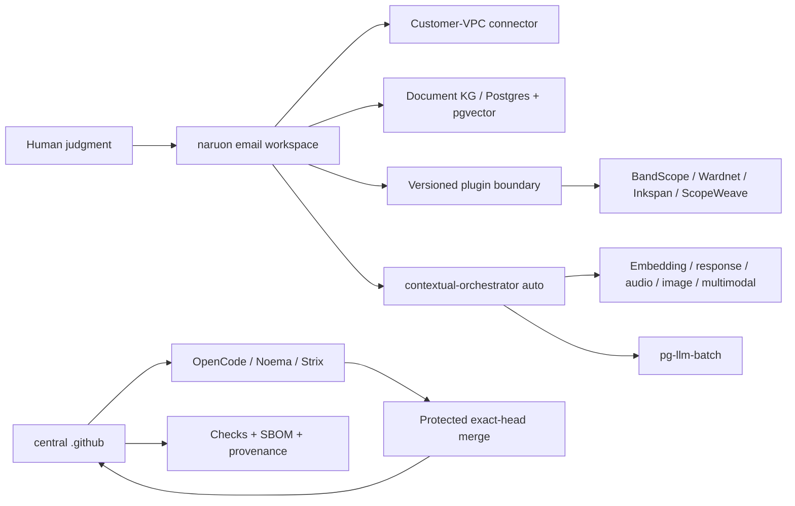

# Product and Technical Gap Baseline

작성 기준일: **2026-08-24 05:56 KST**
대상: **ContextualWisdomLab/.github** 중앙 거버넌스·자동화 레포지터리와 이를 소비하는 naruon 생태계
현재 보호된 `main`: `9f8f84074d8a8bc142eafea12c5b9e1c8570ccd6`
현재 열린 PR 수: **98** (아래 표에 이 스냅샷의 전체 목록 포함)

이 문서는 제품·기술·운영 Gap을 현재 문서와 현재 GitHub 상태에 묶어 두는 기준선이다. 새 작업은 먼저 이 문서의 Gap ID를 PR 설명과 테스트 증거에 연결하고, PR의 정확한 exact HEAD·Checks·리뷰를 다시 수집한 뒤 구현한다. 표의 상태는 작성 시점의 관측값이므로, 병합 판단에는 재사용하지 않는다. 이 인벤토리는 스냅샷이며 merge authorization이 아니다.

## 1. 근거와 범위

### 1.1 우선순위가 높은 근거

1. [CWL Master Context](CWL-MASTER-CONTEXT.md): naruon의 이메일 우선 플랫폼 경계, DIKW, no-ask 자동 해결, 다층·다중소속·시간·프라이버시 원칙.
2. [naruon #974](https://github.com/ContextualWisdomLab/naruon/pull/974): `docs/planning/naruon-platform-plan.md`를 추가한 병합된 제품/IA/User Story/Use Case/Architecture 기준. 이슈 트래커의 Phase 항목은 ContextualWisdomLab/naruon#975–#980.
3. [GitHub Project #1](https://github.com/orgs/ContextualWisdomLab/projects/1): 로드맵의 live source of truth. 이 문서는 live project board의 상태를 반영하며, 세부 항목 수는 project에서 직접 확인한다.
4. 중앙 ADR·doctoring·계약 문서: [ADR-0002](adr/0002-product-technical-gap-baseline.md), [hourly NVIDIA NIM autofix](doctoring/hourly-nvidia-nim-autofix.md), [Strix cryptography override](../requirements-strix-ci-overrides.txt), [trusted uv lock materialization](doctoring/trusted-uv-lock-materialization.md), [product-technical gap doctoring](doctoring/product-technical-gap-baseline.md).

### 1.2 제품 경계

구매자가 사는 핵심 결과는 “흩어진 enterprise context를 판단 가능한 구조로 만들고, 사람이 다음 행동을 승인할 수 있게 하는 것”이다. naruon은 이메일 호스트나 전자결재 시스템이 아니라 고객 소유 데이터에 연결되는 이메일 workspace/platform이다. 중앙 `.github`은 제품 기능을 대신 소유하지 않고, 정확한 HEAD·리뷰·Checks·증거·변경권한을 보장하는 control plane이다.

핵심 구매 여정은 다음과 같다.

1. 여러 계정·언어의 이메일에서 한 사건의 thread와 sender 의미를 찾는다.
2. 변경된 일정의 최신 truth, 변경 이력, commitment status와 충돌을 계산한다.
3. work/personal/project/band 등 겹치는 norm group을 선택하고, 관계·권한·유효기간을 고려한다.
4. 다른 context에는 필요한 결과(예: unavailable)만 consent·audit 기반으로 공개한다.
5. 사람은 근거·confidence·다음 행동을 보고 예외만 수정하며, 외부 writeback은 승인한다.

## 2. PRD / TRD / UML 기준

### 2.1 PRD acceptance

| ID | 구매자가 확인할 결과 | 수용 증거 |
|---|---|---|
| PRD-01 | “이 메일/보낸 사람이 왜 중요한가”를 찾는다 | hybrid retrieval, sender ontology, source segment provenance |
| PRD-02 | 일정 이동과 RSVP/commitment 충돌을 놓치지 않는다 | temporal event history, confirmed > tentative > desired weighting, conflict test |
| PRD-03 | 같은 사람이 여러 조직·팀·밴드에 소속되어도 권한을 뒤섞지 않는다 | reified relationship, multi-membership/norm-group resolution, ecological-fallacy test |
| PRD-04 | private reason을 노출하지 않고 필요한 consequence만 공유한다 | consented minimal-disclosure bridge, audit trail, revocation test |
| PRD-05 | 사용자가 모델 선택을 관리하지 않아도 품질을 우선해 자동 라우팅한다 | contextual-orchestrator `auto`, capability-before-cost, unpriced-is-not-free evidence |
| PRD-06 | 결과를 독립 제품 또는 naruon plugin으로 동일하게 쓴다 | versioned manifest/API, connector contract, standalone/submodule integration test |

### 2.2 TRD target

- **Platform plane:** naruon web/API, customer-VPC connector, Postgres/pgvector document KG, plugin registry, versioned extension points.
- **Evidence/control plane:** central `.github`, OpenCode/Noema/Strix, exact-source and exact-head binding, bounded hourly loops, no credential fallback, protected merge.
- **AI plane:** contextual-orchestrator adaptive routing; role별 reasoning effort, workflow depth, recursion, decomposition, verifier/synthesis를 quality evidence에 따라 배분. Fugu, Conductor, TRINITY를 근거로 단일 모델 라우팅과 심층 다중 에이전트 오케스트레이션 사이에서 계산량을 배분한다. 속도는 최적화 목표가 아니다.
- **Compute plane:** 수리과학·psychometrics의 계산 레이어와 속도·안정성·보안이 핵심인 hot path는 Rust 경계를 우선 검토하며, GPU/CPU multithreading과 낮은 context switching을 benchmark로 입증한다. Python/JS는 orchestration/API adapter로 제한한다.
- **Data plane:** 모든 영속 객체는 두 단어 이상 `snake_case`를 기본으로 하고 3NF를 지키며, 관계·evidence·confidence·validity·disclosure를 별도 정규화한다. Hot partition 대비를 스키마에 둔다.
- **UX plane:** UI 제품만 Figma/Storybook/design token을 사용한다. 중앙 `.github`는 UI 없는 인프라 레포지터리이므로 Figma File ID는 **N/A (UI scope 없음)**이며, UI PR은 별도 ADR에 실제 File ID를 기록한다. UI-owning 저장소는 Storybook scene/edge-case event, Accessibility, Touch & Interaction, Performance, Style Selection, Layout & Responsive, Typography & Color, Animation, Forms & Feedback, Navigation Patterns, Charts & Data를 정의·검토·반영·적용·감사한다.

### 2.3 UML-level dependency

## 3. Gap register

우선순위는 구매자 체감, 보안/증거 위험, 선행 의존성 순서다.

| Gap ID | 현재 관측 | 구매자 영향 | 우선 구현/검증 |
|---|---|---|---|
| G-01 | 열린 PR은 98개다. metadata상 CLEAN은 1개(#1265) / DIRTY 51 / BLOCKED 12 / BEHIND 31 / UNSTABLE 3 / draft 13이다. MERGEABLE/CLEAN은 independent exact-head approval과 terminal required Checks를 자동으로 의미하지 않는다 | 안전하게 출시할 변경과 대기 중인 변경을 구별할 수 없다 | PR마다 current head, reviews, threads, required Checks를 재수집하고 보호 조건 미충족이면 merge하지 않는다 |
| G-02 | 리뷰 credential / same-repo status / agent dispatch #1162/#1227/#1215는 새 main `9f8f84074d8a8bc142eafea12c5b9e1c8570ccd6` 기준으로 BEHIND다. 어느 쪽도 current-head OpenCode APPROVE가 없다 | 리뷰가 호출돼도 승인 증거가 생성되지 않아 자동화가 멈춘다 | current-head quality와 OpenCode/Noema/Strix를 재실행하고, 병합 뒤 router comment/dispatch의 403을 실제 PR에서 검증한다 |
| G-03 | ContextualWisdomLab/.github#1252는 `main` `9f8f84074d8a8bc142eafea12c5b9e1c8570ccd6`에 병합됐다. G-03 successor는 #1263(`50a6ad9129b2da55d049600ecd2516ee0999d7f1`, BLOCKED)이다. Required Strix는 `pull_request_target`로 보호 main 게이트를 쓰므로 MODEL QUALITY / `openai-direct` rewrite를 self-verify하지 못할 수 있다. 닫힌 #1213/#1262를 되살리지 않는다 | 취약점 0건이더라도 CI 인프라 결함이 보안 결과처럼 보이고 큐가 막힌다 | exact runtime signature를 불완전 evidence로 fail-closed 분류하고, vulnerability marker가 있으면 절대 neutralize하지 않는 regression을 유지한다. 중복 Strix PR은 stack/supersede한다 |
| G-04 | 98개 live PR 중 대부분이 BEHIND/DIRTY/BLOCKED이며, 자동 caller PR이 제품 기능보다 앞서 쌓였다 | 제품 개발 속도가 queue hygiene에 소모되고, stacking 순서가 불명확하다 | product/ownership boundary별로 stack을 재정렬하고, 오래된 PR은 current main으로 normal merge/rebase 후 변경 범위를 검증한다 |
| G-05 | ecosystem contract/catalog PR은 존재하지만 naruon의 실제 plugin 소비·standalone 실행·connector round-trip 증거가 제한적이다 | 구매자는 “연결 가능” 문서와 실제 설치 가능한 제품을 구별할 수 없다 | manifest/version compatibility, command/event envelope, consumer smoke, rollback/upgrade contract를 조직 유관 레포에서 증명한다 |
| G-06 | ContextualWisdomLab/naruon#974와 Project #1은 제품 목표를 정의하지만 E1/E2/E3의 live implementation evidence가 이 중앙 레포에 없다. Phase 0 Issue ContextualWisdomLab/naruon#975는 Done(closed completed 2026-07-13)이다. 다음 순서 단계는 ContextualWisdomLab/naruon#976 (P1 Plugin SDK)이며 한 번에 한 phase만 진행한다 | 이메일 검색·일정 충돌이라는 killer workflow가 문서에만 머문다 | naruon에서 thread/sender ontology → temporal commitment/conflict → human correction slice를 독립 PR로 delivery한다. 소유 저장소는 naruon이다 |
| G-07 | multi-level/multi-membership/temporal 관계 원칙은 master context에 있으나 모든 소비 저장소의 schema/API가 동일한 reified relationship contract를 보장하는지는 미확인이다 | 개인 단위로 집계하거나 전역 권한을 적용하는 atomistic/ecological fallacy 위험이 남는다 | relationship, membership, norm_group, validity window, evidence, confidence, disclosure를 정규화하고 cross-context golden tests를 만든다 |
| G-08 | embedding·DOM·sender/receiver 의미 단위 chunking과 base64 image의 OCR/object/tag/position-index 설계가 ecosystem contract에 부분적으로만 반영됐다 | 검색은 되지만 실제 그림 위치와 의미를 회수하지 못해 편집·문서·메일 업무가 끊긴다 | semantic unit chunk schema와 image asset/region/ocr/tag embeddings를 별도 entity로 설계하고 source offset/DOM path를 보존한다 |
| G-09 | 100% coverage/docstring은 중앙 PR별로 증거가 있으나 조직 소비 레포의 frontend interaction/i18n/design-token/real-data accuracy 증거가 동일한지 미확인이다 | “green CI”가 실제 고객 시나리오 정확성을 보장하지 않는다 | domain-specific RMSE/reproducibility/audio/visual/browser acceptance와 edge matrix를 required evidence로 만든다 |
| G-10 | math/psychometrics의 Rust+GPU/CPU path와 시간·다층·다중소속 모델은 fast-mlsirm/psychometrics-commons 등 제품 레포의 책임이다 | 계산 정확도·성능·모델 해석 가능성을 Python glue만으로 보장할 수 없다 | Rust core, GPU/CPU benchmark, temporal/multilevel/multiple-membership fixtures, RMSE/recovery/ablation을 제품 PR에 묶는다 |
| G-11 | UI가 있는 제품의 Figma/Storybook inventory와 token/interaction/i18n 테스트는 중앙 control plane에서 소유할 수 없다. Figma File ID는 이 저장소 ADR에서 N/A다 | 제품 간 UI가 달라지고 운영자 onboarding이 일관되지 않는다 | 각 UI repo가 실제 Figma File ID ADR, Storybook inventory, shared token package, keyboard/edge/i18n tests를 소유한다 |
| G-12 | CSAP/SOC 2 통제 목표와 PII masking 대안은 doctoring에 흩어져 있으며 evidence-to-control mapping의 live completeness가 미확인이다 | PII를 마스킹하면 업무가 멈추고, 원문 접근을 허용하면 감사·유출 위험이 커진다 | consent/purpose/access lease, field-level encryption/tokenization, redaction-at-egress, audit/revocation와 CSAP/SOC 2 evidence map을 구현한다 |
| G-13 | hourly scheduler는 존재하지만 no-op/credential unavailable/queued Checks의 customer next action을 모든 caller가 동일한 receipt로 내는지 미확인이다 | 자동화가 실패해도 운영자가 무엇을 고쳐야 하는지 알 수 없다 | `skipped_credential_unavailable` receipt와 다음 행동 문구를 exact-head Checks로 검증한 뒤 병합하고, bounded receipt schema, retry floor, single-flight, no secret fallback을 모든 caller contract test로 고정한다 |
| G-14 | release/changelog/version 증거가 각 PR에 분산되고 현재 central repo 보호 main의 release candidate가 명확하지 않다 | 운영자는 어떤 기능이 supportable release인지 확인할 수 없다 | merge 후 release readiness ledger, CHANGELOG, semantic version/tag, rollback/operability evidence를 함께 갱신한다 |

## 4. 열린 PR live inventory

아래는 GitHub PR list가 2026-08-24 05:56 KST에 반환한 98개 열린 PR의 number/title/head/base metadata다. CLEAN/BLOCKED/DIRTY/BEHIND/UNSTABLE은 GitHub metadata일 뿐 protected merge 승인이나 required Checks PASS를 뜻하지 않는다. 다음 루프에서 모든 행의 live review, thread, Checks를 다시 확인한다.

스냅샷 요약: CLEAN [1265]; BLOCKED [1280, 1279, 1277, 1275, 1274, 1273, 1271, 1269, 1263, 1245, 821, 790]; UNSTABLE [1282, 1281, 1278]; DIRTY 51; BEHIND 31; draft 13.

| PR | title | head SHA | base | metadata | mode |
|---|---|---|---|---|---|
| #1282 | fix(sandbox): bound web E2E evidence and service logs | `b03af163627bcbbad0f0a003d9d19a1e9100694e` | codex/pr931-sandboxed-verify-stack-20260824 | UNSTABLE | ready |
| #1281 | fix(sandbox): bound verification evidence and copied links | `1d744878ea9768b2be59cb05360a4bd4eea2da17` | codex/pr931-bounded-subprocess-core-20260824 | UNSTABLE | ready |
| #1280 | feat(ci): add a bounded subprocess primitive | `88f5fcc62671ca6e635be05a9ab583adf7399c7a` | main | BLOCKED | ready |
| #1279 | fix(noema): fail closed at the credential egress boundary | `b19c5b452cf53a5b5a85d9805efaa1899cf0a04b` | main | BLOCKED | ready |
| #1278 | fix(opencode): scope coverage artifacts to workflow attempts | `baf7811960b0f4940856b9a39b7bf78ad28d15ee` | codex/pr904-current-main-replacement-20260824 | UNSTABLE | ready |
| #1277 | docs: refresh live product and technical gap baseline after #1252 | `3cfda135f7bc7f68c0740642604d636bde5e853d` | main | BLOCKED | ready |
| #1276 | chore(security): unify OSV Action v2.5.1 | `d9356742fa2ea104f4adedefc8f3976378cce86c` | main | BEHIND | ready |
| #1275 | chore(security): unify Scorecard Action v2.4.4 | `9fa9690fbc9d82c9a433ea75a36741ff4905970b` | main | BLOCKED | ready |
| #1274 | chore(security): unify CodeQL Action v4.37.7 | `b1ffd85e6744ac9800122d9a110baf79b170a391` | main | BLOCKED | ready |
| #1273 | fix(opencode): retain adversarial fallback scope | `7bbbed45a4eeaeec6d392dab5a8fad2f82674498` | main | BLOCKED | ready |
| #1272 | security(deploy-pages): enforce explicit caller contract | `8a0a781d44662f341674d5dfda18990afc7eb8c9` | main | BEHIND | ready |
| #1271 | fix(scheduler): fail after summarized action errors | `4cd10ce7e967bc1d2b1297716ee61e94584141c3` | main | BLOCKED | ready |
| #1270 | fix(scheduler): require independent exact-head approval | `aa0c93e5d461daf64c160b91066f90bad57a532f` | main | BEHIND | ready |
| #1269 | ⚡ Bolt: Combine provider token regexes for log redaction optimization | `0ff116812d816d3571cb3cf133918fdf849b9fd6` | main | BLOCKED | ready |
| #1267 | feat(automation): repair Inkspan reviews hourly | `34efa03ecec7d815d8e6a4f7354767208fb1ce4a` | main | BEHIND | ready |
| #1266 | fix(scheduler): retry OpenCode after coverage blockers clear | `855b1837cc0f277043f6e34509b09245a44a28b3` | main | BEHIND | ready |
| #1265 | test: provision pip in fresh uv environments | `d4d4c2b0589065976e4bdcf5c5ae429bc21ed680` | main | CLEAN | ready |
| #1264 | perf(redaction): skip invalid key rescans without masking diagnostics | `cbc5852b25634cb333a32da1a89de9825cb24802` | main | BEHIND | ready |
| #1263 | fix(strix): make Azure and cross-provider fallbacks executable | `50a6ad9129b2da55d049600ecd2516ee0999d7f1` | main | BLOCKED | ready |
| #1259 | feat(automation): add a thin LineageWeave hourly review-repair caller | `6041f2aa9e23af5850cd83fa838a3eb6c45d84b9` | main | DIRTY | ready |
| #1258 | fix(coverage): run pnpm 9 evidence without --trust-lockfile | `897819c48279b0c0d5e2372eb39dce6120784685` | main | BEHIND | ready |
| #1257 | fix(osv): keep base scan results across fork checkout | `20d72bc838d7f91b74ce01bb4de16d07144fa270` | main | BEHIND | ready |
| #1246 | fix(opencode-review): accept int-typed run_id/run_attempt in control JSON | `f88499b708a90edb6a538aeb2c397e14304681ad` | main | BEHIND | ready |
| #1245 | fix(scheduler): retry and gracefully defer shared installation rate limits | `7046ba98c2d8b243713aaec9b0bf9bd98d6c97b6` | main | BLOCKED | ready |
| #1244 | fix(e2e): restrict readiness polling to loopback destinations | `a0c82c87dfc01b49698fd84db378a71942714b57` | main | BEHIND | ready |
| #1242 | fix(security): preserve exact CI evidence while redacting provider secrets | `9bdfcbdaf4d079de3b346e1584dd505c5043afd3` | main | BEHIND | ready |
| #1238 | fix(scheduler): stop repository_dispatch defaulting review/merge/branch flags off | `21b4c58577d54aed299cf0d2dc30a0ee80ff0902` | main | BEHIND | ready |
| #1233 | fix(automation): restore hourly fleet coordination | `9cda8fa219a2dbfa172cc05edb20ff7d6f08eb75` | main | BEHIND | ready |
| #1231 | fix(scheduler): isolate central Actions inventory quota | `7b16617af04431a43f8f7528b8ac7db345e404a7` | main | BEHIND | ready |
| #1227 | fix(opencode): use same-repo status credential | `5974bee1dbc2f28b33f69f1aab08066bdedaab70` | main | BEHIND | ready |
| #1215 | fix(security): redact agent-mention credential diagnostics | `785401dc911e0a53ef301d1900c1825147f9524a` | main | BEHIND | ready |
| #1198 | fix(security): repair pip audit and schedule orchestrator review | `997e4f19e63c5962ddd168579301e080bd1553ff` | main | BEHIND | ready |
| #1188 | fix: grant hourly callers reusable workflow OIDC scope | `1a0cc1f875db29492861006747ded2b6d9e93d09` | main | DIRTY | ready |
| #1187 | fix(coverage): scope Rust evidence to changed packages | `0a88e24d9a1c92420f412d241f850aab8e72106e` | main | DIRTY | ready |
| #1176 | fix(governance): preserve proposal branch create transition | `49f6988795262194e4eda8b3ea7319b7b39c4e77` | main | BEHIND | ready |
| #1172 | fix(autofix): resolve live NVIDIA NIM models instead of a retired pin | `edab578feca63c223368aef17c175bb52ce22e5a` | main | DIRTY | ready |
| #1170 | feat: route OpenCode reviews through contextual gateway | `cbf937bc7216bf34883032a040aa3850136b9e81` | main | DIRTY | ready |
| #1166 | fix(ci): recognize replacement tests in existing files | `7986334aacb2bc8e5d794d581202f47c91e4875e` | main | BEHIND | ready |
| #1162 | fix: use review credentials for agent dispatch | `4a7031d7adbba759742605deb1c78d10aef16e7d` | main | BEHIND | ready |
| #1161 | fix: make hourly coordinator credential absence auditable | `49bc5e4a59cd30550f87070b48b61e966ac480e1` | main | DIRTY | ready |
| #1158 | fix(osv): preserve immutable direct-source provenance | `e61fb11fbd5c7464d34cc8bedc3a7177fbdcade2` | main | BEHIND | ready |
| #1150 | feat: add read-only Actions queue health evidence | `efa7788bd14e3513221577566a768fc36f03ccff` | main | DIRTY | ready |
| #1147 | feat(integration): add ecosystem capability catalogue | `113de5eb71ff9e06c00f4c272266662dcbd97392` | main | DIRTY | ready |
| #1146 | fix(figma): retain style references and component sets | `8ffdf4d8150091957a79b5fc63c984e927d323b3` | main | DIRTY | ready |
| #1143 | ci: schedule naruon hourly review repair | `9c2842ab1d49bb1ed74683bc52c0e213eb5d5bc7` | main | DIRTY | ready |
| #1123 | feat(edge): standardize organization runtimes on Cloudflare Pingora | `251b16836164cfcfc0914a568d514cc7b6a9dd6d` | main | DIRTY | ready |
| #1120 | Wire Noema to a same-job contextual-orchestrator sidecar | `101e6906cc3568beb99c19c28eaffb526bac335b` | main | DIRTY | draft |
| #1114 | fix(strix): retry transient visibility API failures | `5690b45e2b7caf08644515ca879a091a9bb51a6e` | main | DIRTY | ready |
| #1112 | fix(storage): reject embedded IPv4 rebinding hosts | `dc7e39cf7dff80c2e2ed8d348090394ddc643142` | main | DIRTY | draft |
| #1108 | feat(automation): run free-router hourly NVIDIA NIM review repair | `df5ae0b1fff42205627b4af556c7e95e87138b7a` | main | DIRTY | ready |
| #1104 | chore(deps): bump charset-normalizer from 3.4.7 to 3.5.1 | `d90c8320bcce63269f1ab6368f1073841c157363` | main | BEHIND | ready |
| #1103 | chore(deps): bump google-cloud-resource-manager from 1.17.0 to 1.18.0 | `3b58d8e8d5db29c623bf90ee42ba1b54a7a58749` | main | BEHIND | ready |
| #1101 | feat(automation): run EmbedRelay hourly NVIDIA NIM review repair | `77557a9e35d6467a9b8fcbc25e7e73f90683383c` | main | DIRTY | ready |
| #1100 | feat(automation): run RankWeave hourly NVIDIA NIM review repair | `e9ccfd21f1efd13da03e72664d0585dffc1dac00` | main | DIRTY | ready |
| #1097 | feat(automation): run html4tree hourly NVIDIA NIM review repair | `627b7ade1a4875addb7e38c0726bd6fd82f01511` | main | DIRTY | ready |
| #1095 | feat(automation): run mhtml-etl-gateway hourly NVIDIA NIM review repair | `715935b45cf2688235e40be6b44c595af45d27e1` | main | DIRTY | ready |
| #1094 | feat(automation): run DiagramWeave hourly NVIDIA NIM review repair | `455f2e76f15c5d0e7040777fc22ea4994d850925` | main | DIRTY | ready |
| #1092 | feat(automation): run psychometrics-commons hourly NVIDIA NIM review repair | `6c330dbfbede45acb41972f1d384ef586b83c2b8` | main | DIRTY | ready |
| #1088 | feat(automation): run mightyETL hourly NVIDIA NIM review repair | `d955cb949329f3bc3726c440542f549fe2978209` | main | DIRTY | ready |
| #1087 | feat(automation): run life-os hourly NVIDIA NIM review repair | `37377d0a19dfae9739ae2e0a845b8270303b38be` | main | DIRTY | ready |
| #1085 | feat(automation): run kaefa hourly NVIDIA NIM review repair | `3e6c94603a6332b066e0be962aab23991987e094` | main | DIRTY | ready |
| #1083 | feat(automation): run pg-llm-batch hourly NVIDIA NIM review repair | `584141341346b7882fded053b459a7d4c16477a2` | main | DIRTY | ready |
| #1082 | feat(automation): run semantic-data-portal hourly NVIDIA NIM review repair | `dbfdbbf3547b4c84bb5c2a1760ecfda080751546` | main | DIRTY | ready |
| #1080 | feat(automation): run newsdom-api hourly NVIDIA NIM review repair | `54f53fcad5a241de28aa272d5775e98bf0b9ca00` | main | DIRTY | ready |
| #1079 | feat(automation): run Appguardrail hourly NVIDIA NIM review repair | `d13ff905cd0d4d814cc2e5f2b5e54dd3d1522f0c` | main | DIRTY | ready |
| #1078 | feat(automation): run Scopeweave hourly NVIDIA NIM review repair | `26b684bc231bff24c19b71ddc8302e551f843ebf` | main | DIRTY | ready |
| #1077 | feat(automation): run noema hourly NVIDIA NIM review repair | `a91c94f1c9d92430241e2cf1302286a83310fe37` | main | DIRTY | ready |
| #1076 | feat(automation): run pg-erd-cloud hourly NVIDIA NIM review repair | `e280e2402e9d4fcd7a17e951e944c85bacd5bd61` | main | DIRTY | ready |
| #1075 | feat(automation): run codec-carver hourly NVIDIA NIM review repair | `618813098dfd8e8186bc7e3277004d76e9ae5d56` | main | DIRTY | ready |
| #1074 | feat(automation): run Keyverse hourly NVIDIA NIM review repair | `c70ff9369f9b49b3e961fe1f63d0204e713400f5` | main | DIRTY | ready |
| #1070 | feat(automation): run Wardnet hourly NVIDIA NIM review repair | `9c752db19fa91b320a74da6c8bd0fbe6d03bce1e` | main | DIRTY | ready |
| #1065 | fix(scheduler): fall back to REST when auto-rebase GraphQL transport fails | `ff661f115ae0c6f41e7a2fab304ace3e648b3988` | main | DIRTY | ready |
| #1062 | fix(strix): map official modes without branch-selected dispatch | `74079e5bddd69bf7eac6d3b2492f25d598517905` | main | DIRTY | draft |
| #1061 | fix(scheduler): ignore manual Strix dispatch as merge evidence | `03c087804eec7f4b520ffc3f61b49edba2dc8378` | main | DIRTY | draft |
| #1060 | fix(opencode): prove asyncio coverage plugin without colliding #896 | `a27ae0ac907c04c300ed978e35538e26c094a682` | main | DIRTY | draft |
| #1058 | fix(operability): reject impossible control-plane SLI counts | `0fd148a8fa2b7acc098eb9741b8d8cea92058ef1` | main | DIRTY | draft |
| #1053 | fix(redaction): skip gh run view job/step prefixes | `15fa991d8a99743a640a26665d278bc159653065` | main | DIRTY | draft |
| #1052 | fix(opencode): split review surfaces, give NIM two hours, and remove GitHub Models | `766080a6b76dadb9fb861c5519f2ea82c14de34e` | main | BEHIND | ready |
| #1051 | fix(pip-audit): keep index-url locks hashed and reject symlink parents | `82629751751b82bee88d000ded32b6f141125849` | main | DIRTY | ready |
| #1050 | fix(security): reject dot path components before dependency-review compare | `ee5c15711f0b0a346bb19a634288a49fcd981fab` | main | DIRTY | draft |
| #1046 | fix(opencode): pass trusted visibility into the private free-model hook | `f053ba84ff7dc92c5dbdef2ca1597cd04372dd6b` | main | DIRTY | draft |
| #1036 | fix(ci): bind stub-scan evidence and cap hourly fleet work at 12 | `d8205b139f8396c0452ecd4cc9b95caa45a56f42` | main | BEHIND | draft |
| #1035 | docs(automation): retarget closed-unmerged #840 and #906 lineage | `cb5e2ee03b9f75857e2ce31690fc76de76ad9cc1` | main | DIRTY | draft |
| #1027 | fix(automation): stop mention sweep on already-exceeded rate limits | `d046637834d6d9720852423c3cdb5ef79faa1fe3` | main | DIRTY | draft |
| #1026 | feat(actions): inventory orphaned workflow identities | `1be76989887ab772e3ce0d2e0c7f22d3ca98dd94` | main | DIRTY | ready |
| #1015 | fix(coverage): defer interpreter-specific wheel gaps | `ce28ffba511cb7e2a5135e6f862164834c0f874b` | main | BEHIND | ready |
| #1009 | fix(strix): bind evidence to exact workflow artifacts | `99fee8b1b4ff4fc2219b98561cc4fea851c2f03a` | main | DIRTY | ready |
| #991 | fix(automation): reuse review node_id for mention eyes | `b6303e081756b9598316cdf07f84c038924f0427` | main | DIRTY | draft |
| #949 | fix(opencode-review): discover multi-line run: blocks in safe_pytest_command | `75c6dbdfde34ac7e729e83f44aa0261e76f475d4` | main | BEHIND | ready |
| #941 | fix(semgrep): make the pinned image digest authoritative | `5b07547a01137989ae1324cd472bb15229d5e0d2` | main | BEHIND | ready |
| #939 | fix: keep cross-repo OpenCode evidence healthy | `2d267d48ab78b0cf8621604ff49839b6f795e610` | main | DIRTY | ready |
| #933 | fix: retry Strix provider tool protocol failures | `b260fd3e17a0c6363d2584110314e44eaf1dfd11` | main | DIRTY | ready |
| #932 | fix(sbom): preserve Markdown report integrity | `f8b94d0dfb02c64761df07ebdf658eb4e1d8abc5` | main | DIRTY | ready |
| #897 | fix(security): fail closed on unavailable dependency review | `d9b395cd01999a6ec946d3c7a013f22225143782` | main | BEHIND | ready |
| #834 | fix(noema): validate stable OIDC exchange envelope | `1a202f9745e90280e3b1bbdead4f78320ba413fc` | main | BEHIND | ready |
| #821 | fix(opencode): reap fatal provider process groups | `e1eb67926d9143730054c1fc9f1ef82dc5ef4a0c` | main | BLOCKED | ready |
| #790 | fix(coverage): retry transient trusted uv downloads | `463ddbad84ee40f56f2196af2aa41f1dd4100907` | main | BLOCKED | ready |
| #789 | feat(coverage): add bounded PyO3 peer-evidence gate | `861478bb11ba89f71b97dbbdd874b3d872372125` | main | BEHIND | ready |

### 4.1 Same-session open/close delta

- ContextualWisdomLab/.github#1252 remains merged on `main` `9f8f84074d8a8bc142eafea12c5b9e1c8570ccd6`.
- ContextualWisdomLab/.github#1265 stays GitHub CLEAN on `d4d4c2b0589065976e4bdcf5c5ae429bc21ed680` with hosted Checks green and no current-head OpenCode APPROVE after repeated `@opencode-agent` requests. CLEAN is not merge authorization.
- ContextualWisdomLab/.github#1263 head `50a6ad9129b2da55d049600ecd2516ee0999d7f1` still has required Strix FAILURE on protected-main gate.
- Open count is 98. No additional `.github` PR merged this pass.

## 2026-08-25 central Strix fallback contract recheck

- `main` at `a724582a0768129d481385070bf8f05b2620dd2c` changed the direct-OpenAI
  fallback to `gpt-5.4`, but the required-workflow smoke script still required
  the retired `gpt-5.6-luna` string. The privileged OpenCode model pool also
  retained the retired candidate while its contract tests expected `gpt-5.4`.
- This exact mismatch caused consumer Strix checks to fail before scanning the
  target repository; it was observed on ContextualWisdomLab/disksage#247 at
  exact head `a9c868a6e9c8d68a9c6ea6de381e188740b8f5db`. The focused repair keeps
  provider errors and vulnerability findings fail-closed and only aligns the
  executable model and its assertions.

## 2026-08-27 contextual-orchestrator vendored sidecar (ZDR-first free pool)

- **Gap G-ORCH-027 (closed by this increment):** central review pinned direct
  provider endpoints and hard-coded model ids; no path used the org's five-key
  auto model discovery, the `orchestrator/free` fail-closed zero-cost pool, or
  ZDR-first selection. The 2026-08-18 org decision
  (`ContextualWisdomLab/contextual-orchestrator` AGENTS.md) migrated
  OpenCode/Noema/Strix to the gateway; this snapshot lands the org-repo half.
- `pr-review-autofix.yml` now provisions
  `scripts/ci/contextual_orchestrator_review_sidecar.sh` (current pinned SHA
  `b2164511…`, same-process KV registration of `BYTEZ_API_KEY`,
  `NVIDIA_NIM_API_KEY`, `NVIDIA_NIM_API_KEY_SUB`, `OPENROUTER_API_KEY`,
  `OPENAI_API_KEY`, live auto model discovery, ZDR-prioritized free catalog),
  and the writer runs `--model contextual-orchestrator/orchestrator/free`.
  `opencode.jsonc` default route changes identically. Companions:
  `zdr_policy.py`, `contextual_orchestrator_review_policy.py`,
  `contextual_orchestrator_review_launcher.py`; records
  `docs/adr/0003-…`, `docs/doctoring/contextual-orchestrator-vendored-sidecar.md`.
- At the time of this 2026-08-27 snapshot, the remaining follow-up was the
  read-only dispatch pool, `noema-review.yml`, and `strix.yml` migration. This
  historical observation is superseded by the current-main evidence below.

## 2026-08-28 current-main routing and runtime recheck

- Current protected main is `8f84b661e468de451ba5c076dc938f342bf52d70`,
  the merge commit for #1373 (following #1370 at
  `24ee38b097dbfc1a895e1199ade48cff36431d05`). #1364 is merged at
  `f8823a544c3c4c046977f8511f683e85f83eb496`; #1360 is merged at
  `17052a7ca3c16db90932a4d6036b43165ddee418`.
- The current Required OpenCode dispatch, `noema-review.yml`, `strix.yml`,
  and write-capable `pr-review-autofix.yml` all provision the pinned
  `contextual-orchestrator` sidecar. Their model route is the
  `contextual-orchestrator/orchestrator/free` gateway, with the five provider
  secrets entering the sidecar KV and model discovery performed there. No
  `COPILOT_GITHUB_TOKEN` route is present.
- #1364 was merged by `seonghobae` while its terminal review decision remained
  `CHANGES_REQUESTED`; this is an observed merge event, not protected-main
  governance evidence. The required branch checks still include
  `noema-review` and `opencode-review`.
- Post-merge Strix run `33139957477` exposed a real sidecar runtime defect:
  `contextual_orchestrator.orchestrator.load_agents()` requires an
  `{"agents": [...]}` catalog envelope, while the launcher wrote a bare list.
  Follow-up #1370 fixes the launcher and the standalone policy catalog writer.
  Its exact head `0f40d415b112ca0055f5db5b2f434788b08f01f1` merged as
  `24ee38b097dbfc1a895e1199ade48cff36431d05`.
- #1370's earlier PR-target Noema run `33140830199` executed the pre-fix trusted
  base launcher and is retained only as bootstrap reproduction evidence. A
  fresh protected-main canary must start the corrected sidecar and reach the
  scanner before the runtime gap is closed; queued or cancelled jobs do not
  satisfy that acceptance boundary.
- Protected-main Strix run `33141468804` crossed the corrected catalog and
  sidecar boundary, then LiteLLM rejected the unqualified scanner child model
  `orchestrator/free` because the provider was not explicit. The follow-up maps
  only that child to `openai/orchestrator/free` when the API base is the pinned
  loopback gateway; the public gateway model remains
  `contextual-orchestrator/orchestrator/free`, and absent, empty, or non-pinned
  bases fail closed. This is reproduction evidence, not operational acceptance.
- #1370 merged with no `APPROVED` review; all recorded Reviews API verdicts are
  `COMMENTED`. That governance contradiction is tracked in #1340 and is not
  retrospective approval evidence for this runtime correction.
- #1373 merged the model qualification as `8f84b661…` but retained the raw
  bearer in `GITHUB_ENV`, so its log-exposure claim is contradicted by source.
  #1369 preserves the merged model behavior while moving cross-step credential
  transport to a validated mode-0600 file. Fresh protected-main Strix and Noema
  evidence is still required after that stronger boundary integrates.

## 2026-08-28 post-#1373 request-envelope recheck

- #1373 was merged by `seonghobae` at `8f84b661e468de451ba5c076dc938f342bf52d70`
  to exercise the post-merge runtime path. Main Strix run `33143805461`
  reached the contextual-orchestrator sidecar and sent the qualified
  `openai/orchestrator/free` request, then failed closed with HTTP 413
  `request_too_large` from the pinned gateway. This proves the earlier model
  qualification defect was repaired, but the review request envelope was
  still smaller than the Strix/Noema tool-and-source context.
- The fix is scoped to the review launcher: use an explicit bounded 8 MiB
  `SecurityConfig.max_body_bytes` for the sidecar while preserving the
  contextual-orchestrator library's generic 64 KiB default. Noema run
  `33143860315` was a successful `workflow_run` event handler but skipped
  because the push event had no associated pull request; it is not an LLM
  verdict.

## 2026-08-28 #1374 trusted-base runtime boundary

- Follow-up PR #1374 merged at head
  `3d7cf123ea7459b7f0082bb354280288866256db` with merge commit
  `7c55295ff2dd863d983822d991e67ba037e8f186`; its launcher sets the bounded
  8 MiB review envelope, and its sidecar boot check validates that keyword
  against the exact pinned orchestrator SHA before discovery. Its terminal
  review decision was not an independent `APPROVED`, so this remains an
  observed merge event rather than protected-main governance proof.
- PR-target Strix run `33145070402` used trusted workflow source SHA
  `8f84b661e468de451ba5c076dc938f342bf52d70`, not the PR launcher. It reached
  the pinned sidecar and then failed three bounded attempts with HTTP 413
  `request_too_large`; this is evidence of the pre-merge trusted-base path,
  not evidence that #1374's launcher setting failed.
- PR-target Noema run `33145070347` also reached the pinned sidecar and set
  `orchestrator/free`, then skipped before the LLM call because the current
  head had no primary OpenCode approval. Required OpenCode run `33145070315`
  failed closed for the same missing current-head verdict. Therefore the
  PR-target result was not an LLM verdict.
- Post-merge Strix run `33145807836` used trusted workflow source SHA
  `7c55295ff2dd863d983822d991e67ba037e8f186`, reached
  `openai/orchestrator/free`, and produced no HTTP 413 or
  `request_too_large`. It failed closed after three bounded attempts because
  the Strix Caido target was unavailable at `127.0.0.1:48080`, reported as
  `STRIX_PROVIDER_UNAVAILABLE`; this proves the request-envelope fix on main,
  but not a successful end-to-end vulnerability scan.

## 2026-08-28 OpenAI request-envelope specification check

- OpenAI's official API reference models a function-tool `description` as an
  optional string and does not publish a universal 1024-character field limit.
  The official OpenAPI document also contains no `413` or
  `request_too_large` response definition for the inference operations. The
  `413 Content Too Large` observed above is therefore the vendored gateway's
  HTTP framing response, not evidence of an OpenAI tool-description rule.
- OpenAI's current images-and-vision guide specifies up to 512 MB total payload
  for an image-input request and accepts an image URL, Base64 data URL, or file
  ID in ordinary model-input JSON. The Files API separately permits 512 MB per
  uploaded file, and Batch separately permits 200 MB JSONL files. These are not
  one universal limit for every JSON endpoint. The sidecar's 8 MiB limit is an
  explicitly local, bounded policy for text/tool review envelopes and is not
  claimed to provide general multimodal compatibility: a large inline Base64
  image can fail locally even though a URL or file ID keeps the JSON small. A
  future general multimodal proxy needs a separately governed streaming/spooling
  and provider-capability contract; `/files` alone does not cover inline image
  data URLs. The pinned-SHA probe accepts a body of 65,609 bytes and preserves
  1,025-, 1,026-, and 2,000-character tool descriptions byte-for-byte;
  provider/model context failures remain separate runtime evidence.
- PR #1379 exact head `4a25c46dc2fe046368f304a589885ebffb757dfc`
  reached the pinned sidecar in Strix run `33150437853`; sidecar provisioning
  and the request-envelope preflight passed, but all three scanner attempts
  received HTTP 500 `internal_error` (request IDs
  `7ef2a6bfd7494f80adbf9109b2f5dea2`,
  `193276c218884651a3940dd9a30bcf97`, and
  `ff529b84b101458eae03287d3e8df52d`). No 413 or vulnerability report was
  emitted, so this is an incomplete provider/backend result rather than proof
  of either request-size rejection or scan success. The pinned server currently
  collapses otherwise-unhandled provider exceptions into that generic 500.
  Contextual-orchestrator PR #904 is the separately governed candidate that
  classifies upstream request-size rejection, retries eligible members of the
  virtual `orchestrator/free` pool, and returns `request_too_large` only after
  eligible-provider exhaustion. The sidecar pin must remain on protected main
  until that change is merged and then be reverified by a fresh exact-head
  Strix run.

## 2026-08-29 512 MB review-envelope bootstrap

- Contextual-orchestrator PR #904 head `6cd7d57c177d945f67ba3b86b699949584bc6b7e`
  passed its full unit/contract suite, Required bootstrap, Noema, fuzz, and
  security checks with zero unresolved review threads. Its Required Strix ran
  the pre-change `.github` main sidecar pin and failed three times with generic
  HTTP 500 responses and no vulnerability report; Required OpenCode failed
  closed because no current-head formal verdict existed. The bootstrap cycle
  was resolved by an explicitly authorized admin merge to protected-main commit
  `b21645116b352967e50fc497b87eb745b9cc8c61`; this is an observed bootstrap
  merge, not ordinary protected-governance proof.
- `.github` PR #1379 then pinned that protected-main orchestrator commit and
  changed only the loopback, bearer-authenticated, per-job review sidecar from
  the prior 8 MiB local envelope to the OpenAI image-input ceiling of 512 MiB.
  The generic orchestrator default remains 64 KiB; Files retains its separate
  512 MB per-file and 200 MB Batch JSONL contracts. The branch passed 216
  Required/Noema/Strix/OpenCode/autofix contract tests plus the Strix shell
  smoke. Because pull-request-target loaded the old trusted base pin
  `889b24f8547d059d1bf2b2f9a043aff15c9ea59d`, branch Noema success was not
  runtime proof of the new pin. The same explicitly authorized bootstrap merge
  produced `.github` main `e1b03eebc6dc5c85aed393e5928927c96376cf46`.
- Acceptance remains open until a fresh post-merge PR run proves that Required
  Noema and Strix provision `b2164511…`, route only through
  `contextual-orchestrator/orchestrator/free`, and produce an actual LLM verdict
  or typed provider result. A green event handler that skips the LLM call is not
  acceptance evidence.

## 5. 실행 루프와 고객의 다음 행동

각 hourly pass는 아래 순서를 유지한다.

1. 조직·repo 책임 경계를 확인하고, current default branch SHA와 PR head SHA를 새로 읽는다.
2. 열린 PR 하나를 선택해 review threads, formal review commit SHA, required Checks와 failure logs를 확인한다.
3. 실패가 코드 결함이면 root cause를 해당 PR의 최소 범위에서 수정하고, 원격 agent의 concurrent commit은 normal forward history로 보존한다. Force-push하지 않는다.
4. 현실적인 domain test, edge test, docstring/branch coverage, security/SBOM, actionlint/browser evidence를 실행한다.
5. 새 head에서 Checks를 재실행하고 independent current-head approval을 다시 요청한다. OpenCode/Strix/Noema 지연은 blocker가 아니다. 기다리는 동안 다음 PR 또는 Gap을 진행한다.
6. protected ruleset의 approval·resolved thread·terminal Checks·exact head를 모두 충족할 때만 `--match-head-commit` normal merge한다. 조건이 안 되면 merge하지 않고 다음 PR로 진행한다.
7. PR이 소진되면 Project #1과 소비 repo에서 가장 큰 운영자/제품 Gap을 선택해 새 PR을 만들고, 이 문서의 Gap ID를 연결한다. 다음 제품 increment의 소유 저장소는 naruon(G-06)이다.

운영자는 receipt의 `next_action`만 실행하면 된다. 예를 들어 `PR_REVIEW_MERGE_TOKEN` 부재는 토큰 값을 로그에 남기지 말고 secret을 provision한 후 다음 hourly pass를 기다리며, Strix Caido bootstrap failure는 runner/container readiness를 복구한 후 같은 exact head를 재검증한다.

`COPILOT_GITHUB_TOKEN`은 사용하지 않는다. 리뷰용 Agent 키 체계를 뒤흔들지 않는다.

### 5.1 이번 루프의 다음 개발 increment

1. ContextualWisdomLab/.github#1265 — GitHub CLEAN, Checks green, thread resolved. Independent current-head OpenCode APPROVE가 남아 있다. 승인 전까지 이 head를 바꾸지 않는다.
2. ContextualWisdomLab/.github#1277 — 이 베이스라인. current-head OpenCode APPROVE 후 병합.
3. ContextualWisdomLab/.github#1263 — G-03. Strix CRs on #1278/#1273/#1271/#1267/#1258 are the same provider fail-closed, not those PRs' code.
4. G-06는 naruon 소유. 큐가 비면 ContextualWisdomLab/naruon#976부터 한 phase씩 구현한다.

## 6. Compliance and data boundary

- PII 원문을 무조건 masking하여 업무를 끊지 않는다. 대신 purpose-bound access lease, field-level encryption/tokenization, consented minimal-disclosure consequence, audited access, revocation, retention/deletion을 사용한다. `COPILOT_GITHUB_TOKEN`은 사용하지 않는다.
- 모델·리뷰·sandbox·Checks·merge·release는 서로 다른 authority다. 하나의 PASS를 approval이나 release로 승격하지 않는다.
- 모든 untrusted input, repository patch, image/base64 payload, model output은 data로 취급하고 command/credential로 해석하지 않는다.
- demo/synthetic fixture는 unit test에만 두며 production seed/fixture에는 포함하지 않는다.
- CSAP and SOC 2 evidence maps belong with consent/lease/tokenization, not blanket PII masking.

## 7. APA 7th references

American Institute of Certified Public Accountants. (2017). *2017 trust services criteria for security, availability, processing integrity, confidentiality, and privacy*. AICPA.

International Organization for Standardization. (2022). *ISO/IEC 27001:2022 information security, cybersecurity and privacy protection—Information security management systems—Requirements*. ISO.

International Organization for Standardization. (2023). *ISO/IEC 42001:2023 information technology—Artificial intelligence—Management system*. ISO.

National Institute of Standards and Technology. (2023). *Artificial intelligence risk management framework (AI RMF 1.0)* (NIST AI 100-1). U.S. Department of Commerce. https://doi.org/10.6028/NIST.AI.100-1

World Wide Web Consortium. (2023). *Web Content Accessibility Guidelines (WCAG) 2.2*. https://www.w3.org/TR/WCAG22/

Lewis, P., Perez, E., Piktus, A., Petroni, F., Karpukhin, V., Goyal, N., Küttler, H., Lewis, M., Yih, W.-t., Rocktäschel, T., Riedel, S., & Kiela, D. (2020). Retrieval-augmented generation for knowledge-intensive NLP tasks. *Advances in Neural Information Processing Systems, 33*, 9459–9474.

Tang, Y., Cetin, E., Xu, J., Sun, Q., Nielsen, S., Richard, V., Goda, H., Tymchenko, I., Nguyen, N., Lee, H., Ashiga, M., Kotyan, S., Kuroki, S., & Clanuwat, T. (2026). *Sakana Fugu technical report* [Technical report]. arXiv. https://doi.org/10.48550/arXiv.2606.21228

Zhang, S., Yu, Y., Li, Y., Zhao, W., Yang, Y., Zhang, Y., & Liu, T. (2025). *Conductor: Learning to route multi-agent workflows* [Preprint]. arXiv. https://doi.org/10.48550/arXiv.2512.04388

Xu, J., Sun, Q., Schwendeman, P., Nielsen, S., Cetin, E., & Tang, Y. (2026). *TRINITY: An evolved LLM coordinator* [Preprint]. arXiv. https://doi.org/10.48550/arXiv.2512.04695

Higgins, S. S., Crepalde, N., & Fernandes, L. (2021). Segmented multiplexity: A research agenda for multiplexity beyond the average. *PLOS ONE, 16*(9), e0257527. https://doi.org/10.1371/journal.pone.0257527
