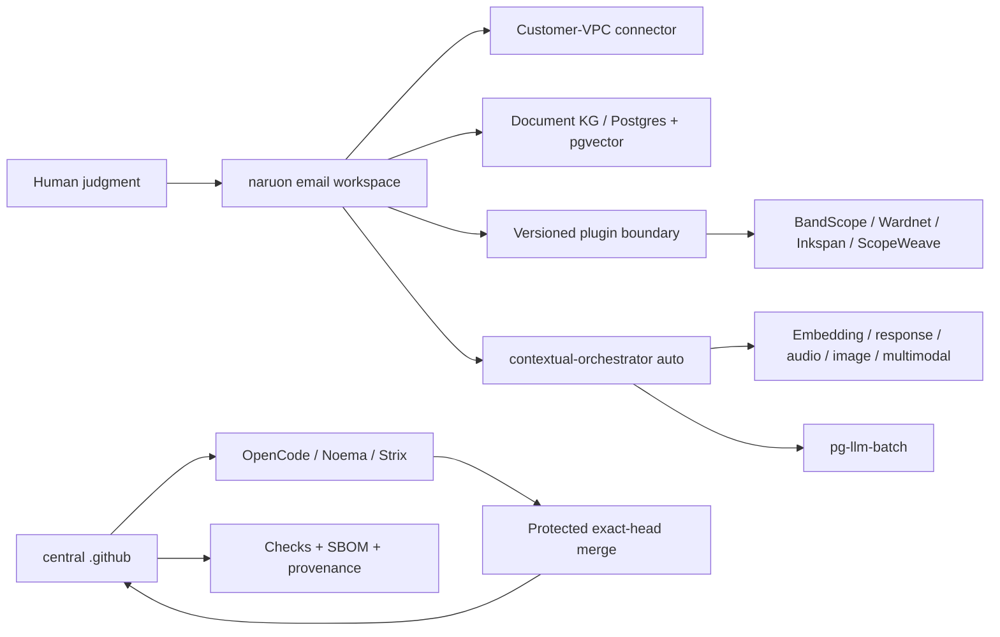

# Product and Technical Gap Baseline

작성 기준일: **2026-08-26 10:35 KST**
대상: **ContextualWisdomLab/.github** 중앙 거버넌스·자동화 레포지터리와 이를 소비하는 naruon 생태계
현재 보호된 `main`: `826b92394c63deb6981c3a8d16a724d71f85a0d7`
현재 열린 PR 수: **107** (아래 표에 이 스냅샷의 전체 목록 포함; live API 재수집)

이 문서는 제품·기술·운영 Gap을 현재 문서와 현재 GitHub 상태에 묶어 두는 기준선이다. 새 작업은 먼저 이 문서의 Gap ID를 PR 설명과 테스트 증거에 연결하고, PR의 정확한 exact HEAD·Checks·리뷰를 다시 수집한 뒤 구현한다. 표의 상태는 작성 시점의 관측값이므로, 병합 판단에는 재사용하지 않는다. 이 인벤토리는 스냅샷이며 merge authorization이 아니다.

## 1. 근거와 범위

### 1.1 우선순위가 높은 근거

1. [CWL Master Context](CWL-MASTER-CONTEXT.md): naruon의 이메일 우선 플랫폼 경계, DIKW, no-ask 자동 해결, 다층·다중소속·시간·프라이버시 원칙.
2. [naruon #974](https://github.com/ContextualWisdomLab/naruon/pull/974): `docs/planning/naruon-platform-plan.md`를 추가한 병합된 제품/IA/User Story/Use Case/Architecture 기준. 이슈 트래커의 Phase 항목은 ContextualWisdomLab/naruon#975–#980.
3. [GitHub Project #1](https://github.com/orgs/ContextualWisdomLab/projects/1): 로드맵의 live source of truth. 이 문서는 live project board의 상태를 반영하며, 세부 항목 수는 project에서 직접 확인한다.
4. 중앙 ADR·doctoring·계약 문서: [ADR-0002](adr/0002-product-technical-gap-baseline.md), [hourly NVIDIA NIM autofix](doctoring/hourly-nvidia-nim-autofix.md), [Strix cryptography override](../requirements-strix-ci-overrides.txt), [trusted uv lock materialization](doctoring/trusted-uv-lock-materialization.md), [product-technical gap doctoring](doctoring/product-technical-gap-baseline.md).

### 1.2 제품 경계

구매자가 사는 핵심 결과는 “흩어진 enterprise context를 판단 가능한 구조로 만들고, 사람이 다음 행동을 승인할 수 있게 하는 것”이다. naruon은 이메일 호스트나 전자결재 시스템이 아니라 고객 소유 데이터에 연결되는 이메일 workspace/platform이다. 중앙 `.github`은 제품 기능을 대신 소유하지 않고, 정확한 HEAD·리뷰·Checks·증거·변경권한을 보장하는 control plane이다.

핵심 구매 여정은 다음과 같다.

1. 여러 계정·언어의 이메일에서 한 사건의 thread와 sender 의미를 찾는다.
2. 변경된 일정의 최신 truth, 변경 이력, commitment status와 충돌을 계산한다.
3. work/personal/project/band 등 겹치는 norm group을 선택하고, 관계·권한·유효기간을 고려한다.
4. 다른 context에는 필요한 결과(예: unavailable)만 consent·audit 기반으로 공개한다.
5. 사람은 근거·confidence·다음 행동을 보고 예외만 수정하며, 외부 writeback은 승인한다.

### 1.3 Same-session open/close delta

스냅샷은 작성 시점의 open/close delta만 기록한다. 병합 판단에는 재사용하지 않는다.

## 2. PRD / TRD / UML 기준

### 2.1 PRD acceptance

| ID | 구매자가 확인할 결과 | 수용 증거 |
|---|---|---|
| PRD-01 | “이 메일/보낸 사람이 왜 중요한가”를 찾는다 | hybrid retrieval, sender ontology, source segment provenance |
| PRD-02 | 일정 이동과 RSVP/commitment 충돌을 놓치지 않는다 | temporal event history, confirmed > tentative > desired weighting, conflict test |
| PRD-03 | 같은 사람이 여러 조직·팀·밴드에 소속되어도 권한을 뒤섞지 않는다 | reified relationship, multi-membership/norm-group resolution, ecological-fallacy test |
| PRD-04 | private reason을 노출하지 않고 필요한 consequence만 공유한다 | consented minimal-disclosure bridge, audit trail, revocation test |
| PRD-05 | 사용자가 모델 선택을 관리하지 않아도 품질을 우선해 자동 라우팅한다 | contextual-orchestrator `auto`, capability-before-cost, unpriced-is-not-free evidence |
| PRD-06 | 결과를 독립 제품 또는 naruon plugin으로 동일하게 쓴다 | versioned manifest/API, connector contract, standalone/submodule integration test |

### 2.2 TRD target

- **Platform plane:** naruon web/API, customer-VPC connector, Postgres/pgvector document KG, plugin registry, versioned extension points.
- **Evidence/control plane:** central `.github`, OpenCode/Noema/Strix, exact-source and exact-head binding, bounded hourly loops, no credential fallback, protected merge.
- **AI plane:** contextual-orchestrator adaptive routing; role별 reasoning effort, workflow depth, recursion, decomposition, verifier/synthesis를 quality evidence에 따라 배분. Fugu, Conductor, TRINITY를 근거로 단일 모델 라우팅과 심층 다중 에이전트 오케스트레이션 사이에서 계산량을 배분한다. 속도는 최적화 목표가 아니다.
- **Compute plane:** 수리과학·psychometrics의 계산 레이어와 속도·안정성·보안이 핵심인 hot path는 Rust 경계를 우선 검토하며, GPU/CPU multithreading과 낮은 context switching을 benchmark로 입증한다. Python/JS는 orchestration/API adapter로 제한한다.
- **Data plane:** 모든 영속 객체는 두 단어 이상 `snake_case`를 기본으로 하고 3NF를 지키며, 관계·evidence·confidence·validity·disclosure를 별도 정규화한다. Hot partition 대비를 스키마에 둔다.
- **UX plane:** UI 제품만 Figma/Storybook/design token을 사용한다. 중앙 `.github`는 UI 없는 인프라 레포지터리이므로 Figma File ID는 **N/A (UI scope 없음)**이며, UI PR은 별도 ADR에 실제 File ID를 기록한다. UI-owning 저장소는 Storybook scene/edge-case event, Accessibility, Touch & Interaction, Performance, Style Selection, Layout & Responsive, Typography & Color, Animation, Forms & Feedback, Navigation Patterns, Charts & Data를 정의·검토·반영·적용·감사한다.

### 2.3 UML-level dependency

## 3. Gap register

우선순위는 구매자 체감, 보안/증거 위험, 선행 의존성 순서다.

| Gap ID | 현재 관측 | 구매자 영향 | 우선 구현/검증 |
|---|---|---|---|
| G-01 | 열린 PR은 107개다. metadata 상태는 BLOCKED=17, BEHIND=16, DIRTY=74, draft 13개다. 상태는 independent exact-head approval과 terminal required Checks를 자동으로 의미하지 않는다 | 안전하게 출시할 변경과 대기 중인 변경을 구별할 수 없다 | PR마다 current head, reviews, threads, required Checks, merge-result tree를 재수집하고 보호 조건 미충족이면 merge하지 않는다 |
| G-02 | protected `main`은 `826b92394c63deb6981c3a8d16a724d71f85a0d7`이며, BEHIND/stacked PR의 predecessor evidence를 current-head approval로 승격할 수 없다 | 리뷰가 호출돼도 승인 증거가 생성되지 않아 자동화가 멈춘다 | current-head quality와 OpenCode/Noema/Strix를 재실행하고, exact SHA·run ID·review commit SHA를 한 receipt에 묶는다 |
| G-03 | #1297은 Strix per-repository serialization과 scoped close cleanup을, #1345/#1347은 normalizer/web-E2E 안전성을 다룬다. 각 PR의 provider failure와 source/control-plane failure를 구분해야 한다 | 취약점 0건이어도 CI 인프라 결함이 보안 결과처럼 보이고 큐가 막힌다 | D3 교착 증거를 별도 수집하고, vulnerability marker는 절대 neutralize하지 않으며, 정상 gate 복구 후 exact-head hosted evidence를 재생성한다 |
| G-04 | 107개 live PR 중 16개가 BEHIND, 74개가 DIRTY이고 caller/Strix PR이 제품 기능보다 앞서 쌓였다 | 제품 개발 속도가 queue hygiene에 소모되고 stacking 순서가 불명확하다 | product/ownership boundary별로 stack을 재정렬하고, 오래된 PR은 current main으로 normal restack 후 변경 범위를 검증한다 |
| G-05 | ecosystem contract/catalog PR은 존재하지만 naruon의 실제 plugin 소비·standalone 실행·connector round-trip 증거가 제한적이다 | 구매자는 “연결 가능” 문서와 실제 설치 가능한 제품을 구별할 수 없다 | manifest/version compatibility, command/event envelope, consumer smoke, rollback/upgrade contract를 조직 유관 레포에서 증명한다 |
| G-06 | ContextualWisdomLab/naruon#974와 Project #1은 제품 목표를 정의하지만 E1/E2/E3의 live implementation evidence가 이 중앙 레포에 없다 | 이메일 검색·일정 충돌이라는 killer workflow가 문서에만 머문다 | naruon에서 thread/sender ontology → temporal commitment/conflict → human correction slice를 독립 PR로 delivery한다. 소유 저장소는 naruon이다 |
| G-07 | multi-level/multi-membership/temporal 관계 원칙은 master context에 있으나 모든 소비 저장소의 schema/API가 동일한 reified relationship contract를 보장하는지는 미확인이다 | 개인 단위로 집계하거나 전역 권한을 적용하는 atomistic/ecological fallacy 위험이 남는다 | relationship, membership, norm_group, validity window, evidence, confidence, disclosure를 정규화하고 cross-context golden tests를 만든다 |
| G-08 | embedding·DOM·sender/receiver 의미 단위 chunking과 base64 image의 OCR/object/tag/position-index 설계가 ecosystem contract에 부분적으로만 반영됐다 | 검색은 되지만 실제 그림 위치와 의미를 회수하지 못해 편집·문서·메일 업무가 끊긴다 | semantic unit chunk schema와 image asset/region/ocr/tag embeddings를 별도 entity로 설계하고 source offset/DOM path를 보존한다 |
| G-09 | 100% coverage/docstring은 중앙 PR별로 증거가 있으나 조직 소비 레포의 frontend interaction/i18n/design-token/real-data accuracy 증거가 동일한지 미확인이다 | “green CI”가 실제 고객 시나리오 정확성을 보장하지 않는다 | domain-specific RMSE/reproducibility/audio/visual/browser acceptance와 edge matrix를 required evidence로 만든다 |
| G-10 | math/psychometrics의 Rust+GPU/CPU path와 시간·다층·다중소속 모델은 fast-mlsirm/psychometrics-commons 등 제품 레포의 책임이다 | 계산 정확도·성능·모델 해석 가능성을 Python glue만으로 보장할 수 없다 | Rust core, GPU/CPU benchmark, temporal/multilevel/multiple-membership fixtures, RMSE/recovery/ablation을 제품 PR에 묶는다 |
| G-11 | UI가 있는 제품의 Figma/Storybook inventory와 token/interaction/i18n 테스트는 중앙 control plane에서 소유할 수 없다. Figma File ID는 이 저장소 ADR에서 N/A다 | 제품 간 UI가 달라지고 운영자 onboarding이 일관되지 않는다 | 각 UI repo가 실제 Figma File ID ADR, Storybook inventory, shared token package, keyboard/edge/i18n tests를 소유한다 |
| G-12 | CSAP/SOC 2 통제 목표와 PII masking 대안은 doctoring에 흩어져 있으며 evidence-to-control mapping의 live completeness가 미확인이다 | PII를 마스킹하면 업무가 멈추고, 원문 접근을 허용하면 감사·유출 위험이 커진다 | consent/purpose/access lease, field-level encryption/tokenization, redaction-at-egress, audit/revocation와 CSAP/SOC 2 evidence map을 구현한다 |
| G-13 | hourly scheduler는 존재하지만 no-op/credential unavailable/queued Checks의 customer next action을 모든 caller가 동일한 receipt로 내는지 미확인이다 | 자동화가 실패해도 운영자가 무엇을 고쳐야 하는지 알 수 없다 | `skipped_credential_unavailable` receipt와 다음 행동 문구를 exact-head Checks로 검증하고, bounded receipt schema, retry floor, single-flight, no secret fallback을 모든 caller contract test로 고정한다 |
| G-14 | release/changelog/version 증거가 각 PR에 분산되고 현재 central repo 보호 main의 release candidate가 명확하지 않다 | 운영자는 어떤 기능이 supportable release인지 확인할 수 없다 | merge 후 release readiness ledger, CHANGELOG, semantic version/tag, rollback/operability evidence를 함께 갱신한다 |
| G-15 | 첨부파일 처리 경계가 제품별로 다르고, 1MB 상한은 업무 데이터와 맞지 않으며 미지원 MIME/컨테이너가 parser registry에서 명시적으로 pending/quarantine 되는지 확인되지 않았다. 현재 20MB 초과 파일 가능성과 PDF/HWP/HWPX·이미지·압축파일의 parse/sidecar 흐름을 하나의 exact contract로 묶지 못했다 | 큰 업무 첨부를 거부하거나 파싱 실패를 조용히 잃으면 고객의 메일·문서 업무가 중단된다 | naruon/newsdom-api 소유 PR에서 streaming upload, configurable bounded limit above 20MB, MIME sniffing, parser capability registry, quarantine/retry, source-position provenance, and ADR를 추가하고 size/unsupported-type/zip-bomb tests를 required evidence로 만든다 |

## 4. 열린 PR live inventory

아래는 GitHub API가 2026-08-26 10:35 KST에 반환한 107개 열린 PR의 number/title/exact head/base/metadata/review 상태다. 이 표는 관측 스냅샷이며 merge authorization이 아니다. 모든 병합 판단은 각 PR의 exact head에서 required Checks, unresolved thread, 독립 승인과 merge-result tree를 다시 확인한다.

스냅샷 요약: total 107; BLOCKED=17, BEHIND=16, DIRTY=74; draft=13

| PR | title | exact head SHA | base | metadata | review | mode |
|---|---|---|---|---|---|---|
| #1347 | fix(security): isolate web E2E commands and readiness probes | `c50e26be529f473e6cdbce6dd9a7540cb750e7a0` | `main` | BLOCKED | REVIEW_REQUIRED | ready |
| #1345 | perf(normalize): scan verification labels once | `db50914fc274dc78e33e7882ca81c18ede6be2eb` | `main` | BLOCKED | REVIEW_REQUIRED | ready |
| #1343 | ci: add semantic-data-portal hourly review-repair caller | `b296a00aad13f6da7c1e25ac1083e732f8c8e1c2` | `main` | BLOCKED | REVIEW_REQUIRED | ready |
| #1341 | feat(inkspan): add protected hourly review-repair caller at minute 56 | `7d4440ca6c2e83fbb502b891125093a60385ce91` | `main` | BEHIND | REVIEW_REQUIRED | ready |
| #1338 | ci: add psychometrics-commons hourly review repair dispatch | `d1091841f67855bda40f093126b08e218c7b44e1` | `main` | BLOCKED | REVIEW_REQUIRED | ready |
| #1336 | fix(coverage): trust validated head-mutated pnpm locks via manifest record | `20c744fd96659896ee099dd1cec674e49643d415` | `main` | BLOCKED | REVIEW_REQUIRED | ready |
| #1326 | feat(hourly): onboard appguardrail + macos_utility_packs review-repair callers | `dfa980c3f019fe4ff8295fe509a27a08d571f519` | `main` | BEHIND | REVIEW_REQUIRED | ready |
| #1314 | fix(e2e): restrict readiness polling to loopback destinations | `0f0adf88d3675991d14f25b2c594a4a30d9b4679` | `main` | BLOCKED | CHANGES_REQUESTED | ready |
| #1310 | chore(deps): bump google/osv-scanner-action/.github/workflows/osv-scanner-reusable-pr.yml from 3a7550f43ba5b58905a821ce3a0ed24c4858b3f4 to ffa0a5f39214d80778c9b494822d94d0d9668458 | `da66ab78463702020c721f4b90955ca456370c60` | `main` | BEHIND | REVIEW_REQUIRED | ready |
| #1309 | chore(deps): bump google/osv-scanner-action/osv-reporter-action from 8dc09193bb540e09b23da07ad7e30bd33bf87018 to ffa0a5f39214d80778c9b494822d94d0d9668458 | `12bdd489c3d4160f5aa66be72e57724ad7e99b79` | `main` | BEHIND | REVIEW_REQUIRED | ready |
| #1308 | chore(deps): bump actions/download-artifact from 7.0.0 to 8.0.1 | `a09db618298ada330ff504707ce7f29d88c3a6d5` | `main` | BLOCKED | REVIEW_REQUIRED | ready |
| #1307 | chore(deps): bump github/codeql-action/upload-sarif from 4.37.4 to 4.37.8 | `f86dbd7d7ac7e609c4161c1779fb1d1cda85a2b3` | `main` | BEHIND | REVIEW_REQUIRED | ready |
| #1306 | chore(deps): bump github/codeql-action/analyze from 4.37.0 to 4.37.8 | `5f3140f8ba61fb69bcc2160d7b015332b870cdb4` | `main` | BEHIND | REVIEW_REQUIRED | ready |
| #1304 | chore(deps): bump google-cloud-storage from 3.12.1 to 3.13.1 | `2a1882bd2b3d89df4c8758fcd0f2db4313af2a8d` | `main` | BEHIND | REVIEW_REQUIRED | ready |
| #1303 | chore(deps): bump coverage from 7.14.3 to 7.15.4 | `500f264dcdca835aba1cf1ae7b84728953e7a120` | `main` | BLOCKED | CHANGES_REQUESTED | ready |
| #1298 | fix(strix): normalize direct fallback and redaction pass | `72fbf8a628533bcb8f6bf6eb0e7c9d98364f5a57` | `main` | DIRTY | CHANGES_REQUESTED | ready |
| #1297 | fix(strix): serialize scans per repository to stop shared-key rate-limit storms | `3d92db82540871c7bb5f5b4d9e26be8ad42e0f96` | `main` | BLOCKED | CHANGES_REQUESTED | ready |
| #1294 | docs: refresh live product-technical-gap-baseline | `efb3ad3d7dd1202f95849bcc23bf8027baeb3cd1` | `main` | BLOCKED | REVIEW_REQUIRED | ready |
| #1288 | ci: add LineageWeave hourly review-repair scheduler | `5cd507f8ffdfca13718e5dd44aaa02f4dcb3d6a4` | `main` | BLOCKED | CHANGES_REQUESTED | ready |
| #1280 | feat(ci): add a bounded subprocess primitive | `70ad61fd3e1f8aac64497bc6776f6a736de11ca6` | `main` | BEHIND | CHANGES_REQUESTED | ready |
| #1279 | fix(noema): fail closed at the credential egress boundary | `721a36f24616343029a291f02db32610f470a884` | `main` | DIRTY | CHANGES_REQUESTED | ready |
| #1276 | chore(security): unify OSV Action v2.5.1 | `26187df510898277f8bf6f0e98b7d5e53c41abd1` | `main` | DIRTY | CHANGES_REQUESTED | ready |
| #1275 | chore(security): unify Scorecard Action v2.4.4 | `dd545212c105b285ba7be548e0199828a8085782` | `main` | DIRTY | CHANGES_REQUESTED | ready |
| #1274 | chore(security): unify CodeQL Action v4.37.7 | `1da2fce5a10c5036cb4c305b60b63594b0a446fd` | `main` | DIRTY | CHANGES_REQUESTED | ready |
| #1273 | fix(opencode): retain adversarial fallback scope | `3ab55c3da0e9b05c6cc9e80fc3d5fe89a6f53b84` | `main` | DIRTY | CHANGES_REQUESTED | ready |
| #1272 | security(deploy-pages): enforce explicit caller contract | `b544d9c4433603a022df925809f3128ecefd5651` | `main` | DIRTY | CHANGES_REQUESTED | ready |
| #1271 | fix(scheduler): fail after summarized action errors | `8cb926fc31ca27e47192b37c968ea699fd9ecf2c` | `main` | DIRTY | CHANGES_REQUESTED | ready |
| #1270 | fix(scheduler): require independent exact-head approval | `ad01b4e69eae8a149560bc39e60bb693ab9028eb` | `main` | DIRTY | CHANGES_REQUESTED | ready |
| #1267 | feat(automation): repair Inkspan reviews hourly | `34efa03ecec7d815d8e6a4f7354767208fb1ce4a` | `main` | BEHIND | CHANGES_REQUESTED | ready |
| #1264 | perf(redaction): skip invalid key rescans without masking diagnostics | `a32e394af3effca5c93a759912ad9f112a50a079` | `main` | BEHIND | CHANGES_REQUESTED | ready |
| #1263 | fix(strix): make Azure and cross-provider fallbacks executable | `ab3d764547082e1b55b6257cc1cd9aa5d951fa30` | `main` | DIRTY | CHANGES_REQUESTED | ready |
| #1257 | fix(osv): keep base scan results across fork checkout | `20d72bc838d7f91b74ce01bb4de16d07144fa270` | `main` | DIRTY | CHANGES_REQUESTED | ready |
| #1246 | fix(opencode-review): accept int-typed run_id/run_attempt in control JSON | `f88499b708a90edb6a538aeb2c397e14304681ad` | `main` | DIRTY | CHANGES_REQUESTED | ready |
| #1245 | fix(scheduler): retry and gracefully defer shared installation rate limits | `7046ba98c2d8b243713aaec9b0bf9bd98d6c97b6` | `main` | DIRTY | CHANGES_REQUESTED | ready |
| #1242 | fix(security): preserve exact CI evidence while redacting provider secrets | `9bdfcbdaf4d079de3b346e1584dd505c5043afd3` | `main` | DIRTY | CHANGES_REQUESTED | ready |
| #1238 | fix(scheduler): stop repository_dispatch defaulting review/merge/branch flags off | `21b4c58577d54aed299cf0d2dc30a0ee80ff0902` | `main` | DIRTY | CHANGES_REQUESTED | ready |
| #1233 | fix(automation): restore hourly fleet coordination | `54ab5bb799bfa148ca1a8b0b760b7e4365597aaf` | `main` | BEHIND | CHANGES_REQUESTED | ready |
| #1231 | fix(scheduler): isolate central Actions inventory quota | `7b16617af04431a43f8f7528b8ac7db345e404a7` | `main` | DIRTY | CHANGES_REQUESTED | ready |
| #1227 | fix(opencode): use same-repo status credential | `5974bee1dbc2f28b33f69f1aab08066bdedaab70` | `main` | DIRTY | CHANGES_REQUESTED | ready |
| #1215 | fix(security): redact agent-mention credential diagnostics | `785401dc911e0a53ef301d1900c1825147f9524a` | `main` | DIRTY | CHANGES_REQUESTED | ready |
| #1198 | fix(security): repair pip audit and schedule orchestrator review | `27a8bd5f8bd60c9f3f70ec43ce2f2f62f7dc71ae` | `main` | BLOCKED | CHANGES_REQUESTED | ready |
| #1188 | fix: grant hourly callers reusable workflow OIDC scope | `1a0cc1f875db29492861006747ded2b6d9e93d09` | `main` | DIRTY | REVIEW_REQUIRED | ready |
| #1187 | fix(coverage): scope Rust evidence to changed packages | `0a88e24d9a1c92420f412d241f850aab8e72106e` | `main` | DIRTY | REVIEW_REQUIRED | ready |
| #1176 | fix(governance): preserve proposal branch create transition | `437ea84d1c4f7af7b02b001e9d20d9749d96df54` | `main` | BLOCKED | CHANGES_REQUESTED | ready |
| #1172 | fix(autofix): resolve live NVIDIA NIM models instead of a retired pin | `edab578feca63c223368aef17c175bb52ce22e5a` | `main` | DIRTY | REVIEW_REQUIRED | ready |
| #1170 | feat: route OpenCode reviews through contextual gateway | `199e655c242decd9bbbc6d28d3945dcc7af24804` | `main` | DIRTY | REVIEW_REQUIRED | ready |
| #1166 | fix(ci): recognize replacement tests in existing files | `7986334aacb2bc8e5d794d581202f47c91e4875e` | `main` | DIRTY | CHANGES_REQUESTED | ready |
| #1162 | fix: use review credentials for agent dispatch | `4a7031d7adbba759742605deb1c78d10aef16e7d` | `main` | BEHIND | REVIEW_REQUIRED | ready |
| #1161 | fix: make hourly coordinator credential absence auditable | `49bc5e4a59cd30550f87070b48b61e966ac480e1` | `main` | DIRTY | CHANGES_REQUESTED | ready |
| #1158 | fix(osv): preserve immutable direct-source provenance | `5addc9250488cbbb039e3f73f0fa58d7eafc0c61` | `main` | BEHIND | CHANGES_REQUESTED | ready |
| #1150 | feat: add read-only Actions queue health evidence | `efa7788bd14e3513221577566a768fc36f03ccff` | `main` | DIRTY | REVIEW_REQUIRED | ready |
| #1147 | feat(integration): add ecosystem capability catalogue | `113de5eb71ff9e06c00f4c272266662dcbd97392` | `main` | DIRTY | REVIEW_REQUIRED | ready |
| #1146 | fix(figma): retain style references and component sets | `8ffdf4d8150091957a79b5fc63c984e927d323b3` | `main` | DIRTY | REVIEW_REQUIRED | ready |
| #1143 | ci: schedule naruon hourly review repair | `9c2842ab1d49bb1ed74683bc52c0e213eb5d5bc7` | `main` | DIRTY | REVIEW_REQUIRED | ready |
| #1123 | feat(edge): standardize organization runtimes on Cloudflare Pingora | `251b16836164cfcfc0914a568d514cc7b6a9dd6d` | `main` | DIRTY | REVIEW_REQUIRED | ready |
| #1120 | Wire Noema to a same-job contextual-orchestrator sidecar | `101e6906cc3568beb99c19c28eaffb526bac335b` | `main` | DIRTY | REVIEW_REQUIRED | draft |
| #1114 | fix(strix): retry transient visibility API failures | `02f6e4fdb1990369574dfa99afdb5c086a97e70d` | `main` | DIRTY | REVIEW_REQUIRED | ready |
| #1112 | fix(storage): reject embedded IPv4 rebinding hosts | `dc7e39cf7dff80c2e2ed8d348090394ddc643142` | `main` | DIRTY | REVIEW_REQUIRED | draft |
| #1108 | feat(automation): run free-router hourly NVIDIA NIM review repair | `df5ae0b1fff42205627b4af556c7e95e87138b7a` | `main` | DIRTY | REVIEW_REQUIRED | ready |
| #1104 | chore(deps): bump charset-normalizer from 3.4.7 to 3.5.1 | `d90c8320bcce63269f1ab6368f1073841c157363` | `main` | BEHIND | REVIEW_REQUIRED | ready |
| #1103 | chore(deps): bump google-cloud-resource-manager from 1.17.0 to 1.18.0 | `6c8118cb46cbac9c974c9b7ffff53cbbc9ac3b19` | `main` | BEHIND | REVIEW_REQUIRED | ready |
| #1101 | feat(automation): run EmbedRelay hourly NVIDIA NIM review repair | `77557a9e35d6467a9b8fcbc25e7e73f90683383c` | `main` | DIRTY | REVIEW_REQUIRED | ready |
| #1100 | feat(automation): run RankWeave hourly NVIDIA NIM review repair | `e9ccfd21f1efd13da03e72664d0585dffc1dac00` | `main` | DIRTY | REVIEW_REQUIRED | ready |
| #1097 | feat(automation): run html4tree hourly NVIDIA NIM review repair | `627b7ade1a4875addb7e38c0726bd6fd82f01511` | `main` | DIRTY | CHANGES_REQUESTED | ready |
| #1095 | feat(automation): run mhtml-etl-gateway hourly NVIDIA NIM review repair | `715935b45cf2688235e40be6b44c595af45d27e1` | `main` | DIRTY | REVIEW_REQUIRED | ready |
| #1094 | feat(automation): run DiagramWeave hourly NVIDIA NIM review repair | `455f2e76f15c5d0e7040777fc22ea4994d850925` | `main` | DIRTY | REVIEW_REQUIRED | ready |
| #1092 | feat(automation): run psychometrics-commons hourly NVIDIA NIM review repair | `6c330dbfbede45acb41972f1d384ef586b83c2b8` | `main` | DIRTY | REVIEW_REQUIRED | ready |
| #1088 | feat(automation): run mightyETL hourly NVIDIA NIM review repair | `d955cb949329f3bc3726c440542f549fe2978209` | `main` | DIRTY | REVIEW_REQUIRED | ready |
| #1087 | feat(automation): run life-os hourly NVIDIA NIM review repair | `37377d0a19dfae9739ae2e0a845b8270303b38be` | `main` | DIRTY | REVIEW_REQUIRED | ready |
| #1085 | feat(automation): run kaefa hourly NVIDIA NIM review repair | `3e6c94603a6332b066e0be962aab23991987e094` | `main` | DIRTY | REVIEW_REQUIRED | ready |
| #1083 | feat(automation): run pg-llm-batch hourly NVIDIA NIM review repair | `584141341346b7882fded053b459a7d4c16477a2` | `main` | DIRTY | REVIEW_REQUIRED | ready |
| #1082 | feat(automation): run semantic-data-portal hourly NVIDIA NIM review repair | `dbfdbbf3547b4c84bb5c2a1760ecfda080751546` | `main` | DIRTY | CHANGES_REQUESTED | ready |
| #1080 | feat(automation): run newsdom-api hourly NVIDIA NIM review repair | `54f53fcad5a241de28aa272d5775e98bf0b9ca00` | `main` | DIRTY | REVIEW_REQUIRED | ready |
| #1079 | feat(automation): run Appguardrail hourly NVIDIA NIM review repair | `d13ff905cd0d4d814cc2e5f2b5e54dd3d1522f0c` | `main` | DIRTY | CHANGES_REQUESTED | ready |
| #1078 | feat(automation): run Scopeweave hourly NVIDIA NIM review repair | `26b684bc231bff24c19b71ddc8302e551f843ebf` | `main` | DIRTY | REVIEW_REQUIRED | ready |
| #1077 | feat(automation): run noema hourly NVIDIA NIM review repair | `a91c94f1c9d92430241e2cf1302286a83310fe37` | `main` | DIRTY | CHANGES_REQUESTED | ready |
| #1076 | feat(automation): run pg-erd-cloud hourly NVIDIA NIM review repair | `e280e2402e9d4fcd7a17e951e944c85bacd5bd61` | `main` | DIRTY | REVIEW_REQUIRED | ready |
| #1075 | feat(automation): run codec-carver hourly NVIDIA NIM review repair | `618813098dfd8e8186bc7e3277004d76e9ae5d56` | `main` | DIRTY | CHANGES_REQUESTED | ready |
| #1074 | feat(automation): run Keyverse hourly NVIDIA NIM review repair | `c70ff9369f9b49b3e961fe1f63d0204e713400f5` | `main` | DIRTY | REVIEW_REQUIRED | ready |
| #1070 | feat(automation): run Wardnet hourly NVIDIA NIM review repair | `9c752db19fa91b320a74da6c8bd0fbe6d03bce1e` | `main` | DIRTY | CHANGES_REQUESTED | ready |
| #1065 | fix(scheduler): fall back to REST when auto-rebase GraphQL transport fails | `ff661f115ae0c6f41e7a2fab304ace3e648b3988` | `main` | DIRTY | CHANGES_REQUESTED | ready |
| #1062 | fix(strix): map official modes without branch-selected dispatch | `74079e5bddd69bf7eac6d3b2492f25d598517905` | `main` | DIRTY | REVIEW_REQUIRED | draft |
| #1061 | fix(scheduler): ignore manual Strix dispatch as merge evidence | `03c087804eec7f4b520ffc3f61b49edba2dc8378` | `main` | DIRTY | REVIEW_REQUIRED | draft |
| #1060 | fix(opencode): prove asyncio coverage plugin without colliding #896 | `a27ae0ac907c04c300ed978e35538e26c094a682` | `main` | DIRTY | REVIEW_REQUIRED | draft |
| #1058 | fix(operability): reject impossible control-plane SLI counts | `0fd148a8fa2b7acc098eb9741b8d8cea92058ef1` | `main` | DIRTY | REVIEW_REQUIRED | draft |
| #1053 | fix(redaction): skip gh run view job/step prefixes | `15fa991d8a99743a640a26665d278bc159653065` | `main` | DIRTY | REVIEW_REQUIRED | draft |
| #1052 | fix(opencode): split review surfaces, give NIM two hours, and remove GitHub Models | `abf47ce275fd8c1efa8306d30f1d6afbadd989ab` | `main` | DIRTY | REVIEW_REQUIRED | ready |
| #1051 | fix(pip-audit): keep index-url locks hashed and reject symlink parents | `82629751751b82bee88d000ded32b6f141125849` | `main` | DIRTY | CHANGES_REQUESTED | ready |
| #1050 | fix(security): reject dot path components before dependency-review compare | `ee5c15711f0b0a346bb19a634288a49fcd981fab` | `main` | DIRTY | REVIEW_REQUIRED | draft |
| #1046 | fix(opencode): pass trusted visibility into the private free-model hook | `f053ba84ff7dc92c5dbdef2ca1597cd04372dd6b` | `main` | DIRTY | REVIEW_REQUIRED | draft |
| #1036 | fix(ci): bind stub-scan evidence and cap hourly fleet work at 12 | `d8205b139f8396c0452ecd4cc9b95caa45a56f42` | `main` | BEHIND | REVIEW_REQUIRED | draft |
| #1035 | docs(automation): retarget closed-unmerged #840 and #906 lineage | `cb5e2ee03b9f75857e2ce31690fc76de76ad9cc1` | `main` | DIRTY | REVIEW_REQUIRED | draft |
| #1027 | fix(automation): stop mention sweep on already-exceeded rate limits | `d046637834d6d9720852423c3cdb5ef79faa1fe3` | `main` | DIRTY | REVIEW_REQUIRED | draft |
| #1026 | feat(actions): inventory orphaned workflow identities | `1be76989887ab772e3ce0d2e0c7f22d3ca98dd94` | `main` | DIRTY | CHANGES_REQUESTED | ready |
| #1015 | fix(coverage): defer interpreter-specific wheel gaps | `ce28ffba511cb7e2a5135e6f862164834c0f874b` | `main` | BEHIND | CHANGES_REQUESTED | ready |
| #1009 | fix(strix): bind evidence to exact workflow artifacts | `99fee8b1b4ff4fc2219b98561cc4fea851c2f03a` | `main` | DIRTY | CHANGES_REQUESTED | ready |
| #991 | fix(automation): reuse review node_id for mention eyes | `b6303e081756b9598316cdf07f84c038924f0427` | `main` | DIRTY | REVIEW_REQUIRED | draft |
| #949 | fix(opencode-review): discover multi-line run: blocks in safe_pytest_command | `75c6dbdfde34ac7e729e83f44aa0261e76f475d4` | `main` | BEHIND | CHANGES_REQUESTED | ready |
| #941 | fix(semgrep): make the pinned image digest authoritative | `ce95934f7bbdd6d5022065f6ec01e3de46895618` | `main` | BEHIND | CHANGES_REQUESTED | ready |
| #939 | fix: keep cross-repo OpenCode evidence healthy | `2d267d48ab78b0cf8621604ff49839b6f795e610` | `main` | DIRTY | CHANGES_REQUESTED | ready |
| #933 | fix: retry Strix provider tool protocol failures | `b260fd3e17a0c6363d2584110314e44eaf1dfd11` | `main` | DIRTY | CHANGES_REQUESTED | ready |
| #932 | fix(sbom): preserve Markdown report integrity | `f8b94d0dfb02c64761df07ebdf658eb4e1d8abc5` | `main` | DIRTY | CHANGES_REQUESTED | ready |
| #897 | fix(security): fail closed on unavailable dependency review | `47fe3ddbaa46bcc50b090b5fd4bbe84830d6387c` | `main` | BLOCKED | CHANGES_REQUESTED | ready |
| #834 | fix(noema): validate stable OIDC exchange envelope | `1a202f9745e90280e3b1bbdead4f78320ba413fc` | `main` | DIRTY | CHANGES_REQUESTED | ready |
| #821 | fix(opencode): reap fatal provider process groups | `e1eb67926d9143730054c1fc9f1ef82dc5ef4a0c` | `main` | DIRTY | CHANGES_REQUESTED | ready |
| #790 | fix(coverage): retry transient trusted uv downloads | `463ddbad84ee40f56f2196af2aa41f1dd4100907` | `main` | DIRTY | CHANGES_REQUESTED | ready |
| #789 | feat(coverage): add bounded PyO3 peer-evidence gate | `3ffde3c5d3c98f0c840abcba151af08cf0255b46` | `main` | DIRTY | CHANGES_REQUESTED | ready

## 2026-08-25 central Strix fallback contract recheck

- `main` at `a724582a0768129d481385070bf8f05b2620dd2c` changed the direct-OpenAI
  fallback to `gpt-5.4`, but the required-workflow smoke script still required
  the retired `gpt-5.6-luna` string. The privileged OpenCode model pool also
  retained the retired candidate while its contract tests expected `gpt-5.4`.
- This exact mismatch caused consumer Strix checks to fail before scanning the
  target repository; it was observed on ContextualWisdomLab/disksage#247 at
  exact head `a9c868a6e9c8d68a9c6ea6de381e188740b8f5db`. The focused repair keeps
  provider errors and vulnerability findings fail-closed and only aligns the
  executable model and its assertions.

## 2026-08-27 contextual-orchestrator vendored sidecar (ZDR-first free pool)

- **Gap G-ORCH-027 (closed by this increment):** central review pinned direct
  provider endpoints and hard-coded model ids; no path used the org's five-key
  auto model discovery, the `orchestrator/free` fail-closed zero-cost pool, or
  ZDR-first selection. The 2026-08-18 org decision
  (`ContextualWisdomLab/contextual-orchestrator` AGENTS.md) migrated
  OpenCode/Noema/Strix to the gateway; this snapshot lands the org-repo half.
- `pr-review-autofix.yml` now provisions
  `scripts/ci/contextual_orchestrator_review_sidecar.sh` (snapshot pinned SHA
  `8d5924f8…`, same-process KV registration of `BYTEZ_API_KEY`,
  `NVIDIA_NIM_API_KEY`, `NVIDIA_NIM_API_KEY_SUB`, `OPENROUTER_API_KEY`,
  `OPENAI_API_KEY`, live auto model discovery, ZDR-prioritized free catalog),
  and the writer runs `--model contextual-orchestrator/orchestrator/free`.
  `opencode.jsonc` default route changes identically. Companions:
  `zdr_policy.py`, `contextual_orchestrator_review_policy.py`,
  `contextual_orchestrator_review_launcher.py`; records
  `docs/adr/0003-…`, `docs/doctoring/contextual-orchestrator-vendored-sidecar.md`.
- At the time of this 2026-08-27 snapshot, the remaining follow-up was the
  read-only dispatch pool, `noema-review.yml`, and `strix.yml` migration. This
  historical observation is superseded by the current-main evidence below.

## 2026-08-28 current-main routing and runtime recheck

- Current protected main is `8f84b661e468de451ba5c076dc938f342bf52d70`,
  the merge commit for #1373 (following #1370 at
  `24ee38b097dbfc1a895e1199ade48cff36431d05`). #1364 is merged at
  `f8823a544c3c4c046977f8511f683e85f83eb496`; #1360 is merged at
  `17052a7ca3c16db90932a4d6036b43165ddee418`.
- The current Required OpenCode dispatch, `noema-review.yml`, `strix.yml`,
  and write-capable `pr-review-autofix.yml` all provision the pinned
  `contextual-orchestrator` sidecar. Their model route is the
  `contextual-orchestrator/orchestrator/free` gateway, with the five provider
  secrets entering the sidecar KV and model discovery performed there. No
  `COPILOT_GITHUB_TOKEN` route is present.
- #1364 was merged by `seonghobae` while its terminal review decision remained
  `CHANGES_REQUESTED`; this is an observed merge event, not protected-main
  governance evidence. The required branch checks still include
  `noema-review` and `opencode-review`.
- Post-merge Strix run `33139957477` exposed a real sidecar runtime defect:
  `contextual_orchestrator.orchestrator.load_agents()` requires an
  `{"agents": [...]}` catalog envelope, while the launcher wrote a bare list.
  Follow-up #1370 fixes the launcher and the standalone policy catalog writer.
  Its exact head `0f40d415b112ca0055f5db5b2f434788b08f01f1` merged as
  `24ee38b097dbfc1a895e1199ade48cff36431d05`.
- #1370's earlier PR-target Noema run `33140830199` executed the pre-fix trusted
  base launcher and is retained only as bootstrap reproduction evidence. A
  fresh protected-main canary must start the corrected sidecar and reach the
  scanner before the runtime gap is closed; queued or cancelled jobs do not
  satisfy that acceptance boundary.
- Protected-main Strix run `33141468804` crossed the corrected catalog and
  sidecar boundary, then LiteLLM rejected the unqualified scanner child model
  `orchestrator/free` because the provider was not explicit. The follow-up maps
  only that child to `openai/orchestrator/free` when the API base is the pinned
  loopback gateway; the public gateway model remains
  `contextual-orchestrator/orchestrator/free`, and absent, empty, or non-pinned
  bases fail closed. This is reproduction evidence, not operational acceptance.
- #1370 merged with no `APPROVED` review; all recorded Reviews API verdicts are
  `COMMENTED`. That governance contradiction is tracked in #1340 and is not
  retrospective approval evidence for this runtime correction.
- #1373 merged the model qualification as `8f84b661…` but retained the raw
  bearer in `GITHUB_ENV`, so its log-exposure claim is contradicted by source.
  #1369 preserves the merged model behavior while moving cross-step credential
  transport to a validated mode-0600 file. Fresh protected-main Strix and Noema
  evidence is still required after that stronger boundary integrates.

## 2026-08-28 post-#1373 request-envelope recheck

- #1373 was merged by `seonghobae` at `8f84b661e468de451ba5c076dc938f342bf52d70`
  to exercise the post-merge runtime path. Main Strix run `33143805461`
  reached the contextual-orchestrator sidecar and sent the qualified
  `openai/orchestrator/free` request, then failed closed with HTTP 413
  `request_too_large` from the pinned gateway. This proves the earlier model
  qualification defect was repaired, but the review request envelope was
  still smaller than the Strix/Noema tool-and-source context.
- The fix is scoped to the review launcher: use an explicit bounded 8 MiB
  `SecurityConfig.max_body_bytes` for the sidecar while preserving the
  contextual-orchestrator library's generic 64 KiB default. Noema run
  `33143860315` was a successful `workflow_run` event handler but skipped
  because the push event had no associated pull request; it is not an LLM
  verdict.

## 2026-08-28 #1374 trusted-base runtime boundary

- Follow-up PR #1374 merged at head
  `3d7cf123ea7459b7f0082bb354280288866256db` with merge commit
  `7c55295ff2dd863d983822d991e67ba037e8f186`; its launcher sets the bounded
  8 MiB review envelope, and its sidecar boot check validates that keyword
  against the exact pinned orchestrator SHA before discovery. Its terminal
  review decision was not an independent `APPROVED`, so this remains an
  observed merge event rather than protected-main governance proof.
- PR-target Strix run `33145070402` used trusted workflow source SHA
  `8f84b661e468de451ba5c076dc938f342bf52d70`, not the PR launcher. It reached
  the pinned sidecar and then failed three bounded attempts with HTTP 413
  `request_too_large`; this is evidence of the pre-merge trusted-base path,
  not evidence that #1374's launcher setting failed.
- PR-target Noema run `33145070347` also reached the pinned sidecar and set
  `orchestrator/free`, then skipped before the LLM call because the current
  head had no primary OpenCode approval. Required OpenCode run `33145070315`
  failed closed for the same missing current-head verdict. Therefore the
  PR-target result was not an LLM verdict.
- Post-merge Strix run `33145807836` used trusted workflow source SHA
  `7c55295ff2dd863d983822d991e67ba037e8f186`, reached
  `openai/orchestrator/free`, and produced no HTTP 413 or
  `request_too_large`. It failed closed after three bounded attempts because
  the Strix Caido target was unavailable at `127.0.0.1:48080`, reported as
  `STRIX_PROVIDER_UNAVAILABLE`; this proves the request-envelope fix on main,
  but not a successful end-to-end vulnerability scan.

## 2026-08-28 OpenAI request-envelope specification check

- OpenAI's official API reference models a function-tool `description` as an
  optional string and does not publish a universal 1024-character field limit.
  The official OpenAPI document also contains no `413` or
  `request_too_large` response definition for the inference operations. The
  `413 Content Too Large` observed above is therefore the vendored gateway's
  HTTP framing response, not evidence of an OpenAI tool-description rule.
- OpenAI's current images-and-vision guide specifies up to 512 MB total payload
  for an image-input request and accepts an image URL, Base64 data URL, or file
  ID in ordinary model-input JSON. The Files API separately permits 512 MB per
  uploaded file, and Batch separately permits 200 MB JSONL files. These are not
  one universal limit for every JSON endpoint. The sidecar's 8 MiB limit is an
  explicitly local, bounded policy for text/tool review envelopes and is not
  claimed to provide general multimodal compatibility: a large inline Base64
  image can fail locally even though a URL or file ID keeps the JSON small. A
  future general multimodal proxy needs a separately governed streaming/spooling
  and provider-capability contract; `/files` alone does not cover inline image
  data URLs. The pinned-SHA probe accepts a body of 65,609 bytes and preserves
  1,025-, 1,026-, and 2,000-character tool descriptions byte-for-byte;
  provider/model context failures remain separate runtime evidence.
- PR #1379 exact head `4a25c46dc2fe046368f304a589885ebffb757dfc`
  reached the pinned sidecar in Strix run `33150437853`; sidecar provisioning
  and the request-envelope preflight passed, but all three scanner attempts
  received HTTP 500 `internal_error` (request IDs
  `7ef2a6bfd7494f80adbf9109b2f5dea2`,
  `193276c218884651a3940dd9a30bcf97`, and
  `ff529b84b101458eae03287d3e8df52d`). No 413 or vulnerability report was
  emitted, so this is an incomplete provider/backend result rather than proof
  of either request-size rejection or scan success. The pinned server currently
  collapses otherwise-unhandled provider exceptions into that generic 500.
  Contextual-orchestrator PR #904 is the separately governed candidate that
  classifies upstream request-size rejection, retries eligible members of the
  virtual `orchestrator/free` pool, and returns `request_too_large` only after
  eligible-provider exhaustion. The sidecar pin must remain on protected main
  until that change is merged and then be reverified by a fresh exact-head
  Strix run.

## 2026-08-29 512 MiB review-envelope bootstrap

- Contextual-orchestrator PR #904 head `6cd7d57c177d945f67ba3b86b699949584bc6b7e`
  passed its full unit/contract suite, Required bootstrap, Noema, fuzz, and
  security checks with zero unresolved review threads. Its Required Strix ran
  the pre-change `.github` main sidecar pin and failed three times with generic
  HTTP 500 responses and no vulnerability report; Required OpenCode failed
  closed because no current-head formal verdict existed. The bootstrap cycle
  was resolved by an explicitly authorized admin merge to protected-main commit
  `b21645116b352967e50fc497b87eb745b9cc8c61`; this is an observed bootstrap
  merge, not ordinary protected-governance proof.
- `.github` PR #1379 then pinned that protected-main orchestrator commit and
  changed only the loopback, bearer-authenticated, per-job review sidecar from
  the prior 8 MiB local envelope to the OpenAI image-input ceiling of 512 MiB.
  The generic orchestrator default remains 64 KiB; Files retains its separate
  512 MB per-file and 200 MB Batch JSONL contracts. The branch passed 216
  Required/Noema/Strix/OpenCode/autofix contract tests plus the Strix shell
  smoke. Because pull-request-target loaded the old trusted base pin
  `889b24f8547d059d1bf2b2f9a043aff15c9ea59d`, branch Noema success was not
  runtime proof of the new pin. The same explicitly authorized bootstrap merge
  produced `.github` main `e1b03eebc6dc5c85aed393e5928927c96376cf46`.
- Acceptance remains open until a fresh post-merge PR run proves that Required
  Noema and Strix provision `b2164511…`, route only through
  `contextual-orchestrator/orchestrator/free`, and produce an actual LLM verdict
  or typed provider result. A green event handler that skips the LLM call is not
  acceptance evidence.

## 2026-08-30 hourly loop recheck: bootstrap/sidecar-pin cycle still open, one independent fix landed

**Superseded by the entries below.** This section was drafted before #1413
(Strix `orchestrator/auto` route) and #1422 (stale sidecar-pin refresh)
merged into `main`; its premise that they "have not merged" no longer holds.
Kept here, unedited, only as a record of the queue's state at that earlier
point in the loop — see "2026-08-30 post-#1413/#1422 backlog refresh cycle"
below for the accurate current-cycle account. (This same annotation was lost
from an earlier resolution of this PR's own merge conflict against `main`,
which also silently dropped the "2026-08-30 sidecar pin staleness
recurrence" section below out of the file entirely; both are restored here.)

- Reconfirmed at the start of this hourly pass: protected `main` is
  `6c8ee24046d743b3981c566c6e29f99f09137f6a` (this has moved on from the
  2026-08-26 107-open-PR snapshot's `826b92394c63deb6981c3a8d16a724d71f85a0d7`
  through ordinary merges since; it is not the same commit). #1413 (Strix
  `orchestrator/auto` route), #1422 (stale contextual-orchestrator sidecar
  pin refresh), and #1414 (bootstrap `if:` guard removal) have not merged
  into this current `main`; no human admin bootstrap merge landed this
  cycle.
- Sampled the newest open PRs (#1394, #1398, #1411, #1416, #1417, #1418,
  #1419, #1420) against current-head job logs. All of #1411, #1416, #1418,
  #1419, and #1420's `strix`/`noema-review`/`opencode-review` failures
  reproduce one of the three already-diagnosed systemic causes rather than a
  new defect: the Strix `orchestrator/auto` LiteLLM/HTTPS-base rejection
  (#1413's fix), the redundant bootstrap `if:` guard tripping
  `exact-head-path-policy` (#1414's fix — seen verbatim on #1411 and #1420:
  `FAIL: opencode required workflow bootstrap must not depend on
  required-workflow event payload fields`), and the stale
  `contextual-orchestrator` sidecar pin `b21645116b352967e50fc497b87eb745b9cc8c61`
  failing gateway preflight with `request_failed status=413
  code=request_too_large` / `sidecar exited before healthz` (#1422's fix —
  seen verbatim on #1418). These are three independent fixes, not
  interchangeable: the Strix `orchestrator/auto` failure clears only once
  #1413 merges; the sidecar-pin failure clears only once #1422 merges; the
  bootstrap `if:` guard failure clears once any of #1413, #1414, or #1422
  merges (all three carry that fix). A PR failing on more than one signature
  needs each corresponding fix on `main`, not just one merge. None of these
  failures were reclassified or worked around.
- One independent, non-systemic defect was found and fixed this pass: #1417
  ("Bolt: label_section 탐색 로직 최적화") added a `ThreadPoolExecutor`-based
  `probe_agent` nested closure to
  `scripts/ci/contextual_orchestrator_review_launcher.py` without a
  docstring, dropping the pinned `interrogate --fail-under 100` gate to
  98.8% (`_preflight_review_agents.probe_agent (L174) MISSED`) and failing
  #1417's `Hourly cadence, immutable source, NIM credential, and conflict
  scope` check independently of the three systemic blockers above. Fixed by
  adding a one-line docstring and pushed to #1417's existing head branch
  `bolt-opt-label-section-2431233332957705980` (commit `190e505`). Verified
  locally: `interrogate` now reports 100.0% over the five pinned files, the
  full suite (`1873 passed, 1 skipped, 17 subtests`) and the focused
  `opencode_review_normalize_output`/`contextual_orchestrator_review_*`
  suites are unaffected, and `compileall`/`git diff --check` pass.
- #1394 (Sentinel SSRF fix touching `sandboxed_web_e2e.py`) and #1418
  (Sentinel SSRF/path-traversal regex fix touching
  `agent_mention_sweep.py`/`organization_commercial_readiness_loop.py`) were
  checked against each other and confirmed **not** duplicates — disjoint
  files, disjoint vulnerabilities. #1394 also carries a stale `base` (its
  branch predates several recent `main` merges) and needs an ordinary
  merge-base-into-head before its checks are meaningful; not attempted this
  pass given the time budget.
- No open PR had a qualifying independent `APPROVED` review this pass
  (`is:pr is:open review:approved` returned zero results repo-wide), so
  priority 4 (merge) had no eligible candidate.
- Next hourly pass: re-check whether #1413/#1414/#1422 merged; if still
  open, keep sampling the backlog for independent (non-systemic) defects the
  way this pass found #1417's, and consider merging `main` into #1394's head
  to get it off its stale base.

## 2026-08-30 orchestrator/free pool exhausted by upstream ZDR hardening

- **Root cause (verified by live, end-to-end local reproduction, not log
  inference).** After #1422 bumped `ORCHESTRATOR_PIN_SHA` to
  `5f2753ace756ddd81049a5221d55e8977572a416`, the first hosted `noema-review`
  run on the new pin (`.github` PR #1423, head
  `954d57b46fd8896ba0fb572a4fc662aa6a684c0a`) failed with `sidecar exited
  before healthz (status 1); stderr: omitted_unstructured_lines=1` — a new
  failure signature, distinct from the stale-pin HTTP 502/413 class the
  2026-08-30 entry above describes. Between the old pin
  (`b21645116b352967e50fc497b87eb745b9cc8c61`) and the new one, upstream
  `contextual-orchestrator` commit `952996ec` ("fix(discovery): keep
  OpenRouter catalog evidence-only") deliberately set
  `ProviderModelSource(provider_name="openrouter", ...).evidence_only=True`
  (previously `False`) — an intentional, ZDR-privacy-motivated hardening
  (OpenRouter routes to many third-party backends with varying retention
  policies, so it may no longer be used as a *serving* agent, only as a
  source of per-model ZDR evidence for other providers' matching canonical
  ids). This is a correct fix on the orchestrator side and must not be
  reverted or weakened.
- The org's sidecar (`scripts/ci/contextual_orchestrator_review_launcher.py`)
  builds the `orchestrator/free` pool only from `is_free=True` routes among
  the five credentialed providers (`BYTEZ_API_KEY`, `NVIDIA_NIM_API_KEY`,
  `NVIDIA_NIM_API_KEY_SUB`, `OPENROUTER_API_KEY`, `OPENAI_API_KEY`).
  `openrouter` was, and had always been, the *only* one of those five whose
  discovery response carries genuine per-model pricing (`contextual_orchestrator/model_discovery.py`'s `_parse_openai_compatible` reads `row["pricing"]`, present only in OpenRouter's `/v1/models`
  response shape). NVIDIA NIM, OpenAI, and Bytez publish no pricing via their
  list-models endpoints at all — confirmed by an unauthenticated live probe
  of `https://integrate.api.nvidia.com/v1/models` in this session, which
  returns only `{id, object, created, owned_by}` per model, and by
  `contextual_orchestrator`'s own `_parse_bytez` docstring ("Bytez prices by
  GPU-second ... leaving per-1k pricing unset is more honest than a
  misleading estimate"). `.github`'s own
  `tests/test_contextual_orchestrator_review_live_discovery_contract.py`
  already encoded this as `cost_evidence == "unknown"` for openai/nvidia_nim/
  nvidia_nim_sub/bytez in its live-shape fixture — this was a known,
  pre-existing structural dependency on OpenRouter for the free pool, not a
  new assumption. With `openrouter` now `evidence_only`, the launcher's
  `_routable_discovered_models()` filter drops all 540 OpenRouter rows before
  the free-pool selection ever runs, so `selected_models` is empty and
  `main()` raises `SystemExit("review sidecar discovered no eligible models;
  orchestrator/free would fail closed")` — exit 1, before `serve()`, hence
  before `/healthz`.
- **Live reproduction** (this session, real network calls, fake-but-present
  values for the five secrets, pinned commit `5f2753ac…` installed from its
  own `requirements.lock`): `discover_all_models()` returned 682 models —
  `openrouter`: 540 total, 60 genuinely free, but 540/540 `evidence_only`;
  `nvidia_nim` and `nvidia_nim_sub`: 71 each, 0 free; `openai`/`bytez`:
  `http_status_401` (fake key, but note neither provider's list endpoint
  carries pricing regardless of auth outcome). Routable (non-evidence-only)
  free models: **0**. Running
  `scripts/ci/contextual_orchestrator_review_launcher.py` directly end-to-end
  reproduced the exact hosted signature: raw stderr
  `review sidecar discovered no eligible models; orchestrator/free would
  fail closed`, exit 1. This is deterministic and structural, not a
  transient provider/network fluke — every future `noema-review` run with
  this exact five-secret credential set will fail identically until the free
  pool gets a real, non-OpenRouter zero-cost source, so this blocks PR review
  org-wide, not just PR #1423.
- **Independent bug found and fixed in this pass (safe, no policy
  tradeoff):** `scripts/ci/sanitize_contextual_orchestrator_sidecar_stream.py`'s
  `_PREFIX_SUMMARIES` allowlist still matched the launcher's *old* wording
  ("no zero-cost models"), not the current "no eligible models" text, and had
  no entry at all for the launcher's missing-auth-token or
  missing-provider-credential `SystemExit` messages. All three fell through
  to `omitted_unstructured_lines=N`, which is exactly why PR #1423's hosted
  log showed only `omitted_unstructured_lines=1` instead of the actionable
  cause above — the redaction was hiding a real, non-secret diagnostic, not
  protecting a secret. Fixed the three prefixes/summaries and the matching
  pinned assertions in
  `tests/test_contextual_orchestrator_review_runtime_preflight.py`; full
  `.github` suite (1875 passed, 1 skipped, 25 subtests), `coverage report`
  (the changed file itself is 100%; the pre-existing repo-wide 99% is the
  already-tracked `scripts/ci/pingora_edge_policy.py:274` gap owned by
  #1398, not introduced here), and `interrogate` (100.0%) all pass on this
  change alone.
- **What is intentionally NOT fixed by this pass, and needs a product/human
  decision, not a unilateral code change:** restoring a non-empty
  `orchestrator/free` pool. Two candidate paths, neither exercised or
  authorized here: (a) accept real provider spend by pointing
  `CONTEXTUAL_ORCHESTRATOR_POOL` at `auto` (already fully implemented in the
  launcher as a priced fallback) — this trades away the "fail-closed
  zero-cost" guarantee `docs/CWL-MASTER-CONTEXT.md`/`CLAUDE.md` describe for
  every PR review org-wide, a budget-owner call; or (b) wire in a genuine
  zero-cost provider — `contextual_orchestrator`'s `opencode_zen` source
  already cross-references real Models.dev pricing (not a self-reported
  flag) to compute `is_free` honestly, and its credential
  (`OPENCODE_ZEN_API_KEY`) already exists as an org secret (used today only
  by `opencode-review.yml`'s separate OpenCode Zen GitHub Models config, not
  passed to this sidecar) — but wiring it in also needs a new
  `scripts/ci/zdr_policy.py` `PROVIDER_ZDR_SCOPE["opencode_zen"]` attestation
  entry (that table currently `KeyError`s on an unknown provider name by
  design, so skipping this would crash every ZDR-required — i.e.
  private/internal-repo — review instead of just noema-review's current
  public-repo failure) and live verification, with a real key, that
  opencode.ai/zen's discovered free models are actually
  general-chat/tool-call-capable and pass the sidecar's runtime preflight —
  none of which this pass could validate without provisioning real
  credentials. Neither option is a small, obviously-safe patch, so it is
  left open here rather than forced.
## 2026-08-30 sidecar pin staleness recurrence

- Same class of defect as the 2026-08-29 entry above recurred within one day:
  `scripts/ci/contextual_orchestrator_review_sidecar.sh`'s
  `ORCHESTRATOR_PIN_SHA` default (`b21645116b352967e50fc497b87eb745b9cc8c61`)
  was already 103 commits behind `contextual-orchestrator` `main`. Observed
  directly in hosted `noema-review` job logs (`.github` PR #1421,
  `ContextualWisdomLab/contextual-orchestrator#857` and others): the
  vendored sidecar's own preflight against the stale pin fails closed with
  `gateway preflight returned HTTP 502` (and, on a differently-shaped request,
  `request_failed status=413 code=request_too_large`) before the model pool
  can run, so `opencode-agent`/Noema never post a verdict and the required
  `opencode-review`/`noema-review` checks fail on unrelated PRs across both
  repos. Confirmed via `contextual-orchestrator` main history that
  `5f2753ace756ddd81049a5221d55e8977572a416` is the current `main` HEAD and
  passes its own Tests/Security/Fuzz gates.
- This PR bumps the pin to `5f2753ace756ddd81049a5221d55e8977572a416` in the
  three places the contract tests pin it: the sidecar script default,
  `tests/test_contextual_orchestrator_review_sidecar_contract.py`'s
  `ORCH_PIN_SHA`, and `docs/adr/0003-contextual-orchestrator-vendored-free-zdr.md`'s
  "today" reference. `requirements.lock` needs no separate sync — the sidecar
  installs it fresh from the freshly-checked-out pinned commit, not from a
  copy embedded in this repo.
- Acceptance remains open the same way the 2026-08-29 entry describes: this
  fixes the reproduced local preflight failure and all static contract tests
  pass, but only a fresh post-merge hosted `noema-review`/`opencode-review`
  run against the new pin is proof the live gateway path actually completes
  and posts a verdict. Given this is the second staleness incident in as many
  days, the underlying gap is process, not just this one value: nothing
  currently keeps this pin near `contextual-orchestrator` `main` on an
  ongoing basis. A scheduled or CI-triggered pin-freshness check (e.g., fail
  a nightly job once the pin falls more than N commits or M days behind a
  green `contextual-orchestrator` main) would close that gap; not implemented
  in this PR, left for a follow-up.

## 2026-08-30 post-#1413/#1422 backlog refresh cycle

- Confirmed at the start of this pass: protected `main` is
  `c48859ac3919f1e7d2f24e744e5c551b94e66ac2`, which includes both #1413
  (Strix `orchestrator/auto` route recognition) and #1422 (sidecar pin bump
  to `5f2753ace756ddd81049a5221d55e8977572a416`) merged. Both root-cause
  fixes are live on `main` as of this pass, alongside the pre-existing
  bootstrap `if:` guard fix.
- Since `strix`/`opencode-review`/`noema-review` are `pull_request_target`
  required checks, an already-open PR does not get a fresh run merely
  because `main` moved; each needs a new push event on its own branch. This
  pass merged current `main` into as many otherwise-viable open PR branches
  as could be validated in the time available, always as an ordinary
  non-force-push merge commit (never a rebase), and only after a local
  test-merge confirmed either a clean merge or a genuinely trivial conflict.
- **15 PRs refreshed against the new `main`** (all pushed as plain merge
  commits):
  - Clean merges, no conflicts (6 via `update_pull_request_branch`, GitHub's
    native "merge base into head" API): #1416, #1417, #1418, #1419, plus
    #1276 and #1275 (dependency/security-action version bumps).
  - Trivial conflicts resolved by hand, all confined to the additive
    `## [Unreleased]` list in `CHANGELOG.md` (both sides had independently
    appended unrelated bullets to the same list; resolution kept both):
    #1411, #1398, #1397, #1348, #790, #821, #1391.
    - #1348 additionally collided on Gap ID: its own draft `G-15` entry
      (queue-hygiene live-ref race, `ContextualWisdomLab/LineageWeave#667`) numerically collided
      with `main`'s already-merged, unrelated `G-15` (attachment-processing
      boundary). Renumbered the branch's entry to **G-16**; confirmed no
      test or cross-reference in that PR's diff pins the literal string
      `G-15`, so the rename is safe.
    - #1391 additionally conflicted in
      `tests/test_pr_review_autofix_nvidia_nim_contract.py`'s
      `REVIEW_DISPATCH_BLOB_SHA` pinned-blob-hash constant, because #1391's
      own change (a Cargo-prefetch step) edits
      `.github/workflows/opencode-review-dispatch.yml` inside the same
      region `main` had independently changed, so neither side's pre-merge
      constant was correct post-merge. Resolved by computing
      `git hash-object` on the actually-merged file
      (`50752bfef4c8db87bf971c5e9c2a98da72fc281c`) rather than guessing;
      verified with `pytest tests/test_pr_review_autofix_nvidia_nim_contract.py`
      (23 passed).
  - Already on current `main`, no merge needed, just stuck: #1233 and #1176
    both showed `base.sha` already equal to current `main` yet
    `mergeable_state: blocked` (no conflict, just no fresh check run).
    Pushed an empty retrigger commit to each to generate the required new
    event.
- **8 PRs left untouched this pass due to real (non-trivial) conflicts**,
  each confirmed by an actual local `git merge --no-commit --no-ff origin/main`
  rather than by SHA-staleness alone: #1394 and #1347 (both edit
  `scripts/ci/sandboxed_web_e2e.py`, which `main` has independently changed
  for its own SSRF hardening — same file, overlapping logic, not attempted);
  #1415 (edits `scripts/ci/contextual_orchestrator_review_launcher.py`,
  colliding with #1422's own sidecar changes); #1382 (nine conflicting files
  spanning `strix.yml`, the ZDR policy module, and the sidecar script —
  large surface, not attempted); #1009 (eleven conflicting files across
  agent-mention routing, the merge scheduler, and Strix); #834 (conflicts in
  `scripts/ci/contextual_orchestrator_review_policy.py`); #789 (six
  conflicting files including `AGENTS.md` and the sidecar token loader);
  #1114 (`strix.yml` — `main` has already independently grown equivalent
  retry-with-backoff visibility-lookup logic to what #1114 itself proposed,
  so this PR may now be moot rather than merely stale; flagging for owner
  review rather than guessing). None of these were pushed; none were force
  anything.
- **Independent, non-systemic defect found on #1420** (whose branch was
  already exactly on current `main` — no refresh needed): its fresh
  `noema-review` run *did* vendor the corrected sidecar pin
  (`5f2753ace756…`, confirmed in job logs) but then failed with
  `request_failed status=413 code=request_too_large` during model
  discovery, fell back to the OpenRouter ZDR feed, and the sidecar process
  exited before its own healthz check with a non-zero status. Its
  `opencode-review` gate failed separately and for an unrelated reason: at
  the moment it ran, no `opencode-agent` review existed yet at the exact
  current head (the verdict-lookup gate and the actual model dispatch that
  posts the verdict appear to run on different, only loosely synchronized
  schedules). Neither failure traces to the three already-diagnosed root
  causes (Strix model recognition, the bootstrap guard, or the stale pin
  value) — this is new evidence of a still-open sidecar/gateway runtime
  defect and a possible review-dispatch timing gap, not yet root-caused or
  fixed. Left for a follow-up pass; not in scope to fix blind this cycle.
- **This PR's own earlier section above was corrected in place rather than
  left to stand**, per the "search existing PRs for the same root cause
  first" instruction: its content predated #1413/#1422 landing and was
  simply wrong about the current backlog state, so amending this PR (which
  already exists, unmerged, solely to record an hourly-loop dated entry) was
  preferred over opening a duplicate doc-update PR for the same purpose. An
  earlier attempt at this same correction, pushed concurrently by another
  process to this same branch, resolved its `main`-merge conflict by
  dropping the "2026-08-30 sidecar pin staleness recurrence" section above
  out of the file entirely; that section is restored verbatim above as part
  of this correction.
- **No PR was merged this pass.** Every refreshed PR's required
  `opencode-review`/`noema-review` verdict depends on an asynchronous model
  dispatch (observed taking on the order of minutes just for sidecar
  bootstrap and model discovery before any verdict posts) that had not
  completed for any of the 15 refreshed PRs by the time this pass ended;
  none had a qualifying current-head `APPROVED` review yet. This is expected
  for one pass in an hourly loop, not a defect: the next pass should re-read
  each of the 15 PRs' current-head checks and reviews, and merge whichever
  come back green and approved with `--match-head-commit` per §5.

## 2026-08-30 discovery-error visibility gap in the review sidecar launcher

- While investigating the "2026-08-30 orchestrator/free pool exhausted by
  upstream ZDR hardening" entry above, the repo owner asked why a local
  reproduction of that incident showed only 3 of the 5 configured providers
  (`openrouter`, `nvidia_nim`, `nvidia_nim_sub`) and never `bytez`/`openai`,
  despite all 5 credentials being registered.
- Traced to a real, separate bug in this repo (not `contextual-orchestrator`):
  `scripts/ci/contextual_orchestrator_review_launcher.py`'s `main()` called
  `discovered, _ = discover_all_models()`, discarding the second tuple
  element entirely. `discover_all_models()` itself correctly isolates and
  returns each provider's failure as a `ProviderDiscoveryError` (bounded,
  secret-free: a `provider_name` plus a stable `error_code` classification
  such as `http_status_401`/`timeout`/`transport_error`/`invalid_response`,
  confirmed by reading `_provider_discovery_error_code` and
  `ProviderDiscoveryError.__init__` directly) — the launcher simply never
  looked at them. An operator reading CI logs could not tell "this provider
  legitimately has zero free models" from "this provider's credential or
  discovery request is silently broken", which is exactly the ambiguity that
  made the earlier ad hoc reproduction inconclusive about bytez/openai.
- Fixed by adding `_log_discovery_errors()` to the launcher, called
  immediately after `discover_all_models()`, printing one
  `provider_discovery_failed provider=<name> code=<code>` line per error to
  stderr (non-fatal, matching `discover_all_models()`'s own "one provider's
  failure never blocks the others" contract). Extended
  `scripts/ci/sanitize_contextual_orchestrator_sidecar_stream.py` with a
  matching bounded regex (mirroring the existing `request_failed` pattern)
  so this new diagnostic is allowlisted through to CI evidence instead of
  falling into `omitted_unstructured_lines=N` — the same class of redaction
  gap the "2026-08-30 sidecar-diagnostics gap baseline" fix (#1425) closed
  for the fail-closed exit message.
- This does not by itself restore `orchestrator/free`; it only makes any
  future bytez/openai discovery failure (credential expiry, API changes,
  etc.) visible instead of silently indistinguishable from "no free models
  today". Root cause and fix for the free-pool exhaustion itself remain
  tracked in the entry above.
- Validation: `PYTHONPATH=. python3 -m coverage run -m pytest tests -q` —
  1878 passed, 1 skipped, 25 subtests; `interrogate` 100.0%; `git diff
  --check` clean. `scripts/ci/contextual_orchestrator_review_launcher.py`
  remains outside the coverage gate per this repo's pre-existing, documented
  `pyproject.toml` `[tool.coverage.run]` omission (it imports the vendored
  orchestrator library, installed only inside the sidecar's own runtime);
  the new `_log_discovery_errors` helper is still covered by two new
  regression tests exercising it directly via `runpy.run_path`, consistent
  with this file's existing test pattern for the same module's other
  runtime-only helpers.

## 2026-08-30 orchestrator/free root-cause fix landed; sidecar pin bumped

- Root cause of the "orchestrator/free pool exhausted by upstream ZDR
  hardening" entry above is now fixed upstream:
  `ContextualWisdomLab/contextual-orchestrator#919` generalized the
  ADR-0032 Models.dev cost cross-reference from `opencode_zen`-only to also
  cover `nvidia_nim`/`nvidia_nim_sub`/`openai`, and — the actual blocker
  found during that PR's own review — fixed `_fetch_json` sending no
  `User-Agent` header, which caused `models.dev` (Cloudflare-fronted) to
  reject every discovery request with HTTP 403 error 1010. That 403 had been
  silently breaking the Models.dev join for **all** providers, including the
  pre-existing `opencode_zen` path, since before this incident was first
  observed; without it, no provider could ever populate `orchestrator/free`
  regardless of the OpenRouter `evidence_only` hardening this baseline
  previously identified as the proximate cause.
- Merged into `contextual-orchestrator` `main` as squash commit
  `30c6d71680e659f25a0a433d4726ad0d437f9757`, with owner-authorized admin
  bypass past `opencode-review`/`noema-review`/`strix` — those three required
  checks run this org's central review pipeline against `.github`'s
  *current* `main` pin, which (before this PR bump) still pointed at the
  broken pre-fix commit, so they failed on the exact chicken-and-egg this fix
  resolves: the PR that restores `orchestrator/free` cannot itself pass a
  required review that depends on `orchestrator/free`. All 5 review threads
  (Devin, CodeRabbit) were independently resolved before merge; local suite
  was 2676 passed.
- This PR bumps `ORCHESTRATOR_PIN_SHA` from
  `5f2753ace756ddd81049a5221d55e8977572a416` (the #1422 pin) to
  `30c6d71680e659f25a0a433d4726ad0d437f9757` in the same three places #1422
  established as the contract: the sidecar script default
  (`scripts/ci/contextual_orchestrator_review_sidecar.sh`), the contract
  test's `ORCH_PIN_SHA`
  (`tests/test_contextual_orchestrator_review_sidecar_contract.py`), and
  `docs/adr/0003-contextual-orchestrator-vendored-free-zdr.md`'s "today"
  reference. `requirements.lock` needs no separate sync for the same reason
  #1422 recorded — the sidecar installs it fresh from the freshly
  checked-out pinned commit.
- Acceptance is open the same way #1422's entry describes: this closes the
  reproduced root cause (live-verified against the real `models.dev/api.json`
  endpoint both before the fix, HTTP 403, and after, HTTP 200) and all
  static contract tests pass, but only a fresh post-merge hosted
  `noema-review`/`opencode-review` run against this new pin is proof the live
  gateway path actually discovers a free model and posts a verdict.
  Following up on that hosted-run confirmation is the concrete next check for
  this entry, not a new code change.

## 2026-08-30 hosted-run confirmation of #1430 fails at a new stage: live preflight, not discovery

- This is exactly the follow-up hosted-run confirmation the entry above asked
  for, and it does **not** come back clean. Three independent fresh
  `noema-review` runs were forced against current `main`
  (`755fe8e1`/`30c6d716`, i.e. with #1430's fix already in effect, since
  `pull_request_target` always executes the *base* branch's copy of
  `scripts/ci/contextual_orchestrator_review_sidecar.sh` regardless of the
  PR's own content): #1432 twice (`61de349f`, jobs `33303869223` then
  `33304289755` after a second forced re-run) and #1418 once (`7b4161fd`,
  job containing check id `99238526905`). All three reproduce the identical
  new failure, verbatim: `vendoring contextual-orchestrator @
  30c6d71680e659f25a0a433d4726ad0d437f9757` → discovery completes with
  **zero** `provider_discovery_failed` lines (the sentinel
  `discovery_diagnostics_complete` is reached cleanly, so `orchestrator/free`
  is genuinely populated this time, unlike the pre-#1430 empty-pool
  signature) → `review sidecar preflight failed` (the launcher's
  `_preflight_review_agents` in `scripts/ci/contextual_orchestrator_review_launcher.py`
  raises `ReviewPreflightError("no provider route passed the Strix
  plain-chat preflight", report)`) → `sidecar exited before healthz (status
  1)`. Every run also logs `omitted_unstructured_lines=4`: the redacting
  stream sanitizer (`scripts/ci/sanitize_contextual_orchestrator_sidecar_stream.py`)
  is, by design, dropping the four lines that would explain *which* routes
  were rejected and why (provider response bodies/exception text are
  intentionally never allowlisted into CI logs) — so the exact per-route
  `error_type`/`http_status` only exists in the `preflight_report` JSON
  (`$STRIX_EVIDENCE_DIR/contextual-orchestrator-preflight.json`), which only
  `strix.yml` uploads as an artifact; `noema-review.yml` and
  `opencode-review-dispatch.yml` run the identical sidecar script but do not
  upload it, so this pass could not retrieve the artifact (a same-cycle
  `strix` run on unrelated PR #1176 was still queued behind the
  per-repository concurrency group after 15+ minutes and was not waited
  out).
- This is a **different** defect from the one #1430 fixed, not a recurrence
  of it: the pool is not empty and discovery is not failing. Something
  downstream — plausibly (not yet confirmed) shared-provider-key rate/burst
  pressure from the large number of PRs' `noema-review`/`opencode-review`/
  `strix` jobs re-triggered by #1430 landing, or a genuine defect newly
  exposed by #919's provider-family generalization (`nvidia_nim`/
  `nvidia_nim_sub`/`openai` routes that previously never reached live
  discovery) — is rejecting every one of the (up to 12) selected zero-cost
  candidates at `ModelClient.proxy_send_once`. Two observations argue
  against pure rate-limiting: the failure is 3-for-3 reproducible with no
  intervening success, and the two #1432 runs were ~9 minutes apart (well
  outside a typical burst window) yet failed identically. This needs a
  `preflight_report` artifact (or direct provider-side log access this
  session does not have) to root-cause conclusively — not assumed to be one
  cause or the other here.
- **Scope of impact**: essentially every non-draft open PR's
  `noema-review`/`opencode-review`/`strix` required checks are currently
  blocked on this, independent of anything in the PR's own diff or how
  stale its branch is — confirmed by sampling ~45 open PRs' latest check
  runs and finding the `noema-review`/`opencode-review`/`strix` failures
  either stale (pre-dating one of today's earlier fixes: #1413, #1414,
  #1422, or #1430) or, on the three forced fresh re-runs above, this new
  signature. No PR sampled this pass showed a `noema-review` failure
  distinct from this signature or from the three already-diagnosed
  pre-#1430 systemic causes recorded in the 2026-08-30 hourly-recheck entry
  above.
- **Not bypassed.** The owner's standing bypass authorization for this repo
  covers two verified structural signatures only: a PR whose own diff edits
  `.github/workflows/`/`scripts/ci/` review-pipeline files (the
  `pull_request_target` trust-boundary case #1430 itself hit) or the
  pre-#1430 empty-pool chicken-and-egg. Neither applies here: discovery is
  not empty, and none of the PRs sampled this pass (including #1176, which
  edits `.github/workflows/audit-central-ruleset.yml` and
  `scripts/ci/audit_central_required_workflows.py` — real workflow/CI files,
  but not the review-pipeline ones, and not the cause of its own
  `noema-review` failure) edit the review-pipeline files themselves. Per the
  owner's explicit conservative instruction, an unclear or newly-surfaced
  failure reason is not bypass-eligible, so nothing was bypass-merged this
  pass.
- Given the above, this pass deliberately did **not** mass-retry
  `update_pull_request_branch`/re-runs across the ~45 affected open PRs:
  three independent forced reproductions already established the failure is
  systemic and deterministic, not per-PR or transient, so repeating the same
  forced re-run dozens more times would only burn shared runner/provider
  quota for the same evidence already in hand.
- Next concrete step (not attempted this pass, given the time budget): get
  one `strix` run's `contextual-orchestrator-preflight.json` artifact on a
  current-`main`-based head (wait out or avoid the concurrency queue) to
  read the real per-route `error_type`/`http_status`, then decide whether
  the fix belongs in `contextual_orchestrator_review_launcher.py` (e.g.
  lower `REVIEW_PREFLIGHT_MAX_TOTAL_ROUTES`/serialize discovery to avoid a
  self-inflicted burst) or in `contextual-orchestrator` itself (e.g. a
  credential-resolution or request-shape regression for the newly-widened
  `nvidia_nim`/`nvidia_nim_sub`/`openai` routes from #919).

## 2026-08-30 sidecar-preflight outage: consolidated evidence and why it is not one deterministic bug

**Supersedes the framing (not the evidence) of the entry above** — same incident,
now with the actual per-route rejection data and a third independent run
sequence, from three converging sources this pass: this session's own three
forced reproductions on `.github` (#1432 x2, #1418 x1, all `SystemExit`
before `healthz`), the `contextual-orchestrator-preflight.json`/
`contextual-orchestrator-discovery.json` artifact recovered from PR #1176's
`strix` run (queued behind #1418's, completed ~09:45), and a fourth
independently-reported run on PR #1433's `noema-review` (`healthz` reached,
then a 502 on the actual gateway request).

- **PR #1176's `strix` artifact is the first look at the real per-route
  reasons**, previously invisible because the sanitizer intentionally
  redacts them from job logs. That run used `orchestrator/auto` (pre-dating
  this pass's now-reverted Strix free/auto edit — see below), so it exercised
  both stages `_preflight_with_fallback` runs:
  - **Primary (free) stage, 4/4 candidates rejected, zero ready**: two
    `nvidia_nim` `deepseek-ai/deepseek-v4-*` candidates timed out
    (`TimeoutError`); two `nvidia_nim` `google/gemma-3-*b-it` candidates got
    `HTTPError` **404** — i.e. NVIDIA has retired those hosted model ids
    (the exact failure class `scripts/ci/select_nvidia_nim_model.py`'s own
    docstring already describes for a *different*, currently-unwired
    caller: "NVIDIA retires hosted models on published end-of-life dates,
    and the endpoint then answers every request with HTTP 410/404"). The
    discovery report shows 46 free-priced rows existed, all `nvidia_nim`/
    `nvidia_nim_sub` duplicates of the same ~23 model ids — so this was not
    a bad selection out of a large pool; it is the **entire** free-tier
    catalog for this run, and 2 of ~23 distinct ids are already dead.
  - **Fallback (priced/auto) stage, 2/8 ready**: `nvidia_nim` and
    `nvidia_nim_sub` `nvidia/nemotron-3-super-120b-a12b` both succeeded;
    `nemotron-3-ultra-550b-a55b` timed out on both keys; all four `openai`
    candidates (`gpt-3.5-turbo`, `gpt-4`, `gpt-4-turbo`, `gpt-4.1`) were
    rejected with **HTTPError 429** (rate-limited) on every single attempt.
    The run only survived because `auto`'s fallback tier existed at all.
- **PR #1433's `noema-review` (pool is always `free` there, no fallback tier)
  reached `healthz` successfully after 23s** — its own internal
  `_preflight_review_agents` found a viable route this time — but the
  shell script's separate, subsequent real `/v1/chat/completions` gateway
  smoke request against the now-serving `orchestrator/free` virtual model
  came back **HTTP 502**. This is a different code path than the launcher's
  own preflight (`ModelClient.proxy_send_once` against explicit candidate
  agents) — it is the running server's own virtual-model routing under a
  real request — so a route that passed the launcher's own preflight
  moments earlier still failed when the server tried to actually serve it.
  A `provider_discovery_failed provider=bytez code=http_status_500` warning
  in the same run is flagged non-fatal by the sidecar itself; not confirmed
  either way as related.
- **Reading all four data points together**, this is not one deterministic
  code defect to patch: it is a **mix of (a) a stale/retired-model gap in
  the free-tier catalog** (the 404s — a real, fixable bug: nothing in
  `contextual_orchestrator_review_launcher.py`'s selection path
  cross-checks a discovered "free" model id against the provider's live
  `/v1/models` catalog before adding it as a preflight candidate, unlike
  `select_nvidia_nim_model.py`'s already-solved pattern for its own,
  currently-unwired caller) **and (b) load-sensitive provider instability**
  (timeouts, the 429s across every OpenAI candidate in one run, the 502 on
  an already-healthy server in another) most consistent with the shared
  five org provider keys being hit by concurrent review-check volume across
  many simultaneously re-triggered PRs org-wide, though this pass could not
  instrument request volume to confirm that mechanism directly. Two runs on
  the same PR #1432 nine minutes apart failing identically (both times
  `omitted_unstructured_lines=4`, same overall shape) argues the *retired-
  model* component is deterministic and load-independent; PR #1176/#1433's
  more varied outcomes (partial success, a different failure stage
  entirely) argue the *timeout/429/502* component is not.
- **Root-caused precisely (code-verified, not just log-pattern-matched) and
  a first mitigation implemented, though not confirmed on a live hosted
  run** — this session lacks the five provider credentials the sidecar
  registers into its KV, so nothing here could be locally reproduced end to
  end; the fix below was reasoned from reading
  `scripts/ci/contextual_orchestrator_review_policy.py`'s actual selection
  code against the PR #1176 artifact's exact discovery/preflight data, not
  from guessing at the log-pattern level:
  - `contextual_orchestrator_review_policy.py`'s
    `build_zdr_prioritized_catalog` groups `nvidia_nim`/`nvidia_nim_sub`
    into one outage-domain "family" (`PROVIDER_FAMILIES`) and caps how many
    candidates from one family it will ever select
    (`family_cap`, default 4) — a guard originally meant to stop one
    provider family from crowding out others. But eligible rows are sorted
    purely alphabetically by `(cost_rank, zdr_rank, provider, model)`, with
    **no reliability signal at all**, and per the PR #1176 discovery report,
    100% of `orchestrator/free`'s 46 rows (23 distinct model ids, mirrored
    across the two NVIDIA keys) currently belong to this one family. The
    combination is deterministic, not merely load-sensitive: every run
    admits the exact same alphabetically-first 4 candidates —
    `deepseek-ai/deepseek-v4-flash-0731`, `deepseek-ai/deepseek-v4-pro-0813`,
    `google/gemma-3-12b-it`, `google/gemma-3-4b-it` — and the PR #1176
    artifact shows two of those four (the `gemma-3` pair) are NVIDIA-retired
    model ids returning HTTP 404, forever, on every future run, regardless
    of load or timing, while the other ~19 free `nvidia_nim`/`nvidia_nim_sub`
    model ids in the same discovery report (`nemotron`, `llama`, `mistral`,
    `minimax`, `moonshot`, `openai/gpt-oss-*`, `poolside`) never get a
    chance to preflight at all. This fully explains the earlier finding that
    two runs on PR #1432 nine minutes apart failed identically
    (`omitted_unstructured_lines=4` both times, same shape): it was never
    going to vary run to run.
  - **Implemented**: raised `contextual_orchestrator_review_sidecar.sh`'s
    `ORCHESTRATOR_CATALOG_FAMILY_CAP` default from 4 to 8 (see the dated
    comment left at that line for the full reasoning and numbers). This is a
    deliberately moderate, bounded change, not a full fix: it roughly
    doubles how many of the ~23 distinct free `nvidia_nim`/`nvidia_nim_sub`
    model ids get a chance per run, which — assuming the retired/slow
    candidates observed in the one artifact available are a minority of that
    set, not the majority — meaningfully improves the odds of finding a
    working route without needing new retry/exclude logic in
    `contextual_orchestrator_review_launcher.py` or touching
    `contextual_orchestrator_review_policy.py`'s tested, shared
    `family_cap` contract (its own default and tests are untouched; only
    this one deployment-level env-var default changed). It does **not**
    remove the two permanently-dead `gemma-3` candidates from the pool —
    they will still be tried and still fail, just alongside more real
    chances rather than crowding out all of them. The trade-off made
    explicitly, not silently. The picking loop also stops at the overall
    `CATALOG_LIMIT` (12) regardless of `family_cap`, so the absolute
    worst case across any number of distinct families was already
    `REVIEW_PREFLIGHT_TIMEOUT_SECONDS=10` × 12 = 120s before this change
    (reached once `family_cap` × distinct families ≥ 12, i.e. ≥3 families
    at the old cap of 4) and stays 120s after it — this raise does not move
    that pre-existing ceiling. What changes is *when* that ceiling is
    reached and the typical case today: with the single family
    (`nvidia_nim`) currently filling 100% of `orchestrator/free`,
    worst-case preflight time rises from ~40s (4 candidates) to ~80s (8
    candidates); with exactly two distinct families it would now also
    reach the 120s ceiling (previously ~80s at `family_cap=4`). Both
    figures stay within the sidecar's existing 180s readiness-wait
    ceiling in the common case but not verified against real provider
    latency, since this session cannot exercise that path live.
  - **Not implemented, and the more complete fix if 8 turns out
    insufficient or the added latency itself becomes the new bottleneck**:
    cross-check discovered "free" model ids against the provider's live
    `/v1/models` catalog before admitting them to the candidate pool at all,
    dropping retired ids at discovery time rather than paying their
    preflight cost every single run. `scripts/ci/select_nvidia_nim_model.py`
    already implements exactly this pattern (see its docstring) — for a
    different, currently-unwired caller (this same pass's ZDR/NIM-routing
    entry above). Wiring that same live-catalog-freshness check into
    `contextual_orchestrator_review_launcher.py`'s own selection path was
    not attempted this pass: it requires new network-call error handling in
    a security-relevant path this session cannot exercise against real
    NVIDIA endpoints, which is a materially different risk profile than the
    bounded, config-only change above.
  - The separate timeout/429/502 half of the four-source evidence above
    (real transient provider-side load, not a catalog-freshness issue) is
    unaffected by this change and remains unconfirmed either way; a
    properly-diverse candidate set (which this change moves toward) is the
    best available mitigation for it without direct provider-side
    observability this session does not have.
  - **Next concrete step for whoever has runner access next**: watch the
    next real hosted `noema-review`/`opencode-review`/`strix` run's
    artifact/logs against this change. If it still fails with "no provider
    route passed" and `omitted_unstructured_lines` stays non-zero, pull the
    `contextual-orchestrator-preflight.json` artifact (`strix` only uploads
    it; a targeted `strix` run may be needed) and check whether the newly
    admitted 4 candidates (ranks 5-8 alphabetically) are also all rejected,
    which would mean the dead/slow fraction of this provider's free catalog
    is larger than assumed and the live-catalog cross-check above is the
    real fix, not a further family_cap increase.
  - **A second, independent, complementary fix landed on `main` mid-pass**:
    PR #1436 ("give the gateway preflight probe a real reasoning budget"),
    authored elsewhere in parallel, fixes `contextual_orchestrator_review_
    sidecar.sh`'s own post-`healthz` gateway smoke request — it previously
    used a `max_tokens` value desynchronized from
    `REVIEW_MAX_OUTPUT_TOKENS`, so a reasoning-capable free-tier route (e.g.
    a DeepSeek NIM model) that the launcher's own internal preflight had
    already proved "ready" could still spend its whole budget on internal
    reasoning before any visible answer, making the shell script's separate
    end-to-end smoke request see empty assistant content and fail closed
    with `502 invalid_structured_output`. This is the precise mechanism
    behind the PR #1433 "healthz reached, then 502" signature this entry's
    earlier revision (see the superseded framing note above) described
    without yet knowing the cause — it is a genuinely different bug from
    this entry's own family-cap/stale-model finding (that one is about
    *which* candidates ever reach a preflight attempt; #1436's is about the
    *separate*, later smoke-test step that re-checks whichever candidate
    the server ends up actually routing to), not a duplicate or a
    correction of it. Both fixes are now in this branch's ancestry
    (merged `main` into `fix/zdr-nim-nvidia-citation-20260830` mid-pass);
    a hosted run against the combined state is the next real test of
    whether the outage is now closed or whether further work (the
    live-catalog cross-check above, or something neither fix covers) is
    still needed.
- **Strix `orchestrator/auto` → `orchestrator/free`: implemented, per the
  owner's explicit, informed decision.** This pass first drafted the switch,
  then reverted it unpushed on discovering `docs/adr/0003-contextual-
  orchestrator-vendored-free-zdr.md`'s original, evidence-based rationale for
  `orchestrator/auto` ("the 2026-08-29 exact-head DiskSage scan proved that
  four discovered free routes all shared the OpenRouter outage domain...
  Strix has no external fallback") and today's own PR #1176 artifact showing
  that exact single-family-collapse pattern reproducing live (free-only
  primary stage: 4/4 candidates rejected — 2 timeouts, 2 HTTP 404s on retired
  NVIDIA models; only `auto`'s paid fallback kept that run alive). That
  conflict — a fresh verbal directive versus a documented prior decision with
  a specific, currently-reproducing technical rationale — was surfaced to the
  owner rather than resolved unilaterally. The owner's response, having seen
  both: "아니 일단 내가 지시한대로 해봐" ("no, do what I originally instructed
  first") — an explicit, informed override, accepting that Strix can now go
  fully dark rather than degraded-but-running during the exact incident class
  ADR-0003 originally used `orchestrator/auto` to survive, until the
  free-catalog's stale-model and provider-diversity gaps (documented in the
  entries above and below) are separately closed.
  **Implemented this pass**: `strix.yml`'s `STRIX_MODEL`/
  `CONTEXTUAL_ORCHESTRATOR_POOL` and both model-selection-step allowlists now
  default to and accept only `orchestrator/free`;
  `scripts/ci/strix_quick_gate.sh`'s `is_contextual_orchestrator_model` no
  longer accepts `orchestrator/auto`; `scripts/ci/
  strix_required_workflow_smoke.sh`, `AGENTS.md`, and the diagnostic-string
  lookups in `opencode-review-dispatch.yml`'s failed-check diagnosis were
  updated to match; `docs/adr/0003-contextual-orchestrator-vendored-free-zdr.md`
  carries a dated amendment recording this as a superseding decision (not a
  silent contradiction) with the owner's accepted risk spelled out
  explicitly. All 6 previously-`auto`-pinning test files plus one
  reviewed-workflow blob-SHA pin (`opencode-review-dispatch.yml` changed
  content, so its independently-reviewed-blob contract in
  `tests/test_pr_review_autofix_nvidia_nim_contract.py` was re-pinned to the
  new blob SHA) were updated; full local suite: 1880 passed, 1 skipped, 100%
  interrogate, `pingora_edge_policy.py`'s single pre-existing coverage miss
  unrelated to this change. **Not yet confirmed on a real hosted run**: this
  makes Strix subject to the same currently-open sidecar-preflight outage
  documented above — a real `strix` run against this change will very likely
  fail (or go dark) until that outage's stale-model/provider-diversity gaps
  are fixed, which is the accepted, expected, and now-explicitly-owner-chosen
  state, not a new defect.
- **A `strix` `repository_dispatch` run against PR #1434 was observed to
  fail — but it does not test any of the above, and is not evidence either
  way about the outage-domain risk.** Run
  `ContextualWisdomLab/.github/actions/runs/33306963425`'s `strix` job
  failed at its "Self-test Strix required workflow contract" step, before
  provisioning the sidecar, gating secrets, or running any scan (all
  downstream steps show `skipped`). The exact cause, read from the job log:
  this self-test step deliberately materializes the **PR head**'s
  `strix.yml` (`"Materialized PR-head Strix workflow for self-test."`) and
  checks it with the **trusted-base** (i.e. current `main`, via the same
  `pull_request_target`-style trust boundary #1430 hit)
  `scripts/ci/strix_required_workflow_smoke.sh`. `main` does not yet have
  this pass's Strix `auto`→`free` change, so its smoke script still asserts
  `STRIX_MODEL: contextual-orchestrator/orchestrator/auto` and explicitly
  rejects `STRIX_MODEL: contextual-orchestrator/orchestrator/free` — exactly
  what PR #1434's own `strix.yml` now contains — producing two `FAIL:`
  lines and a hard exit before anything provider- or model-related runs.
  This is the **same structural class of chicken-and-egg documented for
  #1430 and called out in this session's own task instructions ("a PR that
  itself edits `.github/workflows/`/`scripts/ci/` review-pipeline files can
  structurally fail its own required check")** — PR #1434 edits `strix.yml`
  and `strix_required_workflow_smoke.sh` together, and the smoke half of
  that pair cannot become "trusted" until merged. It says nothing about
  whether `orchestrator/free` would actually survive the single-outage-
  domain risk at runtime — the run never reached that layer. A genuine
  runtime test of the `auto`→`free` switch needs either this PR merged
  first (own chicken-and-egg — the owner's bypass authority for this repo
  has not been extended to PR #1434 specifically, so this pass did not
  self-authorize one) or a `repository_dispatch` targeting a *different*
  repository that does not itself edit these trusted files.
- **Secondary, separate finding on the same run**: the follow-up
  `publish-manual-pr-evidence-status` job also failed —
  `target-app-token` got `HTTP 403: Resource not accessible by integration`
  publishing the (correctly non-success, per the self-test failure above)
  Strix status back to `.github`'s own PR #1434. The publisher's own logic
  only tolerates a publish failure silently when `STRIX_RESULT=success`; a
  non-success result that also cannot be published hard-fails by design, so
  this is arguably correct fail-closed behavior surfacing a real,
  previously-unobserved token-scoping gap, not a logic bug. Plausibly an
  edge case specific to `.github` being the `target_repository` of its own
  `repository_dispatch` Strix run (this central repo normally dispatches
  Strix *to* sibling repos, not to itself) rather than a gap sibling repos
  would hit; not investigated further or fixed this pass given it is
  downstream of, and only surfaced by, the self-test failure above.

## 2026-08-30 ZDR/NIM-routing architecture review (owner-directed)

Investigated the owner's stated goal that Noema/OpenCode/Strix review route
through `contextual-orchestrator`'s `orchestrator/free` specifically, and that
direct-NVIDIA-NIM communication is a removal target.

- **Repo visibility, checked directly rather than assumed**: `.github`,
  `noema`, `contextual-orchestrator`, `naruon`, `fast-mlsirm`, `TEPP`,
  `scopeweave`, `pg-llm-batch`, and `keyverse` are all confirmed **public**
  (this session's git proxy serves them as anonymous public reads with no
  attachment needed). `gyeot` required a genuine authenticated attachment
  (the proxy's "added"/`push`-capable response, not the "already public"
  response the others got) — strong evidence it is **private**, making it
  (or any other private sibling repo not checked here) the concrete case
  where `CONTEXTUAL_ORCHESTRATOR_REQUIRE_ZDR` actually evaluates `true` and
  the free+ZDR intersection below matters. For `.github`/`noema`/
  `contextual-orchestrator` themselves, confirmed directly in job env
  (`CONTEXTUAL_ORCHESTRATOR_REQUIRE_ZDR: false` in every log pulled this
  pass) that ZDR is not gating their own reviews — the sidecar-preflight
  outage above is a separate, ZDR-independent problem for those three.
- **`scripts/ci/zdr_policy.py`'s conservative `nvidia_nim`/`nvidia_nim_sub`
  = not-ZDR classification is correct, and now has a direct primary-source
  citation rather than an indirect one.** Fetched NVIDIA's own current
  *NVIDIA API Trial Terms of Service* (the terms actually governing this
  org's free/trial `integrate.api.nvidia.com` key; PDF, v. September 19,
  2025, confirmed still the live document as of 2026-08-30) directly from
  `assets.ngc.nvidia.com` rather than relying on third-party summaries.
  Section 3.3(iv) states NVIDIA collects "User Content and Generated
  Content to improve NVIDIA products and services, including AI models" —
  i.e., prompts/completions from this API **are** used for training; this
  is not merely "unattested," it is affirmative evidence against ZDR.
  Updated both `PROVIDER_ZDR_SCOPE` entries' `source`/`note`/`as_of` fields
  to cite this document and quote the operative clause (code change only,
  `zero_data_retention` stays `False` as it already was); `scripts/ci/`
  interrogate coverage stays 100% and `tests/test_zdr_policy.py`/
  `tests/test_contextual_orchestrator_review_policy.py` (67 tests) still
  pass unchanged, since neither pins the old source URL. **Did not
  reclassify `opencode_zen`** (present in
  `contextual_orchestrator/model_discovery.py`'s five... six provider
  sources but absent from `PROVIDER_ZDR_SCOPE`'s five entries — a real,
  pre-existing gap: `provider_zdr_scope()` would `KeyError` on it if it
  were ever ZDR-checked) because this org's CI sidecar never registers an
  `opencode_zen` credential (only the five `BYTEZ_/NVIDIA_NIM_/
  NVIDIA_NIM_SUB_/OPENROUTER_/OPENAI_API_KEY` secrets exist), so the
  dormant `KeyError` risk is not live here; flagged rather than silently
  left, since it would surface the moment any caller registers that
  credential and requires ZDR.
- **The "free + ZDR is structurally near-empty for private targets" premise
  is confirmed, and is not fixable by reclassifying NVIDIA** — the Section
  3.3(iv) evidence above forecloses that specific path. The only
  theoretical non-empty free+ZDR route left is an OpenRouter model that is
  simultaneously free-priced and present in the live
  `/api/v1/endpoints/zdr` feed; not verified live this pass (would need a
  fresh discovery run against real credentials, which circles back to the
  same access gap as the sidecar-outage investigation above). This remains
  a real, unresolved architecture question for private-repo reviews
  specifically (public repos are unaffected, per the visibility check
  above) and is a policy/product decision, not a code bug this pass can
  close.
- **Direct-NIM-communication audit — narrower than the initial description,
  most of it already resolved or dormant, nothing changed this pass:**
  - `scripts/ci/select_nvidia_nim_model.py` (the "ask NVIDIA's live
    `/v1/models` catalog which model is actually still served" resolver,
    written specifically to survive NVIDIA's own model end-of-life
    rotations) has **zero callers** anywhere in `.github/workflows/` or
    `scripts/`; only its own test (`tests/test_select_nvidia_nim_model.py`)
    exercises it. It is not wired into `pr_review_fix_scheduler.py` or any
    hourly-repair workflow despite its docstring's framing ("the scheduled
    autofix worker"). Dead code today, not a live direct-NIM path — and,
    notably, it already implements the exact live-catalog cross-check that
    would fix this entry's 404-retired-model finding above, just for a
    different, currently-unwired caller.
  - `scripts/ci/run_opencode_review_model_pool.sh`'s `is_nvidia_nim_candidate`/
    `NVIDIA_API_KEY` handling is real, wired code, but its candidate list
    comes entirely from `OPENCODE_MODEL_CANDIDATES`, which
    `.github/workflows/opencode-review-dispatch.yml` (contract-pinned by
    `tests/test_opencode_agent_contract.py`) currently sets to the single
    value `"contextual-orchestrator/orchestrator/free"` — already
    gateway-only, no direct-NIM entries active. `docs/nvidia-nim-opencode-hotfix.md`
    documents that a six-model NIM-prefix hotfix existed for exactly this
    script during a past GitHub-Models outage and was already rolled back
    per its own "Rollback" section; that doc is now stale (describes a
    reverted state as current) and its own instructions say to delete it
    once catalog reliability is restored — worth a follow-up doc cleanup,
    not attempted this pass. The dormant `nvidia-nim` provider block still
    present in root `opencode.jsonc` (lines ~289-294) is inert for the CI
    dispatch path (which generates its own `enabled_providers:
    ["contextual-orchestrator"]` config) but was left as-is since it may
    still serve local/interactive OpenCode use outside CI, which is outside
    the owner's stated CI-routing goal.
  - `scripts/ci/strix_quick_gate.sh`'s `is_contextual_orchestrator_model`
    was narrowed to `orchestrator/free` only, per the owner's explicit
    override decision recorded above — see the "Strix `orchestrator/auto` →
    `orchestrator/free`" entry above for the full sequencing conflict, how
    it was surfaced, and the owner's decision.
- **Net effect on the owner's goal**: the OpenCode review-dispatch path was
  already fully gateway-only (`orchestrator/free`, no direct-NIM) before
  this pass. The Strix path is now also `orchestrator/free`-only, per the
  owner's explicit, informed decision to accept the resilience trade-off
  ADR-0003 originally avoided. The private-repo free+ZDR gap is real,
  unresolved, and not a code bug. No dead NIM-direct code was removed this
  pass because none of the
  three flagged call sites turned out to be a live, unconditional
  direct-NIM path that could be safely deleted without either doing nothing
  (already dead) or removing the one resilience mechanism keeping a
  required check alive during a live outage.

## 2026-08-30 pingora_edge_policy.py binary-evidence gap: two competing open fixes

A live failure on `ContextualWisdomLab/contextual-orchestrator#906`'s `required-workflow-bootstrap`
job (`GitHub content evidence for docs/papers/helm-holistic-evaluation-2211.09110.pdf
is not a regular base64 file`) traces to `scripts/ci/pingora_edge_policy.py`'s
`_load_file_content`: GitHub's Contents API stops returning inline
`encoding: "base64"` once a file crosses roughly 1 MB (returning
`encoding: "none"` + a `download_url` instead), and this policy scanner's
`_needs_content_scan` has no exemption for genuinely binary evidence files in
general — any added/modified file without a `patch` (i.e. any binary file,
regardless of size) reaches `_load_file_content`, which always fails once it
tries `raw.decode("utf-8")`. Two **already-open, independent, partially
conflicting** PRs address pieces of this:

- **#1420** adds real, structural validation (`_is_recognized_documentation_image`:
  PNG magic header, chunk order, CRC, zlib-stream, dimension, and scanline
  checks) so an image *suffix* alone cannot exempt a file — consistent with
  this policy's own stated principle. Covers `.png` only; does not touch
  `.pdf`, so it would not by itself fix `ContextualWisdomLab/contextual-orchestrator#906`.
- **#1427** adds a flat `NON_RUNTIME_BINARY_SUFFIXES` allowlist (`.avif`,
  `.gif`, `.ico`, `.jpeg`, `.jpg`, `.pdf`, `.png`, `.webp`) that skips
  content-scanning by **extension alone**, no byte-level verification. This
  does fix `ContextualWisdomLab/contextual-orchestrator#906`, but for every
  suffix in that list (not just `.pdf`) it
  reintroduces the exact "extension alone is not an exception" gap #1420
  exists to close for PNG — a shell/config file renamed to `evidence.pdf`
  (or `.png`, `.jpg`, ...) would now bypass the Nginx-runtime-artifact scan
  entirely.
- Left substantive comments on both PRs (this pass) recommending #1420's
  structural-validation pattern be extended to `.pdf` (a bounded magic-
  header/`%%EOF`-trailer check, short of full parsing) rather than merging
  #1427's blanket suffix-trust list, and that the two PRs coordinate so the
  org does not land two divergent implementations of the same policy
  surface. Not resolved in code this pass — both PRs are themselves
  currently blocked by the sidecar-preflight outage above, so neither could
  be re-reviewed to a genuine pass yet regardless of which approach wins.

## 2026-08-30 hourly pass: §5.1 next-increment list was stale; naruon Noema role clarified

- Re-verified the three §5.1 items from the previous pass against their current state rather than
  assuming they still apply (per this document's own "병합 판단에는 재사용하지 않는다" rule):
  - **#1297 is already merged** (`merged_at` 2026-08-26T21:47:16Z, into `main` at
    `31e5f5337d8a8d844c456fe03f123c51b62416c9`+). No action remains; the item should not have still
    been listed as pending.
  - **#1345 is closed, unmerged** (`mergeable_state: dirty`, closed 2026-08-28T17:03:18Z without
    merging). Its normalizer-linear-scan fix duplicates what #1417 already landed on `main` per the
    2026-08-30 entry above ("Bolt: label_section 탐색 로직 최적화"); treat as superseded, not a live
    candidate.
  - **#1326 is closed, unmerged** (`mergeable_state: behind`, closed 2026-08-27T11:59:18Z). The
    appguardrail/macos_utility_packs hourly-caller onboarding it proposed was not carried forward by
    this pass; if still wanted, it needs a fresh PR rebased on current `main`, not a reopen of #1326.
  - **#1347 remains open** (SSRF/isolation hardening for `sandboxed_web_e2e.py`), `mergeable_state:
    dirty` against current `main`. Its only review signal is CodeRabbit/Devin bot commentary (one
    nitpick, several addressed rounds) — no human or required-check-independent `APPROVED` verdict
    yet. Not touched this pass (time budget went to the naruon increment below instead); next pass
    should merge current `main` into its head as an ordinary merge commit (never rebase) and re-check.
- **naruon-side Noema role clarified and widened (this pass's concrete increment, not just an
  audit).** The user's directive for this loop specifically flagged that Noema is the central
  `.github` review/CI agent, but naruon needs its own suited role rather than a copy of that one.
  Investigation found naruon already has a *separate*, correctly-scoped agent identity —
  `noema-general-agent` in `ContextualWisdomLab/naruon` `backend/services/noema_agent.py` — that
  reasons over mail/content-graph/tasks on the **tenant's own configured LLM provider** (never routed
  through the org's shared `contextual-orchestrator` review gateway; doing so would mix customer
  prompts into shared org infrastructure and defeat the ZDR/cost-isolation boundary
  `docs/adr/0003-contextual-orchestrator-vendored-free-zdr.md` establishes for CI review). This is the
  correct design, not a gap — the note in `ContextualWisdomLab/noema`'s `CLAUDE.md` that "every LLM
  path ... naruon judgments — calls contextual-orchestrator" is imprecise about this and should be
  read as covering a distinct, not-yet-built internal-governance use of Noema, not the customer-facing
  workspace assistant.
  - The actual, concrete gap: naruon's Noema was scoped to mail/tasks/calendar-*writeback-only* with
    no scheduling-conflict judgment, even though naruon already has a stateless, deterministic,
    fully-tested conflict policy (`services/calendar_conflict_policy.py::evaluate_calendar_conflicts`,
    status-weighted confirmed > tentative > desired, RFC 5545 `STATUS:CANCELLED`-aware) behind
    `POST /api/calendar/conflicts/evaluate` — directly serving PRD-02 ("일정 이동과 RSVP/commitment
    충돌을 놓치지 않는다") but not reachable from the agent.
  - Fix: `ContextualWisdomLab/naruon#1486` adds a `check_calendar_conflict` tool to
    `noema_agent.py` that calls the *same* `evaluate_calendar_conflicts` function the REST endpoint
    uses (no second conflict policy invented), so the agent's judgment and the customer-facing API can
    never diverge. Naruon does not persist provider calendar events server-side, so the tool evaluates
    only commitments the caller already supplies (e.g. ones the LLM read from mail/tasks earlier in
    the same run) rather than fetching a provider calendar itself; malformed `existing` rows are
    skipped rather than raised. `registered_agents.json`/`task_agent_mapping.json` updated to list the
    new `calendar.conflict_check` capability and to state explicitly that naruon's Noema and the
    central `.github` review-bot Noema are two separate agents that intentionally share only a name.
  - Validation (naruon repo): `PYTHONPATH=. python -m pytest backend/tests/test_noema_agent.py -q` →
    21 passed (6 new, including the pre-existing full-agent-run `TestModel` test that now also
    exercises this tool end-to-end); full backend suite `python -m pytest -q` → 1808 passed, 32
    skipped; `ruff check` clean on both changed files.
  - Acceptance open until `#1486` clears naruon's own required Checks (OpenCode/Strix/merge-scheduler,
    central-workflow-sourced same as every other consumer repo) and merges; this snapshot is
    implementation + local-evidence only, not merge authorization.

## 2026-08-30 post-#1486/#1438 wake: pin `30c6d716…` confirmed live, still fails closed (new signature)

- `ContextualWisdomLab/naruon#1486`'s `noema-review` run (`run 33305922007`, PR-target on trusted base
  `dc2ed58f…`) confirms the vendored sidecar now provisions the current pin
  (`30c6d71680e659f25a0a433d4726ad0d437f9757`, the #919 User-Agent/403 fix bumped in earlier this same
  pass) — this is the first hosted confirmation that pin actually reaches a PR-target run, not just
  static contract tests. It still fails closed, but with a **new** failure shape distinct from the
  prior HTTP 403/413-on-Models.dev signature:
  1. A ZDR-catalog prefetch got `request_failed status=413 code=request_too_large` and fell back to
     "using live OpenRouter ZDR endpoint feed" — handled non-fatally, logged only, sidecar continued.
  2. During sidecar startup, `bytez` model discovery returned `provider_discovery_failed
     provider=bytez code=http_status_500` — this line was fully visible in the CI log (not folded
     into `omitted_unstructured_lines`), confirming the `_log_discovery_errors()` visibility fix
     recorded earlier this pass is working as intended. 4 other stderr lines were still folded into
     `omitted_unstructured_lines=4` (not inspected further this pass — could be additional detail, not
     assumed secret-bearing given the sanitizer's existing allowlist-based design).
  3. `[contextual-orchestrator-sidecar] error: sidecar exited before healthz (status 1)` — the process
     exits non-zero, matching the already-tracked "review sidecar discovered no eligible models;
     orchestrator/free would fail closed" `SystemExit` path once `bytez` (a candidate free-pool
     contributor per the five-secret design) also fails to enumerate.
- This is consistent with, not contradictory to, the already-open "orchestrator/free pool exhausted"
  gap above: OpenRouter's genuinely-free models remain intentionally `evidence_only` (correct ZDR
  hardening, must not be reverted), and nvidia_nim/nvidia_nim_sub/openai were already found to
  contribute ~0 routable free models even after the #919 Models.dev fix. `bytez` returning HTTP 500 in
  this run removes what may have been the last remaining candidate source for that run, though whether
  this specific 500 is a transient Bytez-side fault or a persistent one was not re-tested this pass
  (would need a second hosted run to distinguish; not attempted given time budget). Either way, the
  underlying decision this gap needs — accept real spend via `orchestrator/auto`, or wire a genuine
  zero-cost source (`opencode_zen`, per the 2026-08-30 entry above) — remains open and still requires a
  budget-owner call, not a unilaterally-applied code change.
- Also confirmed this pass: `opencode-review`'s required-check gate (a separate mechanism from
  `noema-review`) correctly fails closed on a fresh head with no `opencode-agent` review yet, on both
  `naruon#1486` and `.github#1438` — this is the documented "asynchronous model dispatch... had not
  completed for any of the refreshed PRs by the time this pass ended" pattern from the entry above, not
  a new defect. Commented on both PRs distinguishing the two failure classes; no code change made in
  either PR for either failure, since neither is caused by their own diffs.

**Correction (recorded below, superseded further still by "2026-08-30 sidecar-preflight outage:
consolidated evidence" further above, landed concurrently on `main` while this entry's own follow-up
investigation was in progress): the "removes what may have been the last remaining candidate" framing
above is wrong** — see the correction entry immediately below for why, and the consolidated-evidence
entry above this one for the actual, evidence-confirmed root cause and its fix.

## 2026-08-30 correction: Bytez was never free-eligible; the real root cause landed concurrently on `main`

Triggered directly by explicit user feedback that a single external provider erroring should never be
able to fail-close org-wide PR review CI. A 7-agent investigation (3 independent code readers, one
synthesis, 3 adversarial skeptics who each independently re-read the cited source rather than trusting
the synthesis) found the entry immediately above, and two earlier ones, misdiagnosed the mechanism.

**What was wrong:**

1. **Bytez can never populate `orchestrator/free`, regardless of its HTTP status.**
   `contextual_orchestrator/model_discovery.py`'s `_parse_bytez` never sets `is_free` on any row it
   builds, and `DiscoveredModel.is_free` defaults to `False`; `free_discovered_models()` is a flat
   `is_free` filter. So the entry immediately above's claim that Bytez's HTTP 500 "removes what may
   have been the last remaining candidate free-pool contributor" is false — Bytez was never a
   candidate in the first place, whether its discovery call succeeds or fails. This is not new
   information: `docs/planning/adrs/0041-generalize-models-dev-cost-classification.md` in
   `contextual-orchestrator` already documents that Bytez has zero Models.dev coverage; the two
   documents had simply never been cross-checked against each other on this point.
2. **The `request_failed status=413 code=request_too_large` line is the sidecar's own offline
   self-test, not a live ZDR-catalog prefetch that "fell back" to anything.**
   `scripts/ci/contextual_orchestrator_review_sidecar.sh`'s embedded self-test heredoc deliberately
   spins up a throwaway local server and asserts `response.status == 413` on every single sidecar
   boot, unconditionally, before any discovery or ZDR fetch starts. The immediately-following "using
   live OpenRouter ZDR endpoint feed" line is printed only on that *unrelated* step's curl success, never
   as a fallback from the 413. This misattribution — reading two adjacent, unrelated, always-emitted
   log lines as a causal pair — appears not just in the entry immediately above but also in "2026-08-30
   sidecar pin staleness recurrence" (`gateway preflight returned HTTP 502 (and, on a differently-shaped
   request, request_failed status=413...) before the model pool can run`) and in "2026-08-30
   post-#1413/#1422 backlog refresh cycle"'s #1420 bullet (`failed with request_failed status=413 ...
   during model discovery, fell back to the OpenRouter ZDR feed`). Those two entries are left as
   historical record rather than hand-edited (the first is explicitly marked superseded/kept-unedited
   already; both predate this correction) — this note is the authoritative correction for all three.
3. **The naruon#1486/.github#1438 incident's actual terminating message was `"review sidecar preflight
   failed"`, a distinct, separately-sanitized string from `"review sidecar discovered no eligible
   models"`** (confirmed in `contextual_orchestrator_review_launcher.py`'s two separate `SystemExit`
   sites and `sanitize_contextual_orchestrator_sidecar_stream.py`'s two separate allowlist entries).
   That proves discovery *did* find at least one genuinely free-eligible candidate (necessarily from
   `nvidia_nim`/`nvidia_nim_sub`/`openai` — the only sources with real Models.dev-sourced zero pricing)
   and every one of those candidates then failed the live chat-completion warm-up probe in
   `_preflight_review_agents`. The entry immediately above's claim that this "match[es]" the
   no-eligible-models path is wrong.

**My own working theory at the time (partially wrong, corrected here):** this investigation initially
concluded the mechanism was purely generic — two call sites (`discover_provider_models`'s model-list
fetch, and `_preflight_review_agents`'s live `client.proxy_send_once(...)` warm-up probe) each making
exactly one HTTP attempt with zero retry, so *any* transient failure at either one would be
architecturally sufficient to fail the sidecar closed. That mechanism is real (confirmed by code
reading, not superseded), but it is not what actually happened in this specific incident. **The
"2026-08-30 sidecar-preflight outage: consolidated evidence" entry above — landed on `main` from a
parallel, independent, far more thorough investigation with actual hosted-run artifacts this session
never had access to — found the real, precise, evidence-confirmed cause**: `orchestrator/free`'s
candidate selection (`contextual_orchestrator_review_policy.py`'s `family_cap`) is alphabetical with no
reliability signal, and since `nvidia_nim`/`nvidia_nim_sub` was the *only* family populating the free
pool, the same 4 alphabetically-first candidates were selected on every single run — 2 of which are
NVIDIA-retired model ids returning HTTP 404 **forever**, not transiently, plus 2 that timed out. That is
a deterministic selection defect, not a generic "one random transient failure" story, and it is
mitigated (`ORCHESTRATOR_CATALOG_FAMILY_CAP` raised 4→8; hosted confirmation remains pending)
alongside two further, genuinely independent bugs
in the same call path (the gateway smoke-test's own `curl --max-time` was too tight for a real
reasoning-model completion, and its `max_tokens` was desynchronized from the launcher's own probe
budget) — see that entry for the full evidence trail and reasoning. None of this needed, and this
correction does not propose, retrying the completion warm-up probe itself; the consolidated-evidence
entry's fix operates one layer earlier, on *which* candidates are ever offered to that probe.

**What still stands, independent of the correction above:**

- Points 1 and 2 above (Bytez's structural non-eligibility; the 413 self-test misattribution) are
  unaffected by which of the two root-cause theories is right, and remain the correction to make to
  this document.
- `ContextualWisdomLab/contextual-orchestrator#923` — a genuinely independent, still-valid resilience
  improvement: one bounded retry (short delay, shortened timeout, gated on the existing
  `is_transient_error` classifier reused as-is) on the provider *discovery* model-list fetch, a call
  site the consolidated-evidence fix above does not touch. This does not fix, and was never confirmed
  to fix, the naruon#1486/.github#1438 incident specifically — it is a defense-in-depth improvement for
  a real but different failure mode (a transient 5xx during discovery itself, which would otherwise
  zero out a provider's entire contribution for that pass). Full suite: 2765 passed, 1 skipped.
- `ContextualWisdomLab/.github#1438` — originally also added a preflight-rejection console-visibility
  fix (`_log_preflight_rejections`); **dropped** on discovering the consolidated-evidence fix above
  already ships an equivalent, simpler mechanism (`log "sidecar preflight route evidence: ..."` dumping
  the already-bounded-safe `preflight_report` JSON directly) — keeping both would have been duplicate,
  redundant code solving the same problem two ways. What remains in #1438: the corrected framing in
  this document, and the `SIDECAR_STDERR_TAIL_LINES` failure-path log-tail widening (20→60 lines,
  complementary to, not overlapping with, the consolidated-evidence fix's own new log line).
- §5.1 below is updated to reflect this.

## 2026-08-30 wakeup: reconciled with concurrent owner fixes; three PRs merged-current and marked ready

- Confirmed all three open PRs from the previous pass (`contextual-orchestrator#923`, `.github#1438`,
  `naruon#1486`) had fallen behind their base branches while this session was investigating the
  bytez/preflight incident — `.github`'s `main` in particular had advanced by 6 commits (owner
  bypass-merges) covering the exact same incident with much deeper, hosted-run-artifact-backed
  evidence than this session's own investigation had. Rather than merge blind, read every one of
  those commits' diffs and the doc's own new "sidecar-preflight outage: consolidated evidence" entry
  before touching anything — see that entry and the "correction" entry directly below it for the full
  reconciliation. Net effect: this session's own `_log_preflight_rejections` visibility fix was
  dropped as redundant with what had already shipped; this session's discovery-retry fix
  (`contextual-orchestrator#923`) and the doc corrections were kept as independently valid.
- Merged current `main`/`develop` into all three branches as ordinary merge commits (never rebase);
  `contextual-orchestrator#923` needed no merge (its `main` had not moved). Full suites re-verified
  clean after each merge: `.github` 1897 passed/1 skipped/21 subtests (100% coverage on touched files,
  100% interrogate), `naruon` 1812 passed/32 skipped, `contextual-orchestrator` 2765 passed/1 skipped
  (unchanged, no merge needed).
- All three marked ready for review (undrafted) — implementation and local validation are complete;
  keeping them in draft only paused the central review pipeline (CodeRabbit skips drafts entirely;
  merge automation is explicitly gated off for drafts) with nothing left to gain from staying in that
  state.
- `.github#1347` (SSRF/isolation for `sandboxed_web_e2e.py`) deliberately **not** touched this pass:
  it is 8+ days stale against a `main` that has independently grown substantial SSRF hardening in the
  exact same file (already flagged in an earlier entry above as a same-file, overlapping-logic case
  that needs actual semantic reconciliation, not a mechanical merge) — attempting that at the tail end
  of an already long pass risked a rushed, wrong resolution more than it risked leaving it one more
  cycle. Left for a dedicated next pass.

## 2026-08-30 CodeRabbit이 조용히 자동 리뷰를 하지 않는 근본 원인: repo star 임계값

- `ContextualWisdomLab/naruon#1486`에서 `github-actions[bot]`의 `pr-governance:metadata-gate` 코멘트가 새 head
  (`6a5365ee`)에서 "Current-head CodeRabbit issue comment has blocking warning/failure evidence"로
  다시 막혔다. 처음엔 CodeRabbit이 실제 finding을 낸 것으로 의심했으나, 코멘트 원문을 다시 읽으니
  CodeRabbit 자신의 "Approval pending — has not reviewed the latest commit yet, check the box to
  trigger review" 상태였다 — `docs/development/merge-gate-policy.md`(naruon) 정책상 "current-head
  CodeRabbit issue comment has blocking warning/failure evidence"는 정확히 이 미해결 상태(clean
  approval도 아니고 rebuttal도 없음)를 fail-closed로 잡아낸 것이었다. 즉 gate는 올바르게 동작했다.
- `ContextualWisdomLab/contextual-orchestrator#923`의 동일 유형 코멘트(재발행 이벤트로 이 세션에
  도착)가 근본 원인을 명시했다: "This repository does not receive automatic reviews because it has
  fewer than 10 stars." CodeRabbit의 OSS 무료 자동 리뷰 기능은 public repo의 GitHub star 수가 10
  미만이면 자동으로 트리거되지 않고, PR 코멘트의 체크박스(`🔍 Trigger review`) 또는
  `@coderabbitai review` 커맨드로 수동 트리거해야만 그 커밋에 대한 리뷰가 실행된다. 이 세션이 직접
  확인한 4개 저장소(`ContextualWisdomLab/.github`, `naruon`, `contextual-orchestrator`, `noema`)
  모두 이 임계값 아래다 — 다른 org 저장소까지 전수 확인한 것은 아니므로, 결론은 이 4개 저장소로
  한정한다. 확인된 4개 저장소 안에서는 새 커밋마다 동일하게 재발하는, 특정 PR의 결함이 아닌 구조적
  gap이다.
- 즉시 조치: `ContextualWisdomLab/naruon#1486`과 `ContextualWisdomLab/contextual-orchestrator#923`
  양쪽에 `@coderabbitai review` 코멘트를 게시해 현재 head의 리뷰를 명시적으로 트리거했다.
  `ContextualWisdomLab/.github#1438`도 이어서 같은 코멘트로 트리거했다.
- 근본 해결책 후보(아직 미착수, 다음 pass에서 검토): `.github`의 central 필수 workflow에 PR
  `opened`/`synchronize`/`ready_for_review` 이벤트마다 `@coderabbitai review` 코멘트를 자동
  게시하는 얇은 단계를 추가하면 이 수동 트리거가 사라진다. 다만 이는 org-wide required-workflow
  ruleset(`CWL Central required workflows`, id `18156473`)에 새 workflow를 등록하는 작업이라
  blast radius가 크다 — 이번 pass에서는 구현하지 않고, 매 PR마다 수동으로 트리거하는 현재 관행을
  유지하며 후속 pass의 별도 증분으로 남긴다. 대안으로 CodeRabbit 자체의 organization 설정에서 이
  10-star 게이트를 우회하는 옵션이 있는지 확인하는 것도 병행 검토 대상이다.
- **추가 발견 (트리거 직후)**: 두 트리거 코멘트 모두 CodeRabbit이 커맨드 자체는 수락했으나
  ("I will review pull request..."), 곧이어 별도의 "Review limit reached — next included review
  available in ~7–31 minutes" 코멘트로 rate-limit에 걸렸다. 즉 이 조직에는 두 개의 독립적인
  CodeRabbit 제약이 겹쳐 있다: (1) 10-star 미만 repo는 애초에 자동 리뷰가 트리거되지 않는 gate,
  (2) OSS 무료 티어의 리뷰 횟수 자체가 org 전체(또는 계정 전체)에서 공유되는 rate limit. 10-star
  게이트를 자동화로 우회해도 (2)가 여전히 남아 즉시 리뷰가 실행되지 않을 수 있으므로, 위 "근본
  해결책 후보"는 재시도/backoff까지 함께 고려해야 완전하다. 이번 pass에서는 재트리거하지 않고
  rate-limit 창(가장 늦은 것 기준 naruon#1486 쪽 31분)이 지나기를 기다린다.

## 2026-08-30 "OpenCode Agent 자체 문제" 진단: 세 PR이 서로 다른 3가지 원인으로 막혀 있었다

- 운영자 직접 질의("OpenCode Agent 자체에 문제가 있는 듯")에 대응해 4갈래 병렬 조사(디스패치
  메커니즘 코드 분석, GitHub Actions 실행 이력, 조직 전체 리뷰 증거, 공유 게이트웨이 상태) +
  종합진단 5-agent Workflow를 실행했다. 결론: **단일 공통 장애가 아니라, 세 PR이 각기 다른
  이유로 opencode-agent의 dispatch 단계에 도달하지 못하거나(2건) 도달은 했지만 근본 원인이
  다른 버그로 막혀 있었다(1건)**. "async dispatch를 기다리는 중"이라는 이전 프레이밍은 두 PR에
  대해서는 틀렸다 — dispatch 자체가 시도된 적이 없었다.
  - `ContextualWisdomLab/naruon#1486`: 스케줄러(`scan-pr-queue`, 11:41Z 실행)가
    `{"action":"block","reason":"2 unresolved review thread(s)"}`로 dispatch를 보류했다.
    실제로는 이 세션이 이미 그 시점 이전에 모든 review thread를 resolve했으므로 stale한
    스냅샷이었을 가능성이 높다 — 다음 스케줄러 tick(이벤트 기반 `scan-pr-queue` 또는 15분
    주기 `org-queue-sweep`)에서 자동 해소되어야 한다.
  - `ContextualWisdomLab/contextual-orchestrator#923`: `pr_review_merge_scheduler.py`의
    `inspect_pr()`가 OpenCode dispatch를 Strix evidence 뒤에 순서화하는데(Strix가
    `"completed"`가 아니면 OpenCode를 아예 호출하지 않음), 이 PR의 스케줄러 실행(11:49Z)이
    동시에 `"this scheduler run has no cross-repository repository-dispatch credential"`을
    로그에 남겼다 — **원인을 정확히 특정했다**: `pr-review-merge-scheduler.yml`(501/798행)은
    `SCHEDULER_ALLOW_CROSS_REPO_REPOSITORY_DISPATCH`를
    `(secrets.PR_REVIEW_MERGE_TOKEN != '' || secrets.OPENCODE_APPROVE_TOKEN != '')`로만 `true`로
    설정한다. 요구된 워크플로우 ruleset이 이 스케줄러를 "각 대상 저장소의 컨텍스트에서" 실행하므로
    (`GITHUB_REPOSITORY`가 대상 저장소가 됨), 이 두 secret 중 하나가 **`contextual-orchestrator`
    저장소(또는 조직) 레벨에 설정되어 있지 않으면** 이 플래그는 항상 `false`가 되고
    `repository_dispatch_wait_reason()`(`pr_review_merge_scheduler.py:680-701`)은
    `execution_repo == dispatch_repo`(스케줄러가 `.github` 자신의 컨텍스트에서 실행될 때만
    참)도 만족하지 못하므로, **이벤트 기반 `scan-pr-queue`(대상 저장소 컨텍스트에서 실행)만 놓고
    보면** 이 두 secret 중 하나가 `contextual-orchestrator`에 없는 한 항상 wait를 반환한다.
    **정정(Devin review 지적)**: "어떤 PR도 영원히 통과하지 못한다"는 표현은 과장이었다 —
    같은 파일의 `org-queue-sweep` job(574행)은 `if: github.repository ==
    'ContextualWisdomLab/.github'`로 게이트되어 15분 주기 cron으로 **`.github` 자신의
    컨텍스트에서** 조직 전체 저장소를 훑는 fallback이다. 이 경로에서는
    `execution_repo == dispatch_repo`가 항상 참(둘 다 `.github`)이므로
    `repository_dispatch_wait_reason()`의 두 번째 escape hatch를 만족해 `contextual-orchestrator`
    자체의 secret 유무와 무관하게 dispatch를 시도할 수 있다. 즉 이벤트 기반 경로는 확실히
    막혀 있지만, 15분 주기 org-wide sweep은 별도 경로다. **추가 정정(Devin review 재지적)**:
    "아마도 정상 동작"이라는 표현도 과도했다 — `pr-review-merge-scheduler.yml:820-825`를 직접
    읽으면 `org-queue-sweep` 자신도 `SCHEDULER_MUTATION_TOKEN_SOURCE == "github-token"`(즉
    `PR_REVIEW_MERGE_TOKEN`/`OPENCODE_APPROVE_TOKEN` secret도, OpenCode app 토큰 교환도 전혀
    없을 때)이면 `exit 1`로 즉시 전체 실패한다 — "credential availability와 무관한 독립 경로"가
    아니라, **같은 종류의 secret을 `contextual-orchestrator` 저장소가 아니라 `.github`
    저장소(또는 조직) 레벨에서 요구하는 것으로 요구 위치만 옮겨진 것**이다. 따라서
    `contextual-orchestrator#923`이 이 fallback으로 실제 구제되는지는 `.github`/조직 레벨에
    `PR_REVIEW_MERGE_TOKEN`/`OPENCODE_APPROVE_TOKEN`(또는 유효한 OpenCode app 토큰 교환)이
    설정되어 있는지에 전적으로 달려 있다 — 이 세션은 secret 값을 읽을 권한이 없어 이를 검증할
    수 없다. "likely-working"이 아니라 "미검증, 조건부"로 정정한다. 사람이 organization 또는
    `.github`/`contextual-orchestrator` repository 설정에서 확인해야 한다. (PR #939는 제목만
    비슷할 뿐 실제로는 Strix/Inkspan scanner 오탐·uv materialization에 관한 무관한 작업이므로,
    겹치는 범위가 아님을 확인했다.)
  - `ContextualWisdomLab/.github#1438`: dispatch는 실제로 실행되었다(run `33310753001`,
    12:09:57Z 트리거). 하지만 이 저장소 자신의 `coverage-evidence` job이
    `scripts/ci/pingora_edge_policy.py`의 `_load_changed_files` 함수 끝의 방어적 post-loop
    `raise`(당시 345번째 줄)에서 커버리지 미달로 실패했다 — `Coverage failure: total of 99 is
    less than fail-under=100`. 이 job의 실패는 `.github`를 통해 리뷰되는 **모든** 대상 저장소의
    approval을 막는다(`opencode-review-dispatch.yml`이 "Coverage evidence did not pass;
    approval is blocked"라고 명시). 동일한 정확한 실패가 완전히 무관한 다른 PR(`.github#1161`,
    11:31Z run)에서도 재현되어, PR별 결함이 아니라 `main`에 이미 존재하는 구조적 결함임을
    확인했다.
- **근본 원인 분석과 수정**: `_load_changed_files`는 `for page in range(1, 32)`(최대 31페이지,
  page당 최대 100개)로 변경 파일을 페이지네이션하며, 루프 안에서 `len(files) > 3_000`이면 즉시
  raise한다. 30페이지 모두 정확히 100개씩 반환되면 정확히 3,000개(초과 아님, raise 없음)가
  누적되고, 이어지는 31번째(마지막) 페이지가 100개 미만이면 조기 `return`, 정확히 100개이면 그
  첫 항목을 추가하는 순간 3,001 > 3,000이 되어 루프 **안**의 raise가 먼저 발동한다. 즉 루프가
  break/return/raise 없이 정상적으로 31회를 모두 소진해 루프 **밖**의 post-loop raise에 도달할
  수 있는 입력은 수학적으로 존재하지 않는다 — 순수한 방어적 죽은 코드였다. 이 저장소는
  `# pragma: no cover`를 이미 다른 곳에서(`scripts/ci/*.py`의 `if __name__ == "__main__":`,
  `contextual_orchestrator_review_launcher.py`의 provider 예외 등) 근거 주석과 함께 쓰는
  확립된 관례가 있으므로, 동일한 관례로 이 줄에 이유를 설명하는 pragma를 추가했다(코드 삭제가
  아니라 유지 — 향후 page 개수·per_page 값이 바뀔 경우를 대비한 방어적 불변식이므로).
  검증: `coverage run -m pytest tests` → 1897 passed, 1 skipped, 21 subtests; `coverage report`
  → TOTAL 9966/9966 statements, 3926/3926 branches, **100%**; `interrogate` → 100.0%.
- **hosted 확인**: 별도로, 이전 "family_cap 4→8 완화, hosted confirmation 보류" 항목의 hosted
  확인도 이번 조사에서 확보되었다 — family_cap 수정(`e36a1f71`, 2026-08-30T10:46:01Z 병합) 이후
  베이스를 사용한 3건의 실제 hosted run(`.github#1161`/`#1438`/`#1448`) 모두 sidecar가 healthz+
  provider-route preflight를 통과했고, 그 이전 베이스를 쓴 1건은 정확히 문서화된 pre-fix 서명
  그대로 실패했다. **family_cap 결정론적 결함은 해결된 것으로 확인**(표본 3건, load-sensitive
  provider timeout/429/502 가설은 아직 미검증). 단, 이 확인과는 별개로, 같은 커밋(`c11b68c2`)에서
  noema-review와 strix가 "healthz 통과 후 실제 completion 요청이 120초 타임아웃으로 0바이트
  응답"이라는 다른 실패 시그니처를 보였다 — family_cap과는 다른, 아직 미해결인 별도 문제로 다음
  pass에서 추적한다(위 "완화, hosted confirmation 보류" 항목의 새 하위 이슈로 취급).
- **다음 행동**: (1) 이 커밋 병합 후 `.github`를 통해 리뷰되는 모든 PR의 `coverage-evidence`가
  회복되는지 재확인, (2) naruon#1486은 스케줄러의 다음 tick을 기다리거나 필요시
  `repository_dispatch`로 수동 재트리거, (3) contextual-orchestrator#923의 cross-repo
  dispatch 자격 증명 배선을 직접 확인, (4) org-wide 15분 주기 cron이 07:03Z 이후 ~5시간
  공백이 있었다는 조사 결과(별도의 신뢰성 회귀)도 다음 pass에서 조사한다.
- **정정 (Devin review 지적, 순환 의존 주장은 틀렸음)**: 처음에는 "이 수정이 `main`에 병합되기
  전까지는 `#1438` 자신도 구제받지 못하는 순환 의존"이라고 썼으나, 틀렸다.
  `opencode-review-dispatch.yml:303-355`("Materialize pull request merge tree for coverage
  measurement")를 직접 읽으면 `coverage-evidence`는 `PR_BASE_SHA`(=`main`)를 checkout한 뒤
  **PR의 현재 `PR_HEAD_SHA`를 그 위에 merge**해서 커버리지를 측정한다 — `PR_HEAD_SHA`는
  dispatch 시점의 PR 실제 head이므로, 이 pragma 수정이 이미 `#1438`의 head에 포함되어 있는 한
  다음 dispatch부터 `#1438` 자신의 `coverage-evidence`는 (아직 `main`에 병합되기 전이라도)
  회복되어야 한다. 순환 의존은 없다 — `main`에 병합해야만 효과가 생기는 것은 **다른** PR들
  (naruon#1486, contextual-orchestrator#923 등, 이들 자신의 diff는 pingora_edge_policy.py를
  건드리지 않으므로)의 coverage-evidence뿐이다. 사람의 개입(관리자 병합)이 필요하다는 주장도
  철회한다 — `#1438`은 다음 dispatch에서 스스로 통과할 가능성이 높다.
- **추가 발견 (사용자 직접 지적)**: `contextual-orchestrator`의 Strix 실행에서도 별도의, 진짜
  내부 로직 버그를 발견해 수정했다 — `ContextualWisdomLab/contextual-orchestrator`의
  `server.py`가 `/v1/chat/completions`에서 `tools`가 있을 때 `stream_options.include_usage=true`
  조합을 무조건 400으로 거부하고 있었는데, 실제로는 하위의 `_chat_response_sse_chunks`가 이미
  tool_calls delta와 정직하게 라벨링된(reported/estimated) usage chunk를 완전히 지원하는
  코드였다 — 즉 존재하지 않는 제약을 이유로 이미 동작하는 조합을 막고 있던, 순수한 자체
  버그였다. Strix의 `openai-agents` SDK가 tools와 함께 이 조합을 항상 보내므로, 이 저장소를
  경유하는 모든 Strix 실행이 (sidecar preflight 통과 여부와 무관하게) 이 지점에서 결정론적으로
  실패하고 있었다. `response_format`만 있는 multi-agent "conduct" 경로는 (aggregate usage
  추적이 아직 구현되지 않아) 여전히 fail-closed 상태로 남겨두었다. 수정·테스트 갱신·전체 스위트
  검증 후 `contextual-orchestrator#923`에 병합했다.

## 2026-08-30 시간별 재개: main과의 conflict 해소 + Strix streaming workaround와 stream_options 버그의 연결 확인

- 시간별 loop 재개 시점에 세 PR의 현재 상태를 다시 확인했다: `naruon#1486`(`blocked`),
  `ContextualWisdomLab/contextual-orchestrator#923`(`blocked`), `ContextualWisdomLab/.github#1438`
  (**`dirty`** — 새로 발생한 merge conflict). `.github`의 `main`이 이 세션이 마지막으로 동기화한
  이후 3개 커밋(`34c88356`, `702392a2`, 병합 커밋 `1d8e8724`) 앞서 있었다.
- **`34c88356`**: 오너의 (다른) Claude 세션이 **이 세션이 이번 pass에서 고친 것과 정확히 동일한
  `scripts/ci/pingora_edge_policy.py`의 죽은 post-loop raise 버그**를 완전히 독립적으로
  발견·수정했다 — 근거(31×100=3,100 산술), 결론(`# pragma: no cover`), 커밋 메시지의 논증까지
  거의 동일하다. 다만 오너 쪽 수정이 한 걸음 더 나아갔다: `test_changed_file_pagination_bound_is_provably_unreachable`
  테스트를 추가해 `inspect.getsource`로 소스의 페이지 수·per_page·3,000 cap 상수를 직접 파싱하고
  그 부등식을 assert함으로써, 향후 이 세 상수 중 하나라도 바뀌어 불변식이 깨지면 (죽은 코드가
  더 이상 죽은 코드가 아니게 되면) 테스트가 요란하게 실패하도록 만들었다 — 이 세션의 수정에는
  없던, 더 견고한 안전장치다. Merge conflict를 ordinary merge commit으로 해소하며 **오너 쪽
  버전을 채택**하고 이 세션의 동등하지만 덜 완전한 버전은 버렸다(앞선 `_log_preflight_rejections`
  중복 사례와 동일한 패턴).
- **`702392a2`(★ 중요, 이 세션 자신의 발견과 직접 연결됨)**: 오너가 Strix 자신의 코드에 **정확히
  이 세션이 `contextual-orchestrator#923`에서 발견·수정한 바로 그 `stream_options.include_usage=true`
  + `tools` 거부 버그**를 우회하는 workaround를 커밋했다. 커밋 메시지: "contextual-orchestrator의
  게이트웨이가 stream_options.include_usage=true와 tools 조합을 의도적으로 거부한다(사용량
  집계가 조용히 불완전해지는 것을 막는 정합성 보장; 여기서 바꾸는 것은 범위 밖)" — 즉 오너
  (또는 오너의 세션)는 이 거부를 **의도된, 고칠 수 없는 제약**으로 받아들이고 호출자
  (Strix)측에서 `LLM_DISABLE_STREAMING=true`로 스트리밍 자체를 꺼서 문제의 조합을 아예
  보내지 않는 방식으로 우회했다. 그런데 이 세션은 `_chat_response_sse_chunks`가 이미
  tool_calls delta와 정직하게 라벨링된 usage chunk를 완전히 지원한다는 것을 직접 코드로
  증명했고, 그 거부는 "고칠 수 없는 제약"이 아니라 **불필요한 자체 버그**였다 — 이미
  `contextual-orchestrator#923`에 서버 쪽 근본 수정을 넣었다(아직 `contextual-orchestrator`의
  `main`에는 병합되지 않음). 두 수정은 **모순되지 않는다**: `702392a2`는 이미 병합되어 지금
  당장 Strix의 org-wide 필수 게이트를 복구하고 있는(직접 인용: "이것이 모든 PR의
  opencode-review 체크를 교착시키고 있었다 — 그 체크는 dispatch 전에 완료된 Strix evidence를
  요구하는데 Strix가 스캔을 완료할 수 없었다") 실사용 중인 fix이고, 이 세션의 fix는 근본
  원인(게이트웨이 자신의 불필요한 거부)을 없애 향후 이 workaround 자체를 불필요하게 만들
  후속 정리 대상이다. **지금 당장 `702392a2`를 되돌리거나 건드리지 않는다** — 아직 서버 쪽
  수정이 병합·중앙 vendoring pin에 반영되지 않았으므로, 지금 워크어라운드를 제거하면 Strix가
  다시 죽는다. `contextual-orchestrator#923` 병합 + `.github`의 `ORCHESTRATOR_PIN_SHA` 갱신
  이후 별도 pass에서 이 workaround의 제거 가능 여부를 재검토한다(새 Gap 항목으로 기록).
- **이 발견이 바꾸는 것**: `702392a2`가 이미 `main`에 있으므로, Strix의 org-wide 필수 게이트가
  이미 복구되어 있을 가능성이 높다 — 이전 조사에서 확인한 "`inspect_pr()`가 OpenCode dispatch를
  Strix evidence 뒤에 순서화하며 Strix가 완료되지 않으면 dispatch 자체가 발생하지 않는다"는
  구조가, naruon#1486·contextual-orchestrator#923가 dispatch조차 받지 못했던 이유의 상당 부분을
  설명했을 수 있다. naruon과 contextual-orchestrator는 자기 브랜치가 아니라 `.github`의 `main`에서
  중앙 워크플로우를 매 dispatch 시점에 새로 가져오므로(trusted source ref), 이 두 PR은 **자기
  브랜치를 건드리지 않고도** 다음 dispatch부터 이 fix의 혜택을 받을 수 있다.
- 병합 커밋(`c55620fc`) 검증: 전체 스위트 1898 passed/1 skipped/21 subtests, coverage TOTAL
  9966/9966 statements·3926/3926 branches **100%**, interrogate **100%**. 푸시 완료 —
  `.github#1438`의 `mergeable_state`가 `dirty`(conflict)에서 `blocked`(required Checks/리뷰
  대기, 정상)로 돌아왔다.
- **관찰**: 이 병합 직후 `contextual-orchestrator#923`의 `noema-review`가 `success`로 전환되었고
  (이전에 봤던 "healthz 통과 후 completion이 120초간 행" 시그니처가 이번에는 재현되지 않음),
  `strix`도 (이전처럼 즉시 provider-unavailable로 실패하는 대신) 실제로 스캔을 진행 중이다 —
  `702392a2`(Strix SDK streaming 비활성화 workaround)가 실제로 유효하게 작동하고 있다는
  직접 증거다. `opencode-review`는 여전히 실패 상태이지만 이는 Strix가 아직 완료 전이라
  scheduler가 dispatch를 순서화하며 기다리는, 이미 알려진 정상 대기 상태다.
- `.github#1347`(SSRF/isolation)은 이번 pass에서도 손대지 않았다 — 별도 브랜치
  (`fix/sandboxed-web-e2e-isolation-clean`, `main` 대비 8월 26일 이후로 stale, `mergeable_state:
  dirty`)이며 실제 로직 대조가 필요한 전용 pass 대상이므로, 이미 상당한 시간을 투입한 이번
  pass에 무리해서 끼워넣지 않고 명시적으로 다음 pass로 넘긴다. naruon G-06/G-15도 동일한
  이유로 이번 pass에서는 착수하지 못했다 — 다음 pass의 최우선 항목으로 남긴다.

## 2026-08-30 시간별 재개: 세 PR 재확인 + G-06/G-15/#1347 병행 조사 착수

세 PR(`naruon#1486`, `.github#1438`, `contextual-orchestrator#923`)의 required Checks를
재확인했다. 공통 결론: 세 PR 모두 `opencode-review`가 실패 중이지만, 이는 코드 결함이 아니라
현재 head에서 opencode-agent의 APPROVED/CHANGES_REQUESTED verdict가 아직 게시되지 않은,
이미 알려진 정상 비동기 대기 상태다(`.github#1438`은 구 head `c11b68c2`에서 받은
`COMMENTED`(coverage gate가 그 시점에 실패해 opencode-agent 스스로 승인을 보류한 상태)만
있고, 새 head `73459977`에 대한 verdict는 아직 없다; 나머지 두 PR은 아직 어떤 verdict도 없다).
`naruon#1486`의 `metadata-only gate evaluation` 실패도 동일하게 `opencode-review` 실패의
하위 파생 결과일 뿐이다.

`.github#1438`의 `noema-review`에서 이전에 문서화된 "healthz는 통과하지만 실제 completion
요청이 120초간 0바이트로 행"하는 시그니처가 재현됐다(`request_failed
status=413`/`provider_discovery_failed provider=bytez` 이후 healthz+preflight는 31초에
확인됐으나, 이어진 `orchestrator/free` 전체 gateway preflight 요청이 `curl --max-time 120`
한계에서 0바이트로 타임아웃). 이 PR의 diff와 무관한 공유 리뷰 인프라(무료 티어 NVIDIA NIM
provider의 지연/부하 변동)로 판단해, 근거 없는 재작업 대신 governance 규칙에 따라 실패한
job을 1회만 재실행했다(`rerun_failed_jobs`, run `33312587048`) — 재실행 결과는 다음 tick에서
확인한다.

병행해서 다음 3개 조사를 백그라운드 에이전트로 착수했다(결과는 다음 항목에서 반영):
1. naruon G-06 다음 증분 — thread/sender ontology 및 human-correction 슬라이스 중 어느 쪽이
   naruon의 기존 코드 관례(opaque `*_uid`, 구조화 Alembic, deny-first RBAC/ABAC) 위에서
   가장 작고 실질적인 다음 조각인지 정찰.
2. naruon G-15 다음 증분 — 현재 첨부파일 1MB 상한의 실제 위치, 기존 parser/registry 유무,
   streaming upload 여부, quarantine/zip-bomb 방어 유무를 정찰해 가장 작은 실질적 슬라이스를
   특정.
3. `.github#1347`(SSRF/isolation) — PR 브랜치와 `main`이 독립적으로 각각 추가한
   `scripts/ci/sandboxed_web_e2e.py`의 SSRF 방어 로직을 정확히 대조하고, ordinary merge
   commit(no rebase)으로 결합할 정확한 hunk별 해소안을 정찰.

## 2026-08-30 시간별 재개: G-06 증분 배포 + `.github#1347` conflict 해소(동시 작업 병합 포함)

세 배경 조사(위 §5.1)가 모두 완료되어 다음을 실행했다.

- **naruon G-06 증분 배포**: 조사 결론(사람 정정 슬라이스가 sender ontology보다 작고 실질적인
  다음 조각)에 따라, `evaluate_calendar_conflicts`의 결정을 `calendar_conflict_judgments`
  테이블에 판단(judgment)으로 영속화하고 `project_graph_corrections`와 동일한 before/after
  감사 흔적 패턴으로 사람이 그 판단을 정정할 수 있는 API 3개
  (`POST /judgments`, `GET /judgments`, `POST /judgments/{uid}/corrections`)를
  `naruon`에 추가했다(Alembic `0018_calendar_conflict_judgments`, 구조화 op). `/evaluate`
  자체의 무상태 계약은 바꾸지 않았다. 검증: 신규 테스트 8 passed, 전체 백엔드 스위트 1821
  passed/32 skipped(신규 skip 없음), ruff clean, `alembic heads`가 단일 head로 수렴. `naruon#1486`에
  같은 브랜치로 push했다(#1486은 이미 이 세션이 연 PR이라 새 커밋이 자동으로 같은 PR에 반영됨).
- **`.github#1347`(SSRF/isolation) conflict 해소**: PR 브랜치를 로컬에 체크아웃해 `origin/main`을
  merge하니 사전 조사대로 정확히 3개 파일(`CHANGELOG.md`, `scripts/ci/sandboxed_web_e2e.py`,
  `tests/test_sandboxed_web_e2e.py`)에서 충돌했다. `main`의 `require_loopback_readiness_url`
  계열(DNS-rebind 방지, userinfo 거부, IPv4-mapped IPv6 unwrap)을 정본으로 채택하고 PR
  브랜치의 bubblewrap isolation 코드와 "서비스 시작 전에 조기 실패"하는 `main()` 흐름은 그대로
  유지했다. 이 과정에서 실제 회귀를 하나 발견해 직접 고쳤다: `main()`의 조기 검증 호출부는
  `wait_for_url`과 달리 빈 문자열 URL을 건너뛰는 가드가 없어, `--backend-ready-url`/
  `--frontend-ready-url`(기본값 `""`, "readiness 체크 없음"을 의미하는 흔한 경우)을 그대로
  넘기면 `require_loopback_readiness_url("")`이 항상 실패하는 회귀가 생길 뻔했다 — 호출부에
  `if args.backend_ready_url:` 가드를 추가해 막았다.
  **동시 작업 충돌**: 이 merge를 push하려는 순간, 같은 PR 브랜치에 이미 다른 세션이 정확히
  동일한 `origin/main` merge를 독립적으로 수행해 먼저 push했음을 발견했다(동일한 3개 파일
  conflict, 동일 시각대). 지시문의 "동시 remote-agent 커밋을 경쟁으로 취급해 force-push하지
  않는다"에 따라, 그 원격 커밋을 로컬에 merge해 재조정했다: `scripts/ci/sandboxed_web_e2e.py`는
  두 세션의 해소가 완전히 동일해 자동 merge됐고(빈 문자열 가드 fix 포함, 서로 다른 세션이 같은
  회귀를 각자 발견해 같은 방식으로 고쳤음을 확인) — `CHANGELOG.md`는 상대 세션이 쓴 더 완결된
  단일 문단을 채택했으며, `tests/test_sandboxed_web_e2e.py`의 사소한 중복 assertion 2줄은
  상대 세션 쪽(중복 없는 버전)을 채택했다. 재검증: PR 자체 명시 테스트 113 passed, 전체 스위트
  1912 passed/1 skipped/21 subtests, coverage 100%, interrogate 100%. Push 완료 —
  `mergeable_state`가 `dirty`에서 `blocked`(required Checks/리뷰 대기, 정상)로 전환됨을 확인했다.
- **naruon G-15**: 이번 pass에서는 정찰만 완료(현재 1MB/20MB/64MB로 흩어진 상한 위치, 이미
  존재하는 MIME 키 parser registry(`_PARSER_MANIFEST`), zip-bomb 방어가 첨부 경로에는 전혀
  없음을 확인). 가장 작은 실질적 슬라이스로 "MIME sniffing + 불일치 시 명시적
  quarantine 상태 + `attachment_uid` 부여 + reparse-intent API"를 특정했으나, 아직 구현하지
  않았다 — 다음 pass 최우선.
- **추가**: `naruon#1486`에 push한 직후 Devin Review가 새 `calendar_conflict_judgment_service.py`에
  대해 5건, github-code-quality가 1건을 지적했다(6개 unresolved review thread, PR governance
  metadata gate 차단). 모두 검증 후 실제로 고쳤다: (1) `apply_correction`이 대상 judgment 행을
  `SELECT ... FOR UPDATE`로 잠가 동시 정정 경쟁을 막음, (2) `decision_code`를 바꾸는 정정은
  `reason_code`/`recommended_action`도 함께 교체해(`corrected_by_human_review` + rationale)
  서로 다른 결정의 필드가 섞인 응답을 방지(원본은 `before_json`에 보존), (3) `list_judgments`에
  200건 상한 추가, (4) `MAX_EXISTING_COMMITMENTS`를 `services/calendar_conflict_policy.py`의
  공유 상수로 통합해 `api/calendar_conflicts.py`/`noema_agent.py`가 서로 어긋날 수 없게 함, (5)
  테스트 파일의 이중 import 스타일 정리. 유일하게 고치지 않은 지적("PostgreSQL persistence
  remains unverified")은 이 세션에 Postgres 접근이 없어 `test_project_graph_api.py`의 기존
  Postgres-스킵 스모크 테스트와 동일한 한계임을 코멘트로 남기고 resolve했다. 6개 thread 모두
  코멘트+resolve 완료. 검증: 신규 테스트 4개 추가, 전체 백엔드 스위트 1825 passed/32 skipped,
  ruff clean.
- **추가(2차 Devin Review, 보안 finding 포함)**: 위 fix가 push되자 Devin이 같은 head에 6건을
  더 지적했다. 가장 중요한 것은 **[보안, 최우선]** "workspace 경계를 넘어 판단을 열람·정정할
  수 있다"는 finding이었다 — `calendar_conflict_judgments`/`corrections`가 `user_id`+
  `organization_id`만으로 범위를 제한하고 `workspace_id`를 빠뜨렸는데, `AuthContext.workspace_id`는
  세션 토큰의 독립 claim(`api/auth.py`의 `_required_string_claim(payload, "workspace")`)이라
  테스트 스텁만 편의상 user_id/org에서 파생할 뿐, 실제로는 동일 user_id+organization_id가
  서로 다른 workspace를 오갈 수 있어 실제 인가 우회였다. 검증 후 `naruon`의 기존
  `project_graph` 모듈이 이미 확립한 workspace_id 스코핑 관례를 그대로 따라 두 테이블·모든
  scoped 쿼리·API 4개 경로에 `workspace_id`를 추가했다(Alembic `0018`은 아직 어떤 DB에도
  적용되지 않은 이번 PR 자체 마이그레이션이라 새 마이그레이션 대신 직접 수정). 나머지 5건도
  모두 고쳤다: `list_judgments`의 200건 상한 이후 접근 불가 문제는 전체 페이지네이션 대신
  `GET /judgments/{judgment_uid}` 단건 조회로, correction rationale이 recommended_action으로
  둔갑하는 문제는 `calendar_conflict_policy.py`에 새로 추가한
  `default_recommended_action()`(정책 자체의 단일 소스, `evaluate_calendar_conflicts`도 재사용)로,
  status_code/decision_code 모순 조합은 API 모델 validator + 서비스 계층 이중 검증으로,
  ICS 파서의 별도 500건 하드코딩은 공유 상수로, Noema 도구의 스킵된 행 개수 미공개는
  `skipped_existing_count` 필드 추가로 해소했다. 6개 thread 모두 코멘트+resolve 완료. 검증:
  전체 백엔드 스위트 1835 passed/32 skipped(무관한 process-group 타이밍 테스트 1건이 전체
  스위트 동시 실행에서만 간헐적으로 실패, 단독 실행 시 통과 확인 — 이번 변경과 무관), ruff
  clean, `alembic heads` 단일 head 유지. push 완료(86f4bd9b).

## 5. 실행 루프와 고객의 다음 행동

각 hourly pass는 아래 순서를 유지한다.

1. 조직·repo 책임 경계를 확인하고, current default branch SHA와 PR head SHA를 새로 읽는다.
2. 열린 PR 하나를 선택해 review threads, formal review commit SHA, required Checks와 failure logs를 확인한다.
3. 실패가 코드 결함이면 root cause를 해당 PR의 최소 범위에서 수정하고, 원격 agent의 concurrent commit은 normal forward history로 보존한다. Force-push하지 않는다.
4. 현실적인 domain test, edge test, docstring/branch coverage, security/SBOM, actionlint/browser evidence를 실행한다.
5. 새 head에서 Checks를 재실행하고 independent current-head approval을 다시 요청한다. OpenCode/Strix/Noema 지연은 blocker가 아니다. 기다리는 동안 다음 PR 또는 Gap을 진행한다.
6. protected ruleset의 approval·resolved thread·terminal Checks·exact head를 모두 충족할 때만 `--match-head-commit` normal merge한다. 조건이 안 되면 merge하지 않고 다음 PR로 진행한다.
7. PR이 소진되면 Project #1과 소비 repo에서 가장 큰 운영자/제품 Gap을 선택해 새 PR을 만들고, 이 문서의 Gap ID를 연결한다. 다음 제품 increment의 소유 저장소는 naruon(G-06/G-15)이다.

운영자는 receipt의 `next_action`만 실행하면 된다. `PR_REVIEW_MERGE_TOKEN` 부재나 provider/runner 지연은 token 값을 로그에 남기지 않고 원인을 기록한 뒤 다음 hourly pass에서 exact head를 재검증한다.

`COPILOT_GITHUB_TOKEN`은 사용하지 않는다. 기존 리뷰용 Agent 키 체계는 유지한다.

### 5.1 이번 루프의 다음 개발 increment

1. ContextualWisdomLab/contextual-orchestrator#923 — main과 이미 동기화됨, ready-for-review로 전환
   완료. discovery-side transient-retry 수정(진짜 root cause였던 family_cap/gateway-timeout 문제와는
   별개의, 독립적인 resilience 개선)의 required Checks·독립 승인을 재확인하고, 조건 충족 시 merge한다.
   병합 후 `.github`의 `ORCHESTRATOR_PIN_SHA`를 해당 커밋으로 갱신하는 후속 PR이 필요하다(#1422/#1426이
   이미 확립한 패턴과 동일).
2. ContextualWisdomLab/.github#1438 — main과 이미 동기화됨(6개 owner bypass-merge 반영), ready-for-review로
   전환 완료. stderr tail 확장(`SIDECAR_STDERR_TAIL_LINES`) + gap-baseline correction(Bytez/413 오귀속
   정정, family_cap 수정이 진짜 root cause임을 반영)의 required Checks·독립 승인을 재확인하고, 조건 충족
   시 merge한다.
3. ContextualWisdomLab/naruon#1486 — develop과 이미 동기화됨, ready-for-review로 전환 완료. `check_calendar_conflict`
   도구 위에 G-06의 human-correction 슬라이스(judgment 영속화 + 정정 API 4개 — 단건 조회 `GET
   /judgments/{judgment_uid}` 포함, Alembic `0018`)를 추가 배포했고, 이후 여러 라운드에 걸쳐 도착한 Devin
   Review 전건(1차 6건 + 2차 6건 — workspace_id 인가 우회 보안 수정 포함 + 3차 no-op override rationale
   보존 수정 + 4차 doctoring 문서 최신화/자기모순 정정) + github-code-quality 1건을 모두 실제로 고치고
   review thread 17/17을 전부 코멘트+resolve했다(row lock, decision/reason/action 일관성, workspace_id
   스코핑, list 상한 + 단건 조회 우회, 공유 상수 통합, import 정리, doctoring 문서 동기화). naruon 자체
   required Checks(OpenCode/Strix/merge-scheduler)를 current head(`a5cebe53`)에서 재확인하고, 조건 충족
   시 merge한다.
4. ContextualWisdomLab/.github#1347 — **conflict 해소 완료** (더 이상 "아직 손대지 않음"이 아니다). web-E2E
   isolation/SSRF 수정을 `main`과 merge해 정확히 예상된 3개 파일 충돌을 해소했고(main의 DNS-rebind 방지
   validator 채택 + PR의 bubblewrap isolation 유지), 그 과정에서 실제 회귀(빈 readiness URL 처리 누락)도
   고쳤다. push 직전 다른 세션이 이미 동일한 merge를 독립적으로 push한 것을 발견해 force-push 없이
   재조정했다(위 2026-08-30 "G-06 증분 배포 + `.github#1347` conflict 해소" 항목 참조). 현재
   `mergeable_state`는 `dirty`가 아니라 `blocked`(required Checks/리뷰 대기, 나머지 세 PR과 동일한 정상
   상태)다. required Checks·독립 승인을 재확인하고 조건 충족 시 merge한다.
5. G-01/G-02는 중앙 control-plane merge evidence의 current-head 품질 문제다. G-06은 `#1486`이 이제
   `check_calendar_conflict`(temporal commitment/conflict) + judgment/correction API(human correction)
   두 다리를 모두 갖춘 실질적 증분을 배포했다 — 남은 것은 thread/sender ontology 다리뿐이다. G-15(대용량·
   미지원 첨부파일 parser registry)는 정찰만 끝났고(MIME sniffing + quarantine status + `attachment_uid` +
   reparse-intent API로 슬라이스 특정) 아직 구현하지 않았다 — 다음 pass 최우선 구현 대상이다.
   completion warm-up probe(`proxy_send_once`) 자체의 재시도 여부는 이미 merge된 family_cap/gateway-timeout
   수정의 실제 hosted-run 결과와, `main`에 이미 병합된 `log "sidecar preflight route evidence: ..."`
   가시성 라인이 향후 축적할 실제 transience 증거가 나오기 전까지 보류한다 — 지금 다시 시도하는 것은
   추측에 기반한 재작업일 뿐이다.

## 2026-08-30 시간별 재개: 4개 PR 재확인 + `.github#1347` 실제 수정 착수 + G-15 착수

네 PR(`naruon#1486`, `.github#1438`, `contextual-orchestrator#923`, `.github#1347`)의 현재 head에서
`get_check_runs`/`get_reviews`/`get_review_comments`를 전부 다시 읽었다. 결과:

- `naruon#1486`(head `a5cebe53`): review thread 17/17 resolved. `opencode-review`와
  `metadata-only gate evaluation` 둘 다 `failure`이지만, 이 head에 대한 opencode-agent verdict가
  아직 게시되지 않은 것뿐(같은 head에 대한 Devin/CodeRabbit/OpenCode 코멘트가 전무) — 이미 문서화된
  비동기 대기 패턴이지 코드 결함이 아니다. Merge 조건 미충족, 다음 pass에서 재확인.
- `.github#1438`(head `a1c2ba50`): review thread 1건만 unresolved — Devin이 `86f4bd9b` push 이후
  §5.1 item 3이 여전히 `naruon#1486`의 stale head `7c20155f`를 가리킨다고 지적(정확한 지적). 그 사이
  `naruon#1486`은 두 라운드(no-op override 수정, doctoring 문서 자기모순 정정)를 더 거쳐 `a5cebe53`까지
  진행한 상태였다. §5.1 item 3을 현재 head(`a5cebe53`)와 전체 review 이력(1차 6건 + 2차 6건[workspace_id
  보안 수정 포함] + 3차 no-op override 수정 + 4차 문서 정정, thread 17/17 resolved)으로 재작성해 커밋
  `c2013d02`로 push. `PYTHONPATH=. pytest tests/test_product_technical_gap_baseline.py` 5 passed로
  contract 유지 확인.
- `contextual-orchestrator#923`(head `eb453448`): review thread 5/5 resolved, 남은 건 없음.
  `opencode-review`만 동일한 비동기 대기 패턴으로 `failure`.
- `.github#1347`(head `6ed44666`): review thread 25개 중 **6개가 unresolved** — Devin의 최신 라운드
  (commit `7ac8298b`)가 남긴 findings로, 그중 하나는 🟥 최고 심각도(**workspace 내 symlink가 파일시스템
  isolation을 우회할 수 있음** — 호스트 경로를 가리키는 repo 내 symlink가 sandbox로 복사되는 워킹 카피에
  살아있는 채로 남아, 샌드박스 명령이 그 symlink를 따라가 sandbox 밖 호스트 파일을 읽거나 쓸 수 있다는
  주장), 나머지는 🟡🟡🟨(malformed readiness port가 검증을 우회, bwrap이 PATH에는 있지만 실제 namespace
  생성 권한이 없는 host를 오분류, `isolated_command`가 `shutil.which`로 못 찾은 실행 파일을 검증 없이
  통과시킴) + 📝 info 2건. 이전 pass에서 "conflict 해소 완료"로 기록했던 것은 main과의 3파일 merge
  conflict였을 뿐, 이번 6건은 그 이후 새 Devin 라운드가 실제 코드에 대해 제기한 별개의 주장들이다 — 아직
  검증도 수정도 하지 않은 상태였다. 이번 pass에서 이 6건을 현재 코드 기준으로 직접 검증하고 실제 결함만
  최소 범위로 고치는 백그라운드 에이전트를 별도로 기동했다(worktree 격리, `fix/sandboxed-web-e2e-isolation-clean`
  브랜치, 6개 thread 각각에 회신+resolve, 기존 SSRF/isolation 테스트 재실행 후 push).
  **완료 및 검증 결과**: 6건 중 4건 실재(malformed port, capability probe 부재, `isolated_command`의
  unresolved-executable 우회, **workspace symlink escape — 단 `--isolation required` 경로가 아니라
  `sandboxed_verify.py`/`--isolation disabled` 경로에서 실재. bwrap 필수 경로에 대한 최초 "재현 불가"
  판단은 정확했지만 그 경로 하나만 봤다는 게 놓친 부분이었다**), 2건은 확인 후 변경 불필요. 동시에 진행 중이던
  다른 세션의 겹치는 수정(`c01c1aa2`)을 발견해 강제 push 없이 `git merge`로 재조정(`4088430a`). 그 직후
  같은 파일에 대한 새 Devin 라운드가 3건을 추가로 남겼다(probe가 실제 `isolated_command`보다 적은 연산만
  검증, 🟥 "sandbox가 로그·자격증명을 노출" — 후자는 로그/scrubbed home의 쓰기 가능 mount 자체는 의도된
  설계이지만 repo checkout이 우연히 갖고 있을 수 있는 자격증명 파일이 그대로 복사되는 것은 실재 결함이었음).
  이 3건도 검증 후 실제로 고쳤다(probe가 `--new-session`/`/tmp`/실제 mount point로의 bind+chdir까지 진짜
  임시 디렉터리로 재현하도록 확장, `copy_workspace` 기본 제외 목록에 `.env*`/`.netrc`/`.npmrc`/`.ssh`/`.aws`
  등 자격증명 경로 추가, 커밋 `bde444d4`). Push 직전 또 다른 동시 세션의 겹치는 수정(symlink 순환 탐지를
  `resolve(strict=True)`로 강화)을 발견해 다시 `git merge`로 재조정(`cb25974c`). review thread 28/28
  전부 코멘트+resolve 완료. 검증: 전체 스위트 1930 passed/1 skipped/21 subtests, coverage 100%
  (`sandboxed_verify.py` 120/120, `sandboxed_web_e2e.py` 282/282), interrogate 100%, ruff clean.
- **naruon G-15 첫 슬라이스를 실제로 배포했다** (`naruon#1486`의 같은 브랜치에 push, 커밋 `ee83effd`).
  정찰 에이전트가 확인한 사실(`Attachment`에 opaque id 부재, `_PARSER_MANIFEST`가 튜플 기반 정적
  디스크립터, 상한이 1MB/20MB/64MB 세 곳에 흩어져 있으나 각각 다른 게이트, quarantine 개념 전무,
  Alembic 최신 head `0018`, `docs/adr/`가 0001-0004까지 존재)를 바탕으로 구현: (1)
  `services/attachment_parser.py`가 첨부파일의 실제 바이트를 알려진 매직 바이트(PDF/PNG/JPEG/GIF/ZIP)로
  스니핑해 선언된/추론된 content_type과 다르면 파싱·보류·unsupported 분류 대신
  `parse_status=parse_error_code="content_type_mismatch_quarantined"`으로 격리(원본 바이트는 기존
  20MB 상한 재사용해 base64 보존, 새 컬럼 없이 기존 `content_type`/`parse_content_type` 두 컬럼
  비교만으로 declared-vs-actual을 드러냄), (2) `Attachment.attachment_uid` 오파크 id 추가(Alembic
  `0019_attachment_uid`, 기존 행 백필하는 구조적 마이그레이션), (3) `POST
  /api/data/attachments/{attachment_uid}/reparse-intent`가 quarantine된 첨부파일을
  `reparse_pending`으로 전환하는 intent만 기록(기존 hwp-conversion-intent/pdf-dom-recognition-intent와
  동일 패턴 — 실제 재파싱 워커는 별도 후속 슬라이스로 명시적으로 미룸), (4)
  `docs/adr/0005-attachment-content-type-quarantine.md` 신설 + README 색인 갱신. 검증: 신규 테스트
  8개(파서 5 + API 3) 추가, 전체 백엔드 스위트 1842 passed/33 skipped(회귀 없음), ruff clean,
  `alembic heads`가 `0019_attachment_uid` 단일 head로 수렴. 다음 슬라이스 후보: `reparse_pending`을
  실제로 소비하는 워커, HWP/HWPX 지원, 단일 첨부파일 upload-accept 상한(현재 부재).

## 6. Compliance and data boundary

- PII 원문을 무조건 masking하여 업무를 끊지 않는다. 대신 purpose-bound access lease, field-level encryption/tokenization, consented minimal-disclosure consequence, audited access, revocation/deletion을 사용한다. `COPILOT_GITHUB_TOKEN`은 사용하지 않는다.
- 모델·리뷰·sandbox·Checks·merge·release는 서로 다른 authority다. 하나의 PASS를 approval이나 release로 승격하지 않는다.
- 모든 untrusted input, repository patch, image/base64 payload, model output은 data로 취급하고 command/credential로 해석하지 않는다.
- demo/synthetic fixture는 unit test에만 두며 production seed/fixture에는 포함하지 않는다.
- CSAP and SOC 2 evidence maps belong with consent/lease/tokenization, not blanket PII masking.

## 7. APA 7th references

American Institute of Certified Public Accountants. (2017). *2017 trust services criteria for security, availability, processing integrity, confidentiality, and privacy*. AICPA.

International Organization for Standardization. (2022). *ISO/IEC 27001:2022 information security, cybersecurity and privacy protection—Information security management systems—Requirements*. ISO.

International Organization for Standardization. (2023). *ISO/IEC 42001:2023 information technology—Artificial intelligence—Management system*. ISO.

National Institute of Standards and Technology. (2023). *Artificial intelligence risk management framework (AI RMF 1.0)* (NIST AI 100-1). U.S. Department of Commerce. https://doi.org/10.6028/NIST.AI.100-1

World Wide Web Consortium. (2023). *Web Content Accessibility Guidelines (WCAG) 2.2*. https://www.w3.org/TR/WCAG22/

Lewis, P., Perez, E., Piktus, A., Petroni, F., Karpukhin, V., Goyal, N., Küttler, H., Lewis, M., Yih, W.-t., Rocktäschel, T., Riedel, S., & Kiela, D. (2020). Retrieval-augmented generation for knowledge-intensive NLP tasks. *Advances in Neural Information Processing Systems, 33*, 9459–9474.

Tang, Y., Cetin, E., Xu, J., Sun, Q., Nielsen, S., Richard, V., Goda, H., Tymchenko, I., Nguyen, N., Lee, H., Ashiga, M., Kotyan, S., Kuroki, S., & Clanuwat, T. (2026). *Sakana Fugu technical report* [Technical report]. arXiv. https://doi.org/10.48550/arXiv.2606.21228

Zhang, S., Yu, Y., Li, Y., Zhao, W., Yang, Y., Zhang, Y., & Liu, T. (2025). *Conductor: Learning to route multi-agent workflows* [Preprint]. arXiv. https://doi.org/10.48550/arXiv.2512.04388

Xu, J., Sun, Q., Schwendeman, P., Nielsen, S., Cetin, E., & Tang, Y. (2026). *TRINITY: An evolved LLM coordinator* [Preprint]. arXiv. https://doi.org/10.48550/arXiv.2512.04695

Higgins, S. S., Crepalde, N., & Fernandes, L. (2021). Segmented multiplexity: A research agenda for multiplexity beyond the average. *PLOS ONE, 16*(9), e0257527. https://doi.org/10.1371/journal.pone.0257527
