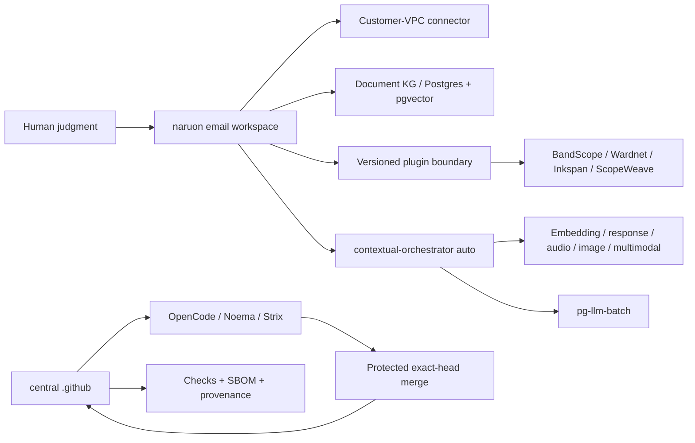

Warning: truncated output (original token count: 90256)
Total output lines: 3703

# Product and Technical Gap Baseline

## 2026-10-01 Noema document-reader transitive security baseline

| Gap | Exact evidence | Action | Status |
|---|---|---|---|
| The generated Noema document-reader lock selected `fast-uri` 3.1.7 and `ip-address` 10.7.0 after CVE-2026-86472, CVE-2026-101911, and CVE-2026-101912 were published | Security Scan run `36773087489`; Trivy job `110084194330`; exact predecessor `.github#2530@a99784219305d1b6e14cf76f0acea30c5ee45e21` | At the central `.github` owner, regenerate only the two transitive entries to `fast-uri` 3.1.8 and the first patched `ip-address` 10.7.1 release, scan every hoisted or nested lock entry in a regression contract, reproduce with `npm ci`, and require a zero-vulnerability npm audit | **Proposed / local RED→GREEN and audit complete; exact-head hosted security and independent approval required** |

## 2026-10-01 trusted review archive transient transport

| Gap | Exact evidence | Action | Status |
|---|---|---|---|
| Required Noema resolved the correct immutable trusted source but a single GitHub archive API HTTP 502 exhausted materialization before model setup | `.github` run `36760921156`, job `110043067331`; protected source `37b10243cec3d160ecc9c1be75c71428b160a703`; combined successor predecessor `.github#2530@5b3a76ea71d7ae2fa9b1719f4f82df8d52e98082` | At the central `.github` owner, add bounded native transport retries to Noema, OpenCode, and merge-scheduler trusted archive downloads; prove the actual commands against a deterministic 502→200 server without changing exact-SHA, credential, extraction, or fail-closed contracts | **Proposed / local RED→GREEN complete; exact-head hosted Checks and independent approval required** |

## 2026-10-01 PyJWT recursion denial-of-service closure

| Gap | Exact evidence | Action | Status |
|---|---|---|---|
| The shared Strix source and hash lock retained PyJWT 2.14.0 after GHSA-42vr-xj54-vc7v / CVE-2026-101918 disclosed an unauthenticated recursion DoS | Security Scan run `36741151937`; dependency-review job `109975641239`; OSV job `109975641271`; dependent `.github#2540@612d8e77cf13eba84782a22587a72d3ffb4b6c6e`; canonical owner PR #2531 predecessor `dde3ea7876ceb1569db717975cc74f44cc8d18f9` | In canonical owner PR #2531, advance source and lock to 2.15.0 without unrelated package movement, preserve exact source/lock parity, and merge-forward dependent branches only after owner acceptance | **Proposed / exact-head Checks and independent approval required** |

## 2026-10-01 shared urllib3 security closure

| Gap | Exact evidence | Action | Status |
|---|---|---|---|
| pip-audit and Strix locks retained urllib3 2.7.0 after CVE-2026-97687 and CVE-2026-97689 were published | Python Security run `36733279716`, job `109949358063`; exact predecessor `d1aa3659fca527a6c7330151f3ab4df3d7578391` | In canonical owner PR #2531, pin urllib3 2.8.0 in both source inputs, regenerate both hash locks without unrelated version movement, and bind all four files with one contract | **Proposed / exact-head Checks and independent approval required** |

작성 기준일: **2026-08-26 10:35 KST**
대상: **ContextualWisdomLab/.github** 중앙 거버넌스·자동화 레포지터리와 이를 소비하는 naruon 생태계
현재 보호된 `main`: `826b92394c63deb6981c3a8d16a724d71f85a0d7`
현재 열린 PR 수: **107** (아래 표에 이 스냅샷의 전체 목록 포함; live API 재수집)

이 문서는 제품·기술·운영 Gap을 현재 문서와 현재 GitHub 상태에 묶어 두는 기준선이다. 새 작업은 먼저 이 문서의 Gap ID를 PR 설명과 테스트 증거에 연결하고, PR의 정확한 exact HEAD·Checks·리뷰를 다시 수집한 뒤 구현한다. 표의 상태는 작성 시점의 관측값이므로, 병합 판단에는 재사용하지 않는다. 이 인벤토리는 스냅샷이며 merge authorization이 아니다.

### 2026-09-30 central coverage owner stack delta

| Gap ID | 상태 | exact-head evidence | causal owner / next gate |
|---|---|---|---|
| CONTROL-CENTRAL-COVERAGE-OWNER-01 | **Proposed — complete local integration GREEN; hosted exact-head acceptance pending** | Current coverage owner `.github#2521@61fb469a…`, parser/security/response integration successor `.github#2530@2510618f…`, GitHub API response-lifecycle owner `.github#2532@9d3ec75d…`를 ordinary two-parent merge로 보존했다. 첫 integrated warning-fatal run은 `5196 passed, 6 skipped` 뒤 queue/Strix/release prescreen/release dependency의 실제 미실행 분기 90개와 partial branch 29개를 드러냈다. Dummy/live-CLI tests를 bounded behavior contracts로 교체하고, exact Git blob·Cargo development lock·runtime receipt·final fanout cap·Python 3.10 TOML fallback을 검증했으며, 앞선 필수조건 때문에 도달 불가능했던 prescreener postcondition만 제거했다. 두 live head를 재수집·일반 병합한 combined successor는 `5291 passed, 5 skipped, 40 subtests passed`, owned production `18729/18729` statements 및 `7642/7642` branches, Docstring 100%, warning 0이다. | Canonical owner는 중앙 `ContextualWisdomLab/.github`이며 source delta는 ordinary merge ancestry로만 통합한다. #2530과 #2521의 live head 이동을 재수집해 force 없이 merge했고 새 integrated tree 전체를 재검증했다. 게시된 #2530 exact head의 hosted security/quality Checks 및 qualifying independent approval을 새로 확인한다. queued/skipped/pending을 성공으로 간주하지 않고 #2521/#2530/#2532를 단순 Close하지 않는다. [RCA와 검증 근거](doctoring/central-coverage-owner-stack-2521.md). |

### 2026-09-30 full-suite parser-lock incident delta

| Gap ID | 상태 | exact-head evidence | causal owner / next gate |
|---|---|---|---|
| CONTROL-QUALITY-FULL-SUITE-PARSER-LOCK-01 | **Proposed — `.github#2530` combined successor preserves live parser, security, response-lifecycle, and coverage heads; hosted acceptance pending** | Protected `main@37b10243…`의 common quality lock만 설치하는 전체 suite가 `defusedxml`을 찾지 못해 collection error 13건으로 중단됐고, 같은 suite의 신규 workflow 계약은 `yaml`을 import한다. Concurrent-head 재검증 뒤 live #2530 `2510618f…`와 live #2521 `61fb469a…`를 Force Push·rebase 없이 ordinary merge했다. 이 ancestry는 security prerequisite #2531 `d1aa3659…`, response-lifecycle prerequisite #2532 `9d3ec75d…`, parser lock, coverage 수리를 함께 보존한다. 잠금을 직접 설치하는 모든 workflow는 생성 lock, 두 source input, compiler 변경을 추적하며 선택형 runtime quality도 실제 consumer suite를 실행한다. Review-repair owner는 launcher runtime 두 suite를 직접 실행·계측한다. Combined local evidence는 Python 3.14 warnings-fatal 5,291 passed, 5 skipped, 40 subtests, production 18,729/18,729 statements·7,642/7,642 branches, Docstring 100%다. 이 행은 live Project #1 상태나 merge authorization을 주장하지 않는다. | Canonical owner는 중앙 `.github`의 source requirement, 생성 hash lock, compiler, 직접 소비 quality workflows다. 새 combined exact head의 hosted Checks, 미해결 thread 0, qualifying independent approval을 다시 수집해야 ordinary protected merge할 수 있다. #2531/#2532/#2521은 protected successor merge와 complete carryover를 확인하기 전 닫지 않는다. |
| CONTROL-REPOSITORY-BRANCH-COVERAGE-01 | **Proposed — `.github#2521`의 전체 유효 delta를 `.github#2530` combined successor가 ordinary merge로 승계; exact-head hosted acceptance pending** | `.github#2521`는 production exclusion을 제거해 전역 100% 주장을 정직하게 RED로 되돌렸다. 네 잔여 소유자인 `opencode_queue_priority`, `strix_unverified_dependency`, `prescreen_release_runtime_archives`, `release_dependency_gate`의 실제 분기를 test-first로 모두 실행했고, launcher production omission도 제거했다. `.github#2530`의 parser lock 없이는 전체 suite collection이 실패하고, parser-lock PR은 이 coverage gap 때문에 전역 gate가 실패하는 순환 선행조건이었다. predecessor의 current head `61fb469a…`까지 successor ancestry에 보존하며 predecessor는 successor의 보호 병합과 tree 동등성을 확인하기 전 닫지 않는다. | Canonical owner는 중앙 `.github`의 production CI modules와 complete repository gate다. coverage 제외·pragma·threshold 하향·샘플 축소는 허용하지 않는다. refreshed combined successor의 complete warnings-fatal suite, 100% statement/branch report, hosted Checks, independent approval, ordinary protected merge를 새 exact head에서 완료해야 한다. |

### 2026-09-30 공유 보안 기준 exact-head delta

이 delta는 아래 2026-08-26 인벤토리를 덮어쓰지 않는다. 2026-09-30 재수집한
보호 `main`은 `37b10243cec3d160ecc9c1be75c71428b160a703`이고, live API의 첫
페이지에는 열린 PR 50개가 있었다. 페이지 전체를 조직의 총 PR 수로 추론하지 않는다.

| Gap ID | 상태 | exact-head evidence | causal owner / next gate |
|---|---|---|---|
| CONTROL-SHARED-SECURITY-LOCK-01 | **Source repair in progress — release HOLD** | `.github#1026@6f645a73502e159d5a229805afa34868ad9bb851`의 Security Scan run `36495499815`는 공통 Rust fixture의 PyO3 `0.22.6`에서 GHSA-36hh-v3qg-5jq4와 GHSA-chgr-c6px-7xpp를 검출했고, Python Security run `36495499871`은 공통 Strix hash lock의 PyJWT `2.13.0`에서 CVE-2026-102274를 검출했다. 두 파일은 #1026 변경 범위 밖이며 보호 `main`에도 동일하게 남아 있었다. RED commit `cd84d887`는 PyO3 `0.29.2`와 PyJWT `2.14.0` source/lock parity를 요구한다. | 중앙 `.github`가 공통 fixture와 Strix lock을 소유한다. [RCA와 검증 계약](doctoring/shared-security-baseline-pyjwt-pyo3-20260930.md)에 따라 owner PR의 exact-head Checks와 독립 승인, ordinary protected merge, immutable consumer source pin 갱신, 그리고 #1026의 비강제 main merge-forward가 순서대로 필요하다. 어떤 실패도 #1026 전용 패치나 bypass로 처리하지 않는다. |

### 2026-09-30 GitHub API response lifecycle incident delta

| Gap ID | 상태 | exact-head evidence | causal owner / next gate |
|---|---|---|---|
| CONTROL-GITHUB-API-HTTP-ERROR-CLOSE-01 | **Proposed — protected-main RED reproduced; source repair under hosted exact-head verification** | 보호된 `.github/main@37b10243cec3d160ecc9c1be75c71428b160a703`의 Python 3.14.7 `tests/test_github_api_url_boundary.py -W error`가 실제 CodeQL/Strix opener의 synthetic 302 여덟 경우에서 `ResourceWarning: Implicitly cleaning up <HTTPError 302>`로 `8 failed, 26 passed`였다. 첫 repair의 warning-fatal full suite가 동일 defect를 Noema/Pingora/preflight/Pages/sandbox readiness에서 추가로 드러냈다. | Canonical owner는 중앙 `.github`이다. 각 caller가 기존 bounded status/telemetry와 fail-closed mapping을 보존한 뒤 file-like error response를 명시적으로 닫는다. `5161 passed, 10 skipped, 40 subtests passed`로 complete warning-fatal local tree가 GREEN이다. [RCA와 acceptance](doctoring/github-api-http-error-response-lifecycle.md)를 따라 exact-head hosted security, independent review, ordinary protected merge를 완료한 뒤 `.github#2040`과 review-transport stack이 새 protected head를 정상 병합해 downstream 증거를 재생성해야 한다. |

### 2026-09-19 exact-head incident delta

| Gap ID | 상태 | exact-head evidence | causal owner / next gate |
|---|---|---|---|
| CONTROL-OPENCODE-COVERAGE-LOCK-CONTEXT-01 | **Proposed — PR-bound incident register; GitHub Project #1 roadmap item이 아님; `.github#2385@950ab885…` source convergence, hosted acceptance pending** | Required OpenCode run `35370902053`의 `coverage-evidence` job `105778600365`은 PR source 실행 전에 `COPY requirements-opencode-review-ci-hashes.txt requirements-noema-document-ci-hashes.txt /tmp/`에서 두 번째 파일을 찾지 못해 종료했다. RED `9b9f5edcd`는 Dockerfile의 모든 lock input이 trusted build context에 존재해야 한다는 계약을 고정했다. 이 행은 live Project 상태를 주장하지 않고 exact-head PR evidence만 추적하며, protected integration 뒤 제거 여부를 재평가한다. | Canonical owner는 중앙 `.github/.github/workflows/opencode-review-dispatch.yml`이고 complete successor는 `.github#2385`이다. 두 lockfile을 각각 regular non-symlink로 검증하고 build context로 복사한 뒤 exact-head focused/full suite와 새 hosted `coverage-evidence`를 통과해야 한다. PR 제품 source나 coverage 비율의 결함으로 오인하지 않으며 synthetic status·manual rerun·bypass를 사용하지 않는다. |

### 2026-09-13 current-head incident delta

| Gap ID | 상태 | exact-head evidence | causal owner / next gate |
|---|---|---|---|
| CONTROL-OPENCODE-VCS-PYROOT-01 | **Source repaired on `main` (#2123 `ebc69a401`); image-path helper extracted + offline-proven under #2157 follow-up; hosted consumer step-#17 link still required to close the issue** | `ContextualWisdomLab/contextual-orchestrator#1149@684cf28f`의 중앙 [OpenCode run 34701472466](https://github.com/ContextualWisdomLab/.github/actions/runs/34701472466) `coverage-evidence` job `103574547257`은 PR 코드를 실행하기 전에 immutable `ContextualWisdomLab/fast-mlsirm@09f762d`의 `python/fast_mlsirm` import root를 찾지 못해 종료했다. 같은 head의 제품 테스트는 `3602 passed, 2 skipped`, native CodeQL·fuzz·SBOM·SAST·Strix는 성공했다. | `.github`의 `opencode-review-dispatch.yml`이 root/`src/`만 허용한 계약 drift를 소유했다. #2123이 `python/` candidates를 추가해 `main`에 병합했고, #2157 follow-up은 동일 로직을 `scripts/ci/resolve_opencode_base_vcs_import_root.sh`로 추출해 `tests/test_opencode_vcs_python_source_root_contract.py` fixture로 증명한다. Issue #2157 종료는 post-`ebc69a401` consumer `coverage-evidence`가 docker step #17을 통과한 job id를 문서에 링크한 뒤에만 한다. |
| CONTROL-PINGORA-DECLARED-BINARY-RUNTIME-01 | **Source repaired on `.github#2386@dea7532e`; protected integration pending** | A base-owned artifact-prefix declaration admitted a no-patch file after any non-UTF-8 byte, even when readable bytes contained `nginx -c /etc/nginx/nginx.conf`. The production-bound regression covers `.sh`, `.dat`, and `.txt`; the focused suite is the exact-head acceptance target. | `.github` owns `scripts/ci/pingora_edge_policy.py`. Replacement-decoded content must contain no `CONTENT_RULES` match before an unrecognized binary suffix is admitted. Current-head hosted security Checks, qualifying independent approval, ordinary protected merge, and downstream `late-life-anxiety-reanalysis#269` revalidation remain required. |

### 2026-09-27 CodeQL compatibility retirement delta

| Gap ID | Status | Evidence and remaining gate |
|---|---|---|
| CONTROL-CODEQL-OBSOLETE-VERDICT-01 | Source repair under verification | ContextualWisdomLab/fast-mlsirm#2172 closed before compatibility job 108414341704 began. The live read returned no verdict and enforcement failed. Explicit obsolete output repairs closed/superseded target retirement without weakening exact-head security evidence. See [RCA and regression checks](doctoring/codeql-obsolete-pr-verdict.md); protected merge and hosted current-head gates remain required. |

## 1. 근거와 범위

### 1.1 우선순위가 높은 근거

1. [CWL Master Context](CWL-MASTER-CONTEXT.md): naruon의 이메일 우선 플랫폼 경계, DIKW, no-ask 자동 해결, 다층·다중소속·시간·프라이버시 원칙.
2. [naruon #974](https://github.com/ContextualWisdomLab/naruon/pull/974): `docs/planning/naruon-platform-plan.md`를 추가한 병합된 제품/IA/User Story/Use Case/Architecture 기준. 이슈 트래커의 Phase 항목은 ContextualWisdomLab/naruon#975–#980.
3. [GitHub Project #1](https://github.com/orgs/ContextualWisdomLab/projects/1): 로드맵의 live source of truth. 이 문서는 live project board의 상태를 반영하며, 세부 항목 수는 project에서 직접 확인한다.
4. 중앙 ADR·doctoring·계약 문서: [ADR-0002](adr/0002-product-technical-gap-baseline.md), [hourly NVIDIA NIM autofix](doctoring/hourly-nvidia-nim-autofix.md), [Strix cryptography override](../requirements-strix-ci-overrides.txt), [trusted uv lock materialization](doctoring/trusted-uv-lock-materialization.md), [product-technical gap doctoring](doctoring/product-technical-gap-baseline.md).

### 1.2 제품 경계

구매자가 사는 핵심 결과는 “흩어진 enterprise context를 판단 가능한 구조로 만들고, 사람이 다음 행동을 승인할 수 있게 하는 것”이다. naruon은 이메일 호스트나 전자결재 시스템이 아니라 고객 소유 데이터에 연결되는 이메일 workspace/platform이다. 중앙 `.github`은 제품 기능을 대신 소유하지 않고, 정확한 HEAD·리뷰·Checks·증거·변경권한을 보장하는 control plane이다.

핵심 구매 여정은 다음과 같다.

1. 여러 계정·언어의 이메일에서 한 사건의 thread와 sender 의미를 찾는다.
2. 변경된 일정의 최신 truth, 변경 이력, commitment status와 충돌을 계산한다.
3. work/personal/project/band 등 겹치는 norm group을 선택하고, 관계·권한·유효기간을 고려한다.
4. 다른 context에는 필요한 결과(예: unavailable)만 consent·audit 기반으로 공개한다.
5. 사람은 근거·confidence·다음 행동을 보고 예외만 수정하며, 외부 writeback은 승인한다.

### 1.3 Same-session open/close delta

스냅샷은 작성 시점의 open/close delta만 기록한다. 병합 판단에는 재사용하지 않는다.

## 2. PRD / TRD / UML 기준

### 2.1 PRD acceptance

| ID | 구매자가 확인할 결과 | 수용 증거 |
|---|---|---|
| PRD-01 | “이 메일/보낸 사람이 왜 중요한가”를 찾는다 | hybrid retrieval, sender ontology, source segment provenance |
| PRD-02 | 일정 이동과 RSVP/commitment 충돌을 놓치지 않는다 | temporal event history, confirmed > tentative > desired weighting, conflict test |
| PRD-03 | 같은 사람이 여러 조직·팀·밴드에 소속되어도 권한을 뒤섞지 않는다 | reified relationship, multi-membership/norm-group resolution, ecological-fallacy test |
| PRD-04 | private reason을 노출하지 않고 필요한 consequence만 공유한다 | consented minimal-disclosure bridge, audit trail, revocation test |
| PRD-05 | 사용자가 모델 선택을 관리하지 않아도 품질을 우선해 자동 라우팅한다 | contextual-orchestrator `auto`, capability-before-cost, unpriced-is-not-free evidence |
| PRD-06 | 결과를 독립 제품 또는 naruon plugin으로 동일하게 쓴다 | versioned manifest/API, connector contract, standalone/submodule integration test |

### 2.2 TRD target

- **Platform plane:** naruon web/API, customer-VPC connector, Postgres/pgvector document KG, plugin registry, versioned extension points.
- **Evidence/control plane:** central `.github`, OpenCode/Noema/Strix, exact-source and exact-head binding, bounded hourly loops, no credential fallback, protected merge.
- **AI plane:** contextual-orchestrator adaptive routing; role별 reasoning effort, workflow depth, recursion, decomposition, verifier/synthesis를 quality evidence에 따라 배분. Fugu, Conductor, TRINITY를 근거로 단일 모델 라우팅과 심층 다중 에이전트 오케스트레이션 사이에서 계산량을 배분한다. 속도는 최적화 목표가 아니다.
- **Compute plane:** 수리과학·psychometrics의 계산 레이어와 속도·안정성·보안이 핵심인 hot path는 Rust 경계를 우선 검토하며, GPU/CPU multithreading과 낮은 context switching을 benchmark로 입증한다. Python/JS는 orchestration/API adapter로 제한한다.
- **Data plane:** 모든 영속 객체는 두 단어 이상 `snake_case`를 기본으로 하고 3NF를 지키며, 관계·evidence·confidence·validity·disclosure를 별도 정규화한다. Hot partition 대비를 스키마에 둔다.
- **UX plane:** UI 제품만 Figma/Storybook/design token을 사용한다. 중앙 `.github`는 UI 없는 인프라 레포지터리이므로 Figma File ID는 **N/A (UI scope 없음)**이며, UI PR은 별도 ADR에 실제 File ID를 기록한다. UI-owning 저장소는 Storybook scene/edge-case event, Accessibility, Touch & Interaction, Performance, Style Selection, Layout & Responsive, Typography & Color, Animation, Forms & Feedback, Navigation Patterns, Charts & Data를 정의·검토·반영·적용·감사한다.

### 2.3 UML-level dependency

```mermaid
flowchart LR
  User[Human judgment] --> Naruon[naruon email workspace]
  Naruon --> Connector[Customer-VPC connector]
  Naruon --> DocKG[Document KG / Postgres + pgvector]
  Naruon --> Plugins[Versioned plugin boundary]
  Plugins --> Verticals[BandScope / Wardnet / Inkspan / ScopeWeave]
  Naruon --> Orch[contextual-orchestrator auto]
  Orch --> Models[Embedding / response / audio / image / multimodal]
  Orch --> Batch[pg-llm-batch]
  Control[central .github] --> Review[OpenCode / Noema / Strix]
  Control --> Checks[Checks + SBOM + provenance]
  Review --> Merge[Protected exact-head merge]
  Merge --> Control
```

## 3. Gap register

우선순위는 구매자 체감, 보안/증거 위험, 선행 의존성 순서다.

| Gap ID | 현재 관측 | 구매자 영향 | 우선 구현/검증 |
|---|---|---|---|
| G-01 | 열린 PR은 107개다. metadata 상태는 BLOCKED=17, BEHIND=16, DIRTY=74, draft 13개다. 상태는 independent exact-head approval과 terminal required Checks를 자동으로 의미하지 않는다 | 안전하게 출시할 변경과 대기 중인 변경을 구별할 수 없다 | PR마다 current head, reviews, threads, required Checks, merge-result tree를 재수집하고 보호 조건 미충족이면 merge하지 않는다 |
| G-02 | protected `main`은 `826b92394c63deb6981c3a8d16a724d71f85a0d7`이며, BEHIND/stacked PR의 predecessor evidence를 current-head approval로 승격할 수 없다 | 리뷰가 호출돼도 승인 증거가 생성되지 않아 자동화가 멈춘다 | current-head quality와 OpenCode/Noema/Strix를 재실행하고, exact SHA·run ID·review commit SHA를 한 receipt에 묶는다 |
| G-03 | #1297은 Strix per-repository serialization과 scoped close cleanup을, #1345/#1347은 normalizer/web-E2E 안전성을 다룬다. 각 PR의 provider failure와 source/control-plane failure를 구분해야 한다 | 취약점 0건이어도 CI 인프라 결함이 보안 결과처럼 보이고 큐가 막힌다 | D3 교착 증거를 별도 수집하고, vulnerability marker는 절대 neutralize하지 않으며, 정상 gate 복구 후 exact-head hosted evidence를 재생성한다 |
| G-04 | 107개 live PR 중 16개가 BEHIND, 74개가 DIRTY이고 caller/Strix PR이 제품 기능보다 앞서 쌓였다 | 제품 개발 속도가 queue hygiene에 소모되고 stacking 순서가 불명확하다 | product/ownership boundary별로 stack을 재정렬하고, 오래된 PR은 current main으로 normal restack 후 변경 범위를 검증한다 |
| G-05 | ecosystem contract/catalog PR은 존재하지만 naruon의 실제 plugin 소비·standalone 실행·connector round-trip 증거가 제한적이다 | 구매자는 “연결 가능” 문서와 실제 설치 가능한 제품을 구별할 수 없다 | manifest/version compatibility, command/event envelope, consumer smoke, rollback/upgrade contract를 조직 유관 레포에서 증명한다 |
| G-06 | ContextualWisdomLab/naruon#974와 Project #1은 제품 목표를 정의하지만 E1/E2/E3의 live implementation evidence가 이 중앙 레포에 없다 | 이메일 검색·일정 충돌이라는 killer workflow가 문서에만 머문다 | naruon에서 thread/sender ontology → temporal commitment/conflict → human correction slice를 독립 PR로…78256 tokens truncated…`coverage-source-tree` carries
`if: needs.admit-current-head.outputs.admitted == 'true'` and a skipped `needs:` predecessor skips it too.
Cutting that edge without moving the guard would let a required context execute on an unadmitted head.
The complete change is therefore: give `coverage-evidence` `needs: [required-workflow-bootstrap,
admit-current-head]` **plus that same explicit `if:`**, and reduce `opencode-review-target` to
`needs: [admit-current-head]` — safe on the admission axis because that job already carries the identical
`if:` guard directly. Chain depth drops from five to three, and queue waits from four to two.

**Second safety condition, and the sharper trap: two different workflow files define jobs with these exact
names, and only one pair is safe to touch.** `opencode-review.yml` (required, `pull_request_target`) holds the
echo-only placeholders analysed above. `opencode-review-dispatch.yml` (privileged, `repository_dispatch`)
defines `coverage-source-tree` (`:206`) and `coverage-evidence` (`:352`) that do the **real** work: the former
exchanges an app token, materializes the PR merge tree, and `upload-artifact`s it (`:344`); the latter runs
with `timeout-minutes: 300` and `download-artifact`s that same tree (`:429`), as its own comment states —
*"The PR tree arrives through a same-run artifact."* There, the `coverage-source-tree` → `coverage-evidence`
edge is a hard data dependency, not ordering, and cutting it would break coverage measurement outright. **Any
parallelization must be confined to `opencode-review.yml`.** This distinction was missed by two sessions
independently — both reasoned about "the coverage jobs" without checking that the name resolves to two
different jobs in two files — and was caught only by opening
`scripts/ci/test_strix_quick_gate.sh`, whose assertions at `:959-963` describe `coverage-source-tree` as
materializing and uploading a merge tree, contradicting "it only echoes" and exposing the second file. A read-only
cross-family (Codex) pass over both files independently reproduced all three points, adding the artifact name
this record had not cited (`opencode-coverage-source`, uploaded at `:344-350`, downloaded at `:429-433`).

**Implemented, scoped correctly: `ContextualWisdomLab/.github#1910`** cuts the chain from five serial links to
three (queue waits per PR from four to two), confined to `opencode-review.yml`, carrying the explicit
admission `if:` onto `coverage-evidence`, and dropping `coverage-evidence` from `opencode-review-target`'s
`needs:` after confirming that job never reads the context at runtime — its only mention was the `needs:` line
itself, and the real consumer (`opencode-review-dispatch.yml` via `scripts/ci/opencode_coverage_identity.py`)
queries the check-runs API at its own time, order-independently. The implementing session noted honestly that
their change was safe because they had scoped it narrowly, not because they had checked for the name
collision — which is the more useful lesson: **a job name is unique only within one workflow file, and the
same name in another file can carry the opposite safety property.**

**Fixed for `sast-semgrep.yml`, 2026-09-13.** The standalone `changed-scope` job is gone; its
"Classify changed paths" step now runs inside the single consumer `semgrep` (after `harden-runner`,
which must audit the classifier's own `gh api` egress) and the four expensive steps plus the final
"Enforce Semgrep gate" step carry `steps.scope.outputs.code == 'true'`. The job keeps
`if: github.event.action != 'closed'` with no `needs.` term, so a doc-only PR's run still executes one
job that concludes `success` -- the load-bearing property from
[`required-workflow-path-filter-boundary.md`](doctoring/required-workflow-path-filter-boundary.md) is
preserved, and neither `Detect changed scope` nor `Semgrep (multi-language SAST)` is among `.github`'s
classic required contexts, so nothing goes Pending there. One trap the first draft would have shipped:
the enforce step's `always() && (... || steps.semgrep.outputs.rc != '0')` evaluates `rc` as the empty
string when `Run Semgrep` is step-skipped, which is `!= '0'` and would have failed every doc-only PR;
the guard on that step is what makes the fold safe. Net: one runner allocation per PR for this
workflow instead of two, org-wide. `strix.yml` (the other single-consumer gate) is deliberately left
alone -- it is a documented multi-PR hot-file collision zone. Contract:
`tests/test_docs_only_pr_runner_admission.py::test_sast_semgrep_folds_the_gate_into_its_single_consumer_at_step_level`,
`tests/test_required_security_runner_image_contract.py`.

## 2026-09-19 GitHub API production-opener redirect proof

**Status:** Proposed on `ContextualWisdomLab/.github#2279`; exact-head hosted checks and qualifying independent review remain mandatory.

**Context Map / owner.** The central `.github` CI bounded context owns the bearer-authenticated CodeQL-analysis and Strix changed-file GitHub REST clients. GitHub remains the upstream REST authority. Product repositories consume only the released central workflow contract; they do not copy either client.

**Gap.** Initial URL admission and direct `_RejectRedirects.redirect_request()` unit cases did not prove that each module-level production `OpenerDirector` actually retained the no-redirect handler chain. A future opener reconstruction could silently re-enable authenticated redirects while the prior tests stayed green.

**Action.** Exact `57477289ebec5631b0c48f0bc419f336dbe19deb` adds a dependency-free synthetic-302 transport to `tests/test_github_api_url_boundary.py`. For both actual production openers, the case drives a canonical bearer request through the real HTTPS open/response chain, requires the typed HTTP-302 failure mapping, and proves transport receives exactly one original request; lookalike HTTPS, HTTP, `file:`, and same-authority redirect targets never receive a second request or bearer. Exact `e0b0b4d4fff5b6ea88236a1e91dcd7dbb3be09b5` repairs the doctoring claim so direct-handler coverage is not mislabeled as production-chain proof.

**Evidence / remaining condition.** The standalone fixture mechanism was executed locally against Python stdlib and produced one canonical request followed by terminal HTTP 302 for every hostile target. This is mechanism evidence, not repository acceptance. Final authority requires focused/full exact-tree GREEN, fresh exact-head Security/SAST/Python Security/CodeQL/runtime-quality checks, no unresolved actionable review, ordinary protected-main integration, and downstream consumer validation. No scanner suppression, redirect allowlist widening, provider fallback, workflow gate weakening, or credential-boundary change is included.

## 2026-09-27 exact release distribution/scope evidence coverage

**Status:** Proposed on `ContextualWisdomLab/.github#2400`; the current
architecture-binding repair starts from reviewed parent
`51db1d0c00c2eab36d051b5307541558bbc735c2`. The PR body—not a
self-referential SHA in this file—is the authority for the current exact head.
The PR remains Draft.

**Context Map / owner.** The central `.github` release-control bounded context
owns same-run distribution/scope artifact verification and the immutable
licence/Strix verdict contract. Product release workflows consume only the
pinned central workflow and helper commits; product repositories do not copy
the verifier source or read central transient state.

**Gap.** The release prescreener was already complete, but the adjacent
distribution and scope evidence verifiers still had unexecuted fail-closed
paths. At predecessor `27cf2f339393aa08b9f8a26c3a9bd0da47de33c1`,
`verify_release_distribution_set.py` covered 148/200 statements with 20
partial branches (71%). At predecessor
`eb8130c5573b4bfc59bdc725be5e1466f24c25db`,
`verify_release_scope_evidence_set.py` covered 197/242 statements with 33
partial branches (77%). The repository-wide mandatory 100% coverage gate was
therefore RED even though the positive release path passed.

**Action.** Two ordinary, non-force commits add test-only boundary evidence for
duplicate/non-finite/oversized controls, canonical time and digest identity,
unsafe and oversized ZIP members, download failure/termination, build snapshot
inventory and byte binding, runtime wheel identity, consumer native layout,
lock drift, scope envelope/row identity, aggregate size, and both CLI entry
paths. Production release code and workflow admission policy are unchanged.

A same-PR continuation covers the adjacent release gate's real trust
boundaries: bounded and nonregular archive input, declared Python/Cargo licence
paths, archive links and member counts, raw-capture/destination symlinks, Cargo
workspace identity, Strix fanout identity/fixture/runtime-report binding, and
install-time licence rebinding. `parse_member_listing` and its isolated test
were removed after repository-wide caller search proved that immutable archive
bytes—not the unused shell listing—are the member authority. The redundant
post-read length branch was also removed because both stdlib ZIP and tar readers
already clamp reads to the entry size checked immediately beforehand.

**Exact-tree evidence / remaining condition.** Distribution focused tests are
15 passed with 200/200 statements and 84/84 branches; scope focused tests are
48 passed with 242/242 statements and 120/120 branches. The warnings-as-errors
full suite is 3,953 passed, 28 skipped, and 40 subtests passed. Against the
pre-repair full-repository run, uncovered statements fell 386→289 and partial
branches 112→59, but the total remains 98%; the 100% gate is still RED. Fresh
exact-head CodeQL PR run `36280393614`, SAST run `36280393599`, and Security
Scan run `36280393621` were queued on that repair head. Adding this baseline
record creates a documentation-only successor with its own fresh runs; their
current IDs and conclusions are tracked in the PR body and must not inherit
the predecessor's status. Qualifying independent approval is absent. Do not
merge, tag, publish, or create an admission manifest until the remaining
production surfaces reach 100%, all required checks are terminal GREEN on one
exact head, and an independent current-head approval exists.

The continuation's focused release-dependency suite is 442 passed with
`release_dependency_gate.py` at 1,126/1,126 statements and 472/472 branches.
The warnings-as-errors full suite is 3,976 passed and 28 skipped; uncovered
repository statements fell 289→249 and partial branches 59→26, raising the
rounded total to 99% but not satisfying the fail-under-100 gate. The remaining
misses belong to queue health, Noema document review, and the separately owned
Rust materializer work on `ContextualWisdomLab/.github#2360`; no duplicate Rust
repair is introduced here. Current exact-head hosted runs and conclusions remain
PR-body authority after the next ordinary-forward update.

The queue-health continuation removes a responsibility contradiction rather
than preserving it with tests: `actions_queue_health_core.py` still contained
a second collector and CLI even though the Context Map assigns collection,
identity reconciliation, and process exit to `actions_queue_health.py`. The
duplicate was unreachable after the executable imported the core and replaced
those names. A source-shape RED contract now prevents either entrypoint from
returning to the core; the executable owns its `time.sleep` retry dependency
directly. Boundary cases cover both pre-evidence identity retry outcomes,
malformed active and terminal run IDs, irrelevant terminal conclusions,
obsolete target cancellations, and remediation-action deduplication. The
focused queue-health suite is 80 passed; both queue-health production modules
are 100% statement and branch covered. No workflow permission, API scope,
queue-age threshold, cancellation behavior, or merge policy changes. The
full exact-tree suite is 3,982 passed, 28 skipped, and 40 subtests passed;
uncovered statements fell from 249 to 163 and partial branches from 26 to 19.
The only remaining uncovered production owners are the Noema document reader
successor and Rust materializer `ContextualWisdomLab/.github#2360`. Hosted-run
identity and conclusions remain PR-body authority.

The Noema document-reader continuation executes the existing fail-closed trust
boundaries without changing production policy: unsupported and oversized
input, bounded DOCX archive and XML structure, empty content, visible Word
controls, ragged and escaped tables, local HWP reader configuration and process
failure, bounded/UTF-8/non-empty adapter output, code-point-safe prompt
truncation, and the smoke-test CLI. The focused suite is 11 passed and 2
optional real-fixture skips; `noema_review_document.py` is 144/144 statements
and 52/52 branches. The warnings-as-errors full exact-tree suite is 3,988
passed, 28 skipped, and 40 subtests passed. Repository coverage stays rounded
to 99% because the separately owned Rust materializer on
`ContextualWisdomLab/.github#2360` retains 128 uncovered statements and one
partial branch. That owner boundary is preserved: this PR does not duplicate
the Rust repair. The 100% gate therefore remains RED, the PR remains Draft,
and current hosted-run identity and conclusions remain PR-body authority after
the next ordinary-forward update.

The coverage successor integrates the canonical Rust materializer owner by an
ordinary two-parent merge rather than copying its source or tests. The owner
branch contributes the full foundation ancestry, deterministic multi-root
`cargo vendor --sync --locked` closure, confinement of synthesized Cargo target
paths to each manifest root, real-Cargo integration contracts, and
toolchain-independent Git/mock/error/CLI coverage. Focused evidence is 26
passed and 3 real-Cargo skips with
`materialize_base_rust_dependencies.py` at 155/155 statements and 60/60
branches. The full merged tree is 4,030 passed, 8 skipped, and 40 subtests
passed; all 17,144 production statements and 6,982 branches are covered. This
closes the repository coverage Gap but is not merge authorization: the release
stack remains Draft/Proposed until fresh exact-head hosted Checks reach terminal
success and a qualifying independent review approves the unchanged head.

The subsequent native-inspection continuation exposed a new exact-tree
coverage Gap rather than inheriting predecessor evidence. Runtime wheels and
build-interpreter snapshots now pass every admitted native member through the
pinned `llvm-readobj-18` boundary, but the first full run on that source left
six prescreener statements/four partial branches and one release-gate
statement/one partial branch uncovered. The RED suite still passed 4,033 tests,
8 skips, and 40 subtests, while `coverage report --fail-under=100` correctly
failed at 99%. The repair adds fail-closed cases for directory members,
analyzer reuse/failure, oversized native files, receipt omissions, unknown
runtime dynamic links, and malformed static-link records. The exact repaired
tree is 4,037 passed, 8 skipped, and 40 subtests passed with all 17,186
production statements and 7,000 branches covered. Context Map ownership stays
in the central release-control gate; consumer repositories receive only its
immutable released workflow contract. Status remains Proposed/Draft and release
admission remains HOLD until fresh exact-head hosted Checks and a qualifying
independent approval complete.

The next ordinary integration closes a distinct native-link review Gap. The
pinned analyzer previously proved which dynamic libraries each wheel needed,
but the sealed report did not bind why those external names were admissible on
the declared Linux, macOS, or Windows target. The central release-control
bounded context remains the single owner: it now classifies only explicit
operating-system runtimes, the wheel-tag-matched CPython DLL, the inspected
extension's own macOS install name, and the named Visual C++ runtimes. Unknown
names fail before verdict sealing, while every accepted name and review basis
is carried in `cwl.release-native-links/2`; consumers receive only the released
workflow contract. The native-link continuation and the coverage repair were
combined by an ordinary two-parent merge, preserving both histories without a
force update. The concurrent Maturin asset verifier initially reproduced a 99%
coverage failure with 22 missing statements and 10 partial branches; its
bounded-download, archive-shape, executable-identity, reviewed-link, CLI, and
prescreen failure paths are now executable contracts. Fresh current-tree
evidence is 4,049 passed, 8 skipped, and 40 subtests passed, with all 17,302
production statements and 7,058 branches covered. Ruff E9/F/I, compileall, and
diff checks pass after import-order repair. Status is Proposed/Draft and
release admission remains HOLD because hosted exact-head Checks and a
qualifying independent approval are not yet complete.

The Intel macOS continuation closes one part of the universal2 runtime Gap.
Three additional same-run artifacts contain x86_64 install receipts and exact
dependency wheel archives. The central verifier authenticates each ZIP,
source SHA, selected distribution row, x86_64 interpreter, and archive member;
the licence prescreen includes distinct x86_64 archive bytes in the Strix
fixture matrix, and the final verdict seals their artifact IDs and digests.
The thirteen publishable distributions remain the only release outputs.
The changed verifier, prescreen, and verdict collector have 100% statement
and branch coverage in the focused suite; the full local suite is 4,063 passed,
4 skipped, and 40 subtests passed. The fast-mlsirm admission consumer has not
yet accepted this verdict shape, and hosted exact-head checks are still
required. Release remains HOLD.

An architecture-binding review then found that the Intel receipt's
`machine=x86_64` claim did not reach the bytes of native dependency wheels.
The common universal2 inspector deliberately permits an architecture subset,
but the prescreener discarded that subset and deduplicated package/hash pairs
before applying any Intel-specific constraint. An aarch64-only Mach-O wheel
could therefore satisfy the Intel continuation. A RED integration contract at
parent `51db1d0c00c2eab36d051b5307541558bbc735c2` reproduces that acceptance.
The repair requires x86_64 in every native member of each Intel variant before
deduplication; universal2 binaries containing both architectures remain valid,
and pure-Python wheels are unchanged. Local exact-tree evidence and hosted
current-head run identities remain PR-body authority. The local exact tree is
4,061 passed, 8 skipped, and 40 subtests passed, with all 17,383 production
statements and 7,098 branches covered. Status stays Proposed/Draft and release
admission remains HOLD pending terminal GREEN hosted Checks, downstream
verdict-shape acceptance, and qualifying independent approval.

## 2026-09-27 Strix AnyIO security-lock carryover

**Status:** Proposed on `ContextualWisdomLab/.github#2386`; fresh exact-head hosted Checks and qualifying independent approval remain mandatory.

**Context Map / owner.** The central `.github` security/review bounded context owns the hash-locked Strix CI runtime. PyPI packages and the vulnerability advisory service are upstream evidence; product repositories consume only the released central workflow contract.

**Gap / RCA.** Exact-head Python Security run [36236245577](https://github.com/ContextualWisdomLab/.github/actions/runs/36236245577), job `108402877544`, found AnyIO `4.14.0` vulnerable to `CVE-2026-63374`, `CVE-2026-64847`, and `CVE-2026-63349`; all three list `4.14.2` as fixed. The generated lock had no explicit AnyIO source constraint, so unrelated PR #2386 inherited a known-vulnerable transitive selection.

**RED → GREEN / carryover.** RED `761be5b0f63422505b37e28a367a4c5170f302ba` imports #2385's source↔lock contract and fails `1 failed, 1 passed` because the source input lacks `anyio==4.14.2`. GREEN `c59ef9aed32ab4c5138c2b7770ddcc10d7ee8393` adds that exact source constraint; `a895dc5aec775076c3819679eadf0b50a563aa2e` adopts #2385's generated lock blob `eb83beda177c9d2e4ca9b7e2888a1ccb55a123ac`, whose only predecessor differences are version line 143 and hash lines 144–145. Exact remote blobs pass the focused contract `2 passed`. This is complete three-file delta integration, not a claim that #2385 or #2386 is accepted. Completion still requires fresh exact-head pip-audit/other required Checks, no unresolved actionable review, qualifying independent approval, and ordinary protected-main integration.
## 2026-09-27 Git blob protocol-hash SAST authority

**Status:** Proposed on `ContextualWisdomLab/.github#2396`; fresh exact-head hosted Checks and qualifying independent approval remain mandatory.

**Context Map / owner.** The central `.github` Pingora policy owns exact-head changed-file evidence admission. GitHub's Git blob API remains the upstream object-identity authority; Semgrep remains the independent static-analysis gate.

**Gap / RCA.** Exact-head SAST run [36243375994](https://github.com/ContextualWisdomLab/.github/actions/runs/36243375994), job `108407968534`, reported `python.lang.security.insecure-hash-algorithms.insecure-hash-algorithm-sha1` at `scripts/ci/pingora_edge_policy.py:602`. The call recomputes Git's protocol-defined `blob <length>\\0<bytes>` object ID with `usedforsecurity=False`; it is equality evidence for the exact GitHub blob, not a cryptographic signature. Replacing it with SHA-256 would contradict the upstream 40-hex blob identifier and remove tamper detection.

**Action / evidence.** RED is the exact hosted failure above. Commit `53f447f73f0ef33eb708bf44202ec4d5954ade66`, formatted by `d00cdff974f5ac665a5f7481620d550735bd26c8`, adds one rule-scoped `nosemgrep` annotation plus the protocol rationale without changing the hash input, comparison, download bound, or failure behavior. Existing executable cases still require exact byte count and reject altered bytes by Git blob-ID mismatch. Completion requires fresh exact-head SAST GREEN, the remaining protected checks, no unresolved actionable review thread, qualifying independent approval, and ordinary merge.

## 2026-09-27 CodeQL terminal-proof fallback run identity

**Status:** Proposed on `ContextualWisdomLab/.github#2405`; direct repair parent `5a77a8c711bc93330c24a4821dff7439f600a264`, tree `5ce8ba7448cb878a5b130ed1acaba1578e4940fd`. This documentation-only successor preserves that executable tree; the PR body is the authority for the current exact head and hosted-run IDs. Merge and required-workflow admission remain HOLD.

**Context Map / owner.** The central `.github` CodeQL required-workflow and dispatch bounded context owns dispatch identity, terminal evidence, and exact job recovery. Product repositories consume the protected workflow contract; they do not copy the producer or manufacture success receipts.

**Gap / failure scene.** The v2 handler names a run with `head/base/required-run/producer-source`, but its required-workflow fallback looked up only `head/base/required-run`. When authenticated status publication is unavailable, a completed clean handler job could not be found and a rerun ended false RED. Omitting the producer source would also allow a regenerated live merge revision to reuse predecessor evidence.

**Action / evidence.** Correct the fallback lookup to include the live merge source and retain fail-closed base, head, required-run, workflow-path, job-name, GHAS-identity, and SARIF checks. The test-first repair reproduced two failures, then passed 96 focused workflow-contract tests; the new edge case rejects a stale merge-source title. Ruff E9/F/I on the changed dispatch-contract file and `git diff --check` pass. Fresh hosted Checks and a qualifying independent approval are still required on the unchanged executable delta before merge.
