# ContextualWisdomLab repository dependency graph

Cross-repository dependencies across the org's 73 active repositories (74 total minus the archived
`trivy-sarif-repro` repro repo), built from the per-repo Topics/Description audit run in this session
(each repo's own README, `pyproject.toml`/`package.json`/`Cargo.toml`, and root file tree were read
directly via `gh api`) plus the existing architecture brief in
[`CWL-MASTER-CONTEXT.md`](CWL-MASTER-CONTEXT.md#inter-component-architecture-uml).

This file exists because the audit surfaced a gap worth recording: some relationships the
architecture brief documents (naruon's plugins, `contextual-orchestrator`'s calibration/batch
routing) are not independently asserted in the *dependent* repo's own current README. That doesn't
mean they're wrong — it means the evidence for them lives in the architecture brief and PR history,
not in the repo itself, yet. Distinguishing the two matters for anyone deciding what to trust without
re-reading every repo.

## Legend

- **Solid arrow** — confirmed this session: the dependent repo's own README, manifest (`pyproject.toml`
  / `package.json` / `Cargo.toml`), or file tree names the target repo directly.
- **Dashed arrow** — documented in `CWL-MASTER-CONTEXT.md`'s architecture brief and/or asserted in
  the **target** repo's own README; not independently re-confirmed in the dependent repo's own
  current README/manifest during this session's audit. Treat as "architecturally intended," not
  "verified as shipped."
- Arrow direction is **dependent → dependency** for auth/adapter/library relationships (the repo that
  needs the other points at it), and **source → destination** for data-flow relationships (ingestion,
  diarization output, batch routing) — each edge is labeled, so the direction's meaning doesn't need
  to be inferred.
- Private repos are marked `(private)`.

## Diagram

```mermaid
flowchart TB
  subgraph EDGE["Edge & security"]
    WARD["wardnet"]
  end
  subgraph IDENT["Identity"]
    KEY["keyverse"]
    ADFS[("feelanet-adfs (private)")]
  end
  subgraph PLATFORM["naruon platform"]
    NAR["naruon"]
  end
  subgraph LLMPLANE["LLM plane"]
    ORCH["contextual-orchestrator"]
    BATCH["pg-llm-batch"]
    XLB[("xtrmLLMBatchPython (private)")]
    FM["fast-mlsirm"]
  end
  subgraph DATA["Knowledge / data"]
    SDP["semantic-data-portal"]
    NEWS["newsdom-api"]
  end
  subgraph VERT["naruon verticals & plugins"]
    INK["inkspan"]
    CLR["clearfolio"]
    ERD["pg-erd-cloud"]
    SCOPE["scopeweave"]
    CODEC["codec-carver"]
    BAND["bandscope"]
    NOEMA["noema"]
    CAL["CalendarWeave"]
  end
  subgraph ENT["Enterprise platforms"]
    ORG["Orgmetra"]
  end
  subgraph RESEARCH["Psychometrics & research"]
    AFIPC["aFIPC"]
    KAEFA["kaefa"]
    LIN["LineageWeave"]
    TW["ThreadWeave"]
    RW["RankWeave"]
    TEPP["TEPP"]
  end
  subgraph CONSUMER["Personal / consumer apps"]
    SAJU["saju-caldav"]
    FP["four-pillars"]
    DW["DiagramWeave"]
  end

  %% confirmed this session (solid) -- each edge evidenced in the DEPENDENT's own README/manifest
  SAJU -->|"OIDC auth"| KEY
  ORCH -->|"optional Keyverse-token verifier"| KEY
  ORG -->|"keyverse-adapter"| KEY
  ORG -->|"naruon-adapter"| NAR
  LIN -->|"PyPI version pin >=0.1.0"| TW
  LIN -->|"git-commit-pinned dependency"| RW
  LIN -->|"wire contract (tepp_client.py)"| TEPP
  LIN -->|"optional LLM adjudication"| ORCH
  LIN -->|"IRT calibration, optional backend, git-pinned"| FM
  DW -->|"AI-edit adapter"| ORCH
  FP -->|"optional interpretation route"| ORCH
  BATCH -->|"extracted from"| XLB
  RW -->|"originated inside, now independent"| NAR

  %% documented (architecture brief and/or the PROVIDER's own README), not
  %% independently re-verified in the DEPENDENT's own README this session (dashed)
  WARD -.->|"routes traffic to"| NAR
  KEY -.->|"federates in"| ADFS
  NEWS -.->|"PDF -> DOM feed"| NAR
  NAR -.->|"ontology plane (unconfirmed in naruon's own README)"| SDP
  NAR -.->|"LLM extract/embed/reason"| ORCH
  NOEMA -.->|"LLM reasoning"| ORCH
  WARD -.->|"SOC LLM reasoning"| ORCH
  WARD -.->|"quarantine detonation"| NOEMA
  ORCH -.->|"batch routing"| BATCH
  FM -.->|"calibrates judge outputs"| ORCH
  FM -.->|"incorporates methodology"| AFIPC
  FM -.->|"incorporates methodology"| KAEFA
  NAR -.->|"a la carte plugin"| INK
  NAR -.->|"a la carte plugin"| CLR
  NAR -.->|"a la carte plugin"| ERD
  NAR -.->|"extracted issues -> manage"| SCOPE
  CODEC -.->|"diarize + minutes"| NAR
  NAR -.->|"agent runtime"| NOEMA
  NAR -.->|"reference threading (ThreadWeave's claim, not naruon's own README)"| TW
  NAR -.->|"consumes fail-closed (CalendarWeave's claim, not naruon's own README)"| CAL
  LIN -.->|"consumes fail-closed (LineageWeave ADR 0183: wiring is a later slice)"| CAL
  NAR -.->|"OIDC relying party (keyverse's claim, not naruon's own README)"| KEY
  ERD -.->|"OIDC relying party (keyverse's claim, not pg-erd-cloud's own README)"| KEY
  SDP -.->|"OIDC relying party (keyverse's claim, not semantic-data-portal's own README)"| KEY
  CLR -.->|"OIDC relying party (keyverse's claim, not clearfolio's own README)"| KEY
  NEWS -.->|"OIDC relying party (keyverse's claim, not newsdom-api's own README)"| KEY

  classDef core fill:#1f6feb,stroke:#0b3d91,color:#fff;
  classDef plane fill:#6e40c9,stroke:#3d1f7a,color:#fff;
  class NAR core;
  class ORCH,KEY,WARD plane;
```

`bandscope` is deliberately not drawn as an edge to `naruon`: the master context brief says its users
"also use naruon for email," which is a shared-user-base overlap, not a data or code integration
between the two repos — drawing it as a dependency arrow would overstate what's actually connected.

## Confirmed this session (solid arrows)

Every row's evidence comes from the **dependent** repo's own README/manifest — not from the target's
description of itself. Five OIDC "relying party" claims that were previously listed here on
keyverse's own say-so were re-checked directly against each dependent's own README, found
unconfirmed there, and moved to the dashed table below. Three further rows (`naruon` → `ThreadWeave`,
`naruon` → `CalendarWeave`, `LineageWeave` → `CalendarWeave`) rested only on the *target's* README
and moved for the same reason.

| Dependent | Depends on | Relationship | Evidence |
|---|---|---|---|
| `saju-caldav` | `keyverse` | Keyverse OIDC auth for its operator console | saju-caldav README, directly (`docs/security/KEYVERSE.md`, multiple mentions) |
| `contextual-orchestrator` | `keyverse` | optional bearer-token verifier for Keyverse-issued OIDC tokens (a production deployment "must inject" one; not a default/always-on call) | contextual-orchestrator README, directly (conditional phrasing preserved) |
| `Orgmetra` | `keyverse` | `packages/keyverse-adapter` | Orgmetra repo tree |
| `Orgmetra` | `naruon` | `packages/naruon-adapter` | Orgmetra repo tree |
| `LineageWeave` | `ThreadWeave` | PyPI version-range pin (`threadweave>=0.1.0`) — **not** git-pinned | LineageWeave `pyproject.toml` |
| `LineageWeave` | `RankWeave` | git-commit-pinned dependency (`rankweave @ git+...@61c49c5`, no PyPI release yet) | LineageWeave `pyproject.toml` |
| `LineageWeave` | `TEPP` | consumed purely through TEPP's own wire contract (`lineageweave/tepp_client.py`, `AnalysisRunRequest` v1) — never reads TEPP's tables directly | LineageWeave README ("How it fits with the rest of the ecosystem") |
| `LineageWeave` | `contextual-orchestrator` | optional LLM-adjudication channel (`lineageweave/adjudication_client.py`) | LineageWeave README |
| `LineageWeave` | `fast-mlsirm` | optional `backend` extra, git-commit-pinned (`fast-mlsirm @ git+...@d025b7d`, no PyPI release yet) — LLM-as-Judge → IRT → Fixed-Item Parameter Calibration for periodic reports (ADR 0003) | LineageWeave `pyproject.toml` |
| `DiagramWeave` | `contextual-orchestrator` | adapter for remote AI edit proposals | DiagramWeave README |
| `four-pillars` | `contextual-orchestrator` | optional LLM interpretation route (or direct NVIDIA NIM) | four-pillars README |
| `pg-llm-batch` | `xtrmLLMBatchPython` (private) | extracted from (lineage, not a runtime dependency) | pg-llm-batch README/NOTICE |
| `RankWeave` | `naruon` | originated inside naruon's Context Search engine; now ships independently | RankWeave README |

## Documented, not independently re-verified this session (dashed arrows)

These come from `CWL-MASTER-CONTEXT.md`'s architecture brief and/or from the **target** repo's own
README. The per-repo audit this session read each dependent repo's own current README and did not
find independent confirmation of the specific integration — that's expected for early-stage repos,
and not itself a red flag, but it means these claims currently rest on the architecture brief, PR
history, or the target's own say-so rather than on the dependent repo's own documentation.

| Dependent / source | Target | Relationship |
|---|---|---|
| `naruon` | `keyverse` | OIDC/OAuth2.0 relying party — keyverse's own README names naruon as one; naruon's own README does not mention keyverse at all |
| `pg-erd-cloud` | `keyverse` | OIDC/OAuth2.0 relying party — same pattern: keyverse's claim, no mention in pg-erd-cloud's own README |
| `semantic-data-portal` | `keyverse` | OIDC/OAuth2.0 relying party — same pattern: keyverse's claim, no mention in semantic-data-portal's own README |
| `clearfolio` | `keyverse` | OIDC/OAuth2.0 relying party — same pattern: keyverse's claim, no mention in clearfolio's own README |
| `newsdom-api` | `keyverse` | OIDC/OAuth2.0 relying party — same pattern: keyverse's claim, no mention in newsdom-api's own README |
| `wardnet` | `naruon` | routes traffic to |
| `keyverse` | `feelanet-adfs` (private) | federates in (external ADFS/LDAP) |
| `newsdom-api` | `naruon` | PDF → DOM feed |
| `naruon` | `semantic-data-portal` | ontology plane — naruon's own audit found only vector/embedding-search evidence, not a graph-database structure, so this is the weakest edge in the graph |
| `naruon` | `contextual-orchestrator` | LLM extract/embed/reason |
| `noema` | `contextual-orchestrator` | LLM reasoning |
| `wardnet` | `contextual-orchestrator` | SOC LLM reasoning |
| `wardnet` | `noema` | quarantine detonation |
| `contextual-orchestrator` | `pg-llm-batch` | batch routing |
| `fast-mlsirm` | `contextual-orchestrator` | calibrates LLM-as-Judge outputs |
| `fast-mlsirm` | `aFIPC` | incorporates Fixed-Item Parameter Calibration methodology |
| `fast-mlsirm` | `kaefa` | incorporates item-fit optimal-model search methodology |
| `naruon` | `inkspan` | à la carte plugin |
| `naruon` | `clearfolio` | à la carte plugin |
| `naruon` | `pg-erd-cloud` | à la carte plugin |
| `naruon` | `scopeweave` | extracted issues → manage |
| `codec-carver` | `naruon` | diarize + minutes |
| `naruon` | `noema` | agent runtime |
| `naruon` | `ThreadWeave` | JWZ/RFC 5256 reference threading — ThreadWeave's own README names naruon as a host, but naruon's README, `backend/pyproject.toml`/`requirements.txt`, and a repo-wide code search for `threadweave` (0 hits) show no trace of it |
| `naruon` | `CalendarWeave` | consumes fail-closed — CalendarWeave's own README makes the claim; naruon's README and a repo-wide code search for `calendarweave` (0 hits) show no reference back |
| `LineageWeave` | `CalendarWeave` | consumes fail-closed — LineageWeave's own `docs/adr/0183` *does* name CalendarWeave, but records the wiring as "a later consume-only slice" that currently fail-closes unwired: planned, not shipped |

## Repos with no known cross-repo dependency

The remaining repos have no confirmed or documented cross-repo dependency as of this audit — they are
independently deployable, or too early-stage for an integration to exist yet. Grouped by area, current
description from each repo's own (audit-refreshed) GitHub metadata:

**Identity, security & edge:** `appguardrail`, `EgressWeave`, `OriginWeave`, `quarantine-sandbox-runtime`,
`litellm-patched-proxy`, `wardnet`'s sibling `feelanet-adfs` client guides are the exception (edged above).

**LLM infrastructure:** *(none beyond the diagram — all standalone-adjacent repos here already appear as edges)*

**Enterprise platforms:** `accounting-information-platform`, `governance-risk-compliance`,
`metering-billing-platform`, `supply-chain-control-plane`, `enterprise-architecture-core`,
`mhtml-etl-gateway`, `mightyETL`, `context-graph-contracts` — each explicitly states independent
deployability, or is a pre-implementation scaffold with no code to integrate yet.

**CWL Learning Platform:** `learning-management-platform`, `learning-content-studio`,
`learning-record-store`, `learning-interoperability-contracts` — a self-contained trio/quartet, all
still bare scaffolds.

**Psychometrics & research:** `psychometrics-commons` — standalone research tool with no sibling-repo
dependency found. (`TEPP` now appears in the diagram as `LineageWeave`'s wire-contract dependency;
`nonnest2` is listed once, under "Forks," below — it's a fork of an external academic package first
and foremost, and listing it in both places overstated it as two separate facts.)

**Standalone modules:** `ConceptWeave`, `EmbedRelay`, `PolicyWeave`, `ELUNVERA`, `disksage`,
`pingora-gateway` — independent products or early scaffolds.

**Personal utilities / side projects:** `j-planner`, `life-os`, `macos_utility_packs`,
`linux-cluster-ops` (private), `hyosung-itx-slogan-brief`, `9drive`.

**Forks tracked separately from lab-originated work (no CWL cross-repo dependency by definition):**
`argos`, `html4tree`, `nonnest2`, `seedream_evasepic`, `vooster`, `free-router`, `g7`, `graphify`,
`OmniRoute`.

**Private, employer-scoped assets (intentionally isolated):** `ccube-jco-potential-customer`,
`xtrm-lead-pi-outbound`, `gyeot`, `IRT-bibliography-set`.

**Org governance (this repo):** `.github`, `ContextualWisdomLab.github.io`.

## Caveats

- This graph is built from what each repo's own current README/manifest says about *itself*, plus the
  existing architecture brief — not from a static-analysis import scan across all 73 repos' actual
  source trees. A repo could have an unstated code-level dependency this audit didn't surface.
- "Documented, not independently re-verified" is not the same as "wrong." Several of those repos are
  intentionally early-stage; the integration may land later. Re-run this audit once a listed dashed
  edge's dependent repo grows real integration code, and promote it to the confirmed table.
- `bandscope`, `RankWeave`'s naruon origin, and `pg-llm-batch`'s xtrmLLMBatchPython lineage are
  historical/organizational facts rather than live runtime dependencies — included for completeness,
  not as "repo A calls repo B at runtime" claims.
