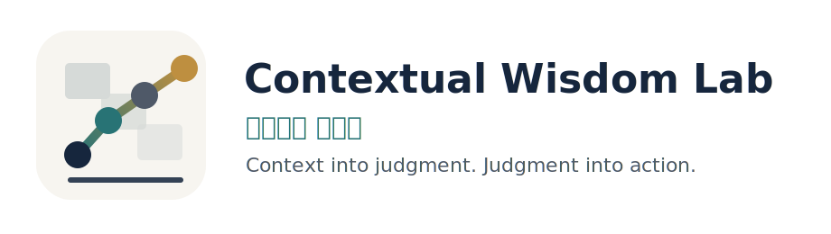
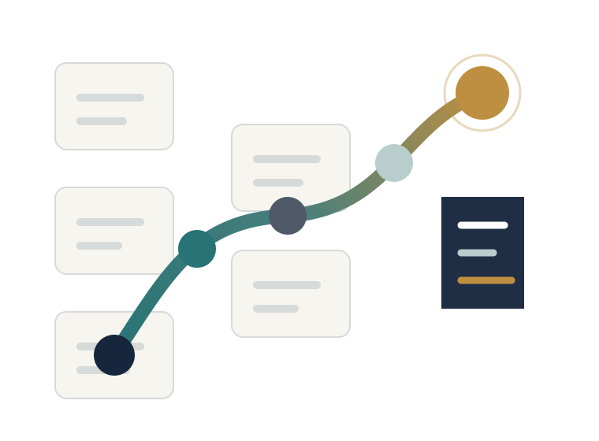
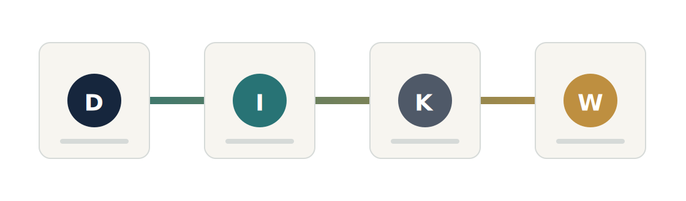

  

# 맥락지혜 연구실

**Contextual Wisdom Lab** researches and builds AI decision-support systems that turn scattered enterprise context into judgment-ready structure.

정보가 부족해서 어려운 것이 아니라, 판단해야 할 맥락이 흩어져 있어서 어렵습니다. 구슬이 서 말이어도 꿰어야 보배이듯, 맥락지혜 연구실은 문서, 메일, 로그, 회의록, VOC, 일정처럼 분산된 자료를 맥락 안에서 꿰어 사람이 무엇을 판단하고 무엇을 실행할지 보이게 합니다.

목표는 개인은 덜 소모되고 조직은 더 원활하게 움직이도록 돕는 것입니다.

  

[Homepage](https://contextualwisdomlab.github.io/) · [GitHub](https://github.com/ContextualWisdomLab)

## Starting Point

- **Cognitive load**: 사람이 버거워지는 순간은 데이터가 많을 때가 아니라 맥락을 다시 조립해야 할 때입니다. 요청은 메일에, 근거는 첨부파일에, 결정은 회의록에, 기한은 일정에 흩어져 있으면 판단이 늦어집니다.
- **Context into judgment**: 같은 말과 기록도 상황이 바뀌면 뜻이 달라집니다. 목적은 고객 요청 처리인지 장애 원인 확인인지 정하고, 제약은 권한·예산·보안·기한처럼 선택을 제한하는 조건으로 따로 봅니다. 이해관계는 고객, 담당자, 승인자, 운영자 중 누가 영향을 받는지 연결하는 일입니다.
- **Synthesis, not summary**: 요약은 길이를 줄이고, 종합은 판단 구조를 만듭니다. 증거는 원문 메일, 회의록 문장, 로그, 첨부파일, VOC처럼 판단을 뒷받침하는 출처입니다. 맥락은 누가, 언제, 왜, 어떤 기준으로 남긴 기록인지 설명합니다. 리스크는 누락된 정보, 반례, 권한 충돌, 일정 지연처럼 결정을 틀리게 만들 수 있는 조건입니다. 선택지는 승인, 보류, 추가 확인, 위임, 일정 변경처럼 지금 실제로 고를 수 있는 행동입니다.
- **Judgment into action**: 좋은 구조는 읽고 끝나지 않습니다. 결정할 것은 지금 사람이 선택해야 하는 승인 여부, 우선순위, 대응 범위입니다. 확인할 가정은 고객 영향, 장애 원인, 비용 추정처럼 틀리면 결론이 바뀌는 전제입니다. 다음 행동은 담당자, 기한, 산출물, 남길 기록까지 붙은 실행 단위입니다.

## DIKW as Checkpoints

DIKW is useful as a set of questions, not as an automatic pyramid. Our working flow is:

  

1. **기업 자료**: 메일 요청, 회의록 문장, 로그 오류, VOC, 일정 변경처럼 아직 서로 연결되지 않은 기록입니다.
2. **맥락화**: 작성자, 시점, 프로젝트, 고객, 권한, 의사결정 기준을 붙여 기록이 무엇을 뜻하는지 보이게 합니다.
3. **판단 포인트**: 반복되는 패턴, 예외, 원인 후보, 제약, 담당 절차를 묶어 오늘 무엇을 판단해야 하는지 드러냅니다.
4. **실행 연결**: 승인, 보류, 위임, 추가 확인처럼 가능한 선택을 비교하고 다음 담당자와 기한으로 연결합니다.

DIKW는 자동 상승 피라미드가 아니라 제품 질문으로 씁니다. 원문을 남겼는가, 맥락을 붙였는가, 리스크를 드러냈는가, 사람이 고를 행동으로 좁혔는가를 확인합니다.

## Naruon

Naruon is the product experiment that starts in email. An inbox is not just a message list; it carries requests, attachments, schedules, relationships, and responsibility.

- **흐름 수집**: 메일, 첨부, 일정, 작업을 한 흐름으로 모읍니다.
- **맥락 종합**: 보낸 사람, 프로젝트, 관계, 타임라인, 근거를 연결합니다.
- **판단과 실행**: 대기 작업, 일정 충돌, 답장, 위임, 확인 요청으로 이어갑니다.

## Current Focus

- **Context systems**: 관계, 출처, 기준, 리스크를 함께 보존하는 지식 구조
- **Decision interfaces**: 오늘 결정할 것과 확인할 가정을 드러내는 화면
- **Enterprise AI rails**: 인증, 권한, 보안, 감사, 사용량 책임이 작동하는 운영 기반
- **Agentic workflows**: 반복 탐색은 줄이고 근거 확인과 사람의 판단은 남기는 작업 흐름

## References

DIKW를 그대로 믿지 않고 제품 원칙으로 옮기기 위해 참고한 자료입니다.

- Ackoff, R. L. (1989). From data to wisdom. *Journal of Applied Systems Analysis, 16*(1), 3-9. https://faculty.ung.edu/kmelton/documents/datawisdom.pdf
- Baskarada, S., & Koronios, A. (2013). Data, information, knowledge, wisdom (DIKW): A semiotic theoretical and empirical exploration of the hierarchy and its quality dimension. *Australasian Journal of Information Systems, 18*(1). https://doi.org/10.3127/ajis.v18i1.748
- Frické, M. (2009). The knowledge pyramid: A critique of the DIKW hierarchy. *Journal of Information Science, 35*(2), 131-142. https://doi.org/10.1177/0165551508094050
- Brienza, J. P., Kung, F. Y. H., Santos, H. C., Bobocel, D. R., & Grossmann, I. (2018). Wisdom, bias, and balance: Toward a process-sensitive measurement of wisdom-related cognition. *Journal of Personality and Social Psychology, 115*(6), 1093-1126. https://doi.org/10.1037/pspp0000171

## Founder

Founded by [Seongho Bae](https://github.com/seonghobae). ORCID: [0000-0003-2484-3881](https://orcid.org/0000-0003-2484-3881).
