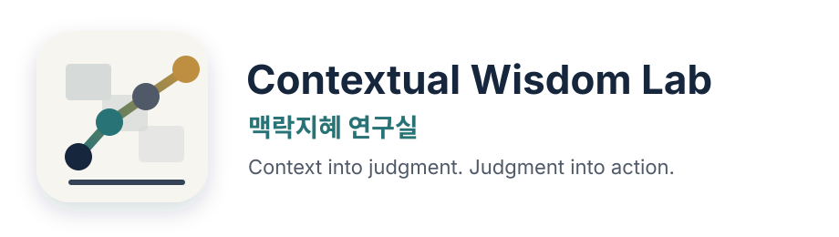
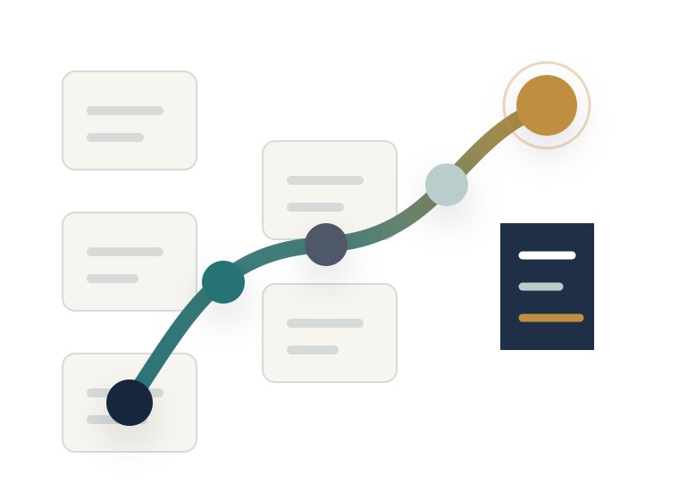
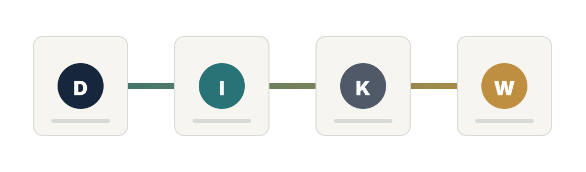

  

# 맥락지혜 연구실

**Contextual Wisdom Lab** researches and builds AI decision-support systems that turn scattered enterprise context into judgment-ready structure.

정보가 부족해서 어려운 것이 아니라, 판단해야 할 맥락이 흩어져 있어서 어렵습니다. 구슬이 서 말이어도 꿰어야 보배이듯, 맥락지혜 연구실은 문서, 메일, 로그, 회의록, VOC, 일정처럼 분산된 자료를 맥락 안에서 꿰어 사람이 무엇을 판단하고 무엇을 실행할지 보이게 합니다.

목표는 개인은 덜 소모되고 조직은 더 원활하게 움직이도록 돕는 것입니다.

  

[Homepage](https://contextualwisdomlab.github.io/) · [GitHub](https://github.com/ContextualWisdomLab)

## Starting Point

- **Cognitive load**: 사람이 버거워지는 순간은 데이터가 많을 때가 아니라 맥락을 다시 조립해야 할 때입니다. 요청은 메일에, 근거는 첨부파일에, 결정은 회의록에, 기한은 일정에 흩어져 있으면 판단이 늦어집니다.
- **Context into judgment**: 같은 말과 기록도 상황이 바뀌면 뜻이 달라집니다. 목적은 고객 요청 처리인지 장애 원인 확인인지 정하고, 제약은 권한·예산·보안·기한처럼 선택을 제한하는 조건으로 따로 봅니다. 이해관계는 고객, 담당자, 승인자, 운영자 중 누가 영향을 받는지 연결하는 일입니다.
- **Synthesis, not summary**: 요약은 길이를 줄이고, 종합은 판단 구조를 만듭니다. 증거는 원문 메일, 회의록 문장, 로그, 첨부파일, VOC처럼 판단을 뒷받침하는 출처입니다. 맥락은 누가, 언제, 왜, 어떤 기준으로 남긴 기록인지 설명합니다. 리스크는 누락된 정보, 반례, 권한 충돌, 일정 지연처럼 결정을 틀리게 만들 수 있는 조건입니다. 선택지는 승인, 보류, 추가 확인, 위임, 일정 변경처럼 지금 실제로 고를 수 있는 행동입니다.
- **Judgment into action**: 좋은 구조는 읽고 끝나지 않습니다. 결정할 것은 지금 사람이 선택해야 하는 승인 여부, 우선순위, 대응 범위입니다. 확인할 가정은 고객 영향, 장애 원인, 비용 추정처럼 틀리면 결론이 바뀌는 전제입니다. 다음 행동은 담당자, 기한, 산출물, 남길 기록까지 붙은 실행 단위입니다.

## DIKW as Checkpoints

DIKW is useful as a set of questions, not as an automatic pyramid. Our working flow is:

  

1. **기업 자료**: 메일 요청, 회의록 문장, 로그 오류, VOC, 일정 변경처럼 아직 서로 연결되지 않은 기록입니다.
2. **맥락화**: 작성자, 시점, 프로젝트, 고객, 권한, 의사결정 기준을 붙여 기록이 무엇을 뜻하는지 보이게 합니다.
3. **판단 포인트**: 반복되는 패턴, 예외, 원인 후보, 제약, 담당 절차를 묶어 오늘 무엇을 판단해야 하는지 드러냅니다.
4. **실행 연결**: 승인, 보류, 위임, 추가 확인처럼 가능한 선택을 비교하고 다음 담당자와 기한으로 연결합니다.

DIKW는 자동 상승 피라미드가 아니라 제품 질문으로 씁니다. 원문을 남겼는가, 맥락을 붙였는가, 리스크를 드러냈는가, 사람이 고를 행동으로 좁혔는가를 확인합니다.

## Naruon

Naruon is the product experiment that starts in email. An inbox is not just a message list; it carries requests, attachments, schedules, relationships, and responsibility.

- **흐름 수집**: 메일, 첨부, 일정, 작업을 한 흐름으로 모읍니다.
- **맥락 종합**: 보낸 사람, 프로젝트, 관계, 타임라인, 근거를 연결합니다.
- **판단과 실행**: 대기 작업, 일정 충돌, 답장, 위임, 확인 요청으로 이어갑니다.

## Public Projects

These repositories are public product and tool repositories that are not forks, grouped by area.

### naruon 플랫폼과 버티컬
- **[naruon](https://github.com/ContextualWisdomLab/naruon)**: 메일·첨부·일정·작업을 맥락으로 묶어 판단과 실행으로 연결하는 AI 이메일 워크스페이스입니다.
- **[bandscope](https://github.com/ContextualWisdomLab/bandscope)**: 곡을 섹션·역할·템포·연습 우선순위로 분석하는 로컬 우선 리허설 앱입니다.
- **[clearfolio](https://github.com/ContextualWisdomLab/clearfolio)**: Java 백엔드 + JS 프리뷰 기반 통합 문서 뷰어 플랫폼입니다.
- **[pg-erd-cloud](https://github.com/ContextualWisdomLab/pg-erd-cloud)**: PostgreSQL 스키마를 리버스 엔지니어링해 ERD·DDL로 관리하는 클라우드 서비스입니다.
- **[codec-carver](https://github.com/ContextualWisdomLab/codec-carver)**: 긴 녹음을 메타데이터 보존 FLAC/Opus 조각으로 변환하는 Python CLI입니다.
- **[scopeweave](https://github.com/ContextualWisdomLab/scopeweave)**: 정적 HTML WBS 플래너이자, 선택적 SaaS 모드를 갖춘 이슈·일정 관리 도구입니다.
- **[newsdom-api](https://github.com/ContextualWisdomLab/newsdom-api)**: PDF를 페이지·섹션·이미지 구조의 표준 JSON으로 변환하는 언어 독립 파싱 사이드카입니다.
- **[inkspan](https://github.com/ContextualWisdomLab/inkspan)**: TipTap/ProseMirror 기반 상용급 Markdown+HTML WYSIWYG 에디터 모듈입니다.

### 아이덴티티·보안·엣지
- **[keyverse](https://github.com/ContextualWisdomLab/keyverse)**: 패스워드리스 OIDC/SCIM과 ADFS/LDAP 연동을 제공하는 생태계 중앙 IdP입니다.
- **[wardnet](https://github.com/ContextualWisdomLab/wardnet)**: DNSBL 배포까지 포함한 Rust 기반 WAF/IDS/AI SOC 게이트웨이입니다.
- **[appguardrail](https://github.com/ContextualWisdomLab/appguardrail)**: 바이브코딩 앱을 위한 보안 가드레일로, 정적 점검과 리뷰·수정 프롬프트를 제공합니다.
- **[EgressWeave](https://github.com/ContextualWisdomLab/EgressWeave)**: SSRF·DNS 리바인딩에 안전한 Python 아웃바운드 HTTP 클라이언트입니다.
- **[OriginWeave](https://github.com/ContextualWisdomLab/OriginWeave)**: 격리 세션과 검증 가능한 증거를 갖춘 AI 에이전트용 웹 런타임입니다 (초기 단계).
- **[quarantine-sandbox-runtime](https://github.com/ContextualWisdomLab/quarantine-sandbox-runtime)**: 자격 증명 없는, 소스 불문 아티팩트 분석 런타임입니다.
- **[litellm-patched-proxy](https://github.com/ContextualWisdomLab/litellm-patched-proxy)**: 헬스체크 쿼리를 강화한 LiteLLM 프록시 다운스트림 이미지입니다.

### LLM 인프라
- **[contextual-orchestrator](https://github.com/ContextualWisdomLab/contextual-orchestrator)**: 논문 기반 LLM 비용·라우팅 오케스트레이션 게이트웨이입니다.
- **[pg-llm-batch](https://github.com/ContextualWisdomLab/pg-llm-batch)**: pg_tiktoken 기반 Postgres LLM 배치 처리 엔진입니다.
- **[DiagramWeave](https://github.com/ContextualWisdomLab/DiagramWeave)**: PlantUML 등 텍스트 다이어그램을 위한 소스 우선 AI 편집 파운데이션입니다.

### 엔터프라이즈 플랫폼
- **[Orgmetra](https://github.com/ContextualWisdomLab/Orgmetra)**: 채용부터 보상까지 다루는 증거 기반 HRIS입니다.
- **[governance-risk-compliance](https://github.com/ContextualWisdomLab/governance-risk-compliance)**: CSAP/SOC2/ISMS-P 통제를 관리하는 CWL GRC 홈입니다.
- **[accounting-information-platform](https://github.com/ContextualWisdomLab/accounting-information-platform)**: 근거 기반 분개 제안을 검증하는 법정 회계 경계입니다.
- **[metering-billing-platform](https://github.com/ContextualWisdomLab/metering-billing-platform)**: 사용량 집계부터 정산까지 다루는 공급자 중립 커머셜 컨트롤 플레인입니다.
- **[supply-chain-control-plane](https://github.com/ContextualWisdomLab/supply-chain-control-plane)**: 공급망 사건을 시간·증거 그래프로 연결해 회복 시나리오를 만드는 플랫폼입니다.
- **[enterprise-architecture-core](https://github.com/ContextualWisdomLab/enterprise-architecture-core)**: 조직 전환 의사결정을 위한 엔터프라이즈 아키텍처 플레인입니다 (초기 단계).
- **[mhtml-etl-gateway](https://github.com/ContextualWisdomLab/mhtml-etl-gateway)**: 브라우저/SAP ALV/Excel MHTML을 거버넌스된 PostgreSQL 자산으로 변환합니다.
- **[mightyETL](https://github.com/ContextualWisdomLab/mightyETL)**: 실시간 CDC와 경계 있는 ETL을 위한 마이크로서비스 플랫폼입니다.
- **[context-graph-contracts](https://github.com/ContextualWisdomLab/context-graph-contracts)**: CWL 컨텍스트·아키텍처 생태계를 위한 공유 상호운용 계약입니다 (초기 단계).

### CWL 러닝 플랫폼
- **[learning-management-platform](https://github.com/ContextualWisdomLab/learning-management-platform)**: 임직원부터 자격증 응시자까지 아우르는 표준 기반 LMS입니다.
- **[learning-content-studio](https://github.com/ContextualWisdomLab/learning-content-studio)**: CWL 러닝 플랫폼의 콘텐츠 저작 권한 시스템입니다 (초기 단계).
- **[learning-record-store](https://github.com/ContextualWisdomLab/learning-record-store)**: xAPI 학습 기록을 저장하는 신뢰 원천 LRS입니다 (초기 단계).
- **[learning-interoperability-contracts](https://github.com/ContextualWisdomLab/learning-interoperability-contracts)**: CWL 러닝 플랫폼의 공유 상호운용 계약입니다 (초기 단계).

### 심리계량학·연구 도구
- **[aFIPC](https://github.com/ContextualWisdomLab/aFIPC)**: IRT equating을 위한 automated Fixed Item Parameter Linking R 패키지입니다.
- **[fast-mlsirm](https://github.com/ContextualWisdomLab/fast-mlsirm)**: MLSIRM/MLS2PLM 시뮬레이션·적합·복원 진단 도구입니다 (Python+Rust).
- **[kaefa](https://github.com/ContextualWisdomLab/kaefa)**: 다층 교차분류 데이터를 위한 자동 탐색적 요인분석 R 패키지입니다.
- **[TEPP](https://github.com/ContextualWisdomLab/TEPP)**: Rust로 구현한 다국어·시간 기반 심리계량 측정 플랫폼입니다.
- **[psychometrics-commons](https://github.com/ContextualWisdomLab/psychometrics-commons)**: 동의 기반 연구 데이터 기여를 지원하는 공개 심리계량 평가 서비스입니다.
- **[RankWeave](https://github.com/ContextualWisdomLab/RankWeave)**: 검색 랭킹 융합·평가·TREC 벤치마킹을 위한 의존성 없는 Python 라이브러리입니다.
- **[ThreadWeave](https://github.com/ContextualWisdomLab/ThreadWeave)**: JWZ/RFC 5256 기반 이메일 스레딩 Python 라이브러리입니다.
- **[LineageWeave](https://github.com/ContextualWisdomLab/LineageWeave)**: 흩어진 짧은 기록에서 lineage DAG를 재구성하는 데모 프로토타입입니다.

### 독립 모듈
- **[semantic-data-portal](https://github.com/ContextualWisdomLab/semantic-data-portal)**: Postgres/Apache AGE 기반 온톨로지 시맨틱 데이터 카탈로그입니다.
- **[noema](https://github.com/ContextualWisdomLab/noema)**: CWL LLM PR 리뷰를 위한 OIDC 토큰 브로커 겸 리뷰 봇입니다.
- **[disksage](https://github.com/ContextualWisdomLab/disksage)**: 온디바이스 LLM 어드바이저를 갖춘 크로스플랫폼 디스크 공간 관리자입니다.
- **[CalendarWeave](https://github.com/ContextualWisdomLab/CalendarWeave)**: CalDAV/iCalendar 기반 독립 캘린더 모듈입니다 (초기 단계).
- **[ConceptWeave](https://github.com/ContextualWisdomLab/ConceptWeave)**: 엔터프라이즈 데이터를 거버넌스된 의미로 바꾸는 온톨로지 엔진입니다 (초기 단계).
- **[EmbedRelay](https://github.com/ContextualWisdomLab/EmbedRelay)**: 모델 간 안전한 임베딩 벡터 마이그레이션 인프라입니다 (초기 단계).
- **[PolicyWeave](https://github.com/ContextualWisdomLab/PolicyWeave)**: 개인정보처리방침 초안을 만드는 로컬 우선 웹 앱입니다 (초기 단계).
- **[ELUNVERA](https://github.com/ContextualWisdomLab/ELUNVERA)**: CRM 이니셔티브입니다 (초기 단계).
- **[pingora-gateway](https://github.com/ContextualWisdomLab/pingora-gateway)**: Cloudflare Pingora 기반 Rust 엣지 게이트웨이입니다 (초기 단계, 코드 없음).

### 개인 유틸리티
- **[four-pillars](https://github.com/ContextualWisdomLab/four-pillars)**: 결정론적 사주 계산과 스키마 검증 AI 리포트 생성기입니다.
- **[saju-caldav](https://github.com/ContextualWisdomLab/saju-caldav)**: 사주 궁합·길한 시간을 CalDAV 캘린더로 발행하는 서비스입니다.
- **[j-planner](https://github.com/ContextualWisdomLab/j-planner)**: 브라우저 저장 기반, 로그인 없는 개인 여행 플래너 PWA입니다.
- **[life-os](https://github.com/ContextualWisdomLab/life-os)**: 목표·프로젝트·습관을 관리하는 셀프호스트 가능한 개인용 OS입니다.
- **[macos_utility_packs](https://github.com/ContextualWisdomLab/macos_utility_packs)**: AI 개발자 워크스테이션을 위한 멱등 macOS 부트스트랩입니다.
- **[hyosung-itx-slogan-brief](https://github.com/ContextualWisdomLab/hyosung-itx-slogan-brief)**: Hyosung ITX 슬로건 리서치 브리프 산출물입니다.

### 조직 인프라·거버넌스
- **[.github](https://github.com/ContextualWisdomLab/.github)**: 조직 프로필 소개 자산이자, 전체 저장소가 공유하는 PR 리뷰·보안 스캔·머지 자동화 워크플로우와 DNS/Cloudflare Pages 인프라 코드를 관리하는 특수 저장소입니다.
- **[ContextualWisdomLab.github.io](https://github.com/ContextualWisdomLab/ContextualWisdomLab.github.io)**: 맥락지혜 연구실 홈페이지로, DIKW·Naruon·로고와 연구-제품 방향을 소개합니다.

## Forked Projects

These repositories started from external upstream projects and are tracked separately from lab-originated work.

- **[argos](https://github.com/ContextualWisdomLab/argos)**: Fork of [vibemafiaclub/argos](https://github.com/vibemafiaclub/argos). Claude Code·Codex 팀의 토큰·스킬·세션 사용 패턴을 분석하는 애널리틱스입니다.
- **[vooster](https://github.com/ContextualWisdomLab/vooster)**: Fork of [jesoos/vooster](https://github.com/jesoos/vooster). 사람과 AI가 함께 제품 행동과 유스케이스를 관리하는 vspec 도구입니다.
- **[9drive](https://github.com/ContextualWisdomLab/9drive)**: Fork of [zenhosta/9drive](https://github.com/zenhosta/9drive). 여러 Google Drive/S3 호환 스토리지 계정을 통합하는 셀프호스트 대시보드입니다.
- **[free-router](https://github.com/ContextualWisdomLab/free-router)**: Fork of [bytonylee/free-router](https://github.com/bytonylee/free-router). 무료 LLM 프로바이더 API 키를 찾아 설정하는 CLI/TUI입니다.
- **[g7](https://github.com/ContextualWisdomLab/g7)**: Fork of [gnuboard/g7](https://github.com/gnuboard/g7). Laravel 12 + React 19로 새로 설계한 그누보드 오픈소스 CMS입니다.
- **[graphify](https://github.com/ContextualWisdomLab/graphify)**: Fork of [Graphify-Labs/graphify](https://github.com/Graphify-Labs/graphify). 코드베이스를 쿼리 가능한 지식 그래프로 바꾸는 Claude Code/Codex 스킬입니다.
- **[html4tree](https://github.com/ContextualWisdomLab/html4tree)**: Fork of [yencarnacion/html4tree](https://github.com/yencarnacion/html4tree). 디렉터리 트리 기반 index.html 생성기입니다.
- **[nonnest2](https://github.com/ContextualWisdomLab/nonnest2)**: Fork of [qpsy/nonnest2](https://github.com/qpsy/nonnest2). Vuong 검정 기반 비중첩 모델 비교 R 패키지입니다.
- **[seedream_evasepic](https://github.com/ContextualWisdomLab/seedream_evasepic)**: Fork of [passeth/seedream_evasepic](https://github.com/passeth/seedream_evasepic). 제품 브리프를 Seedream/Seedance 프롬프트로 변환하는 Claude Code 플러그인입니다 (K-beauty 특화).
- **[OmniRoute](https://github.com/ContextualWisdomLab/OmniRoute)**: Fork of [diegosouzapw/OmniRoute](https://github.com/diegosouzapw/OmniRoute). 290개 이상의 프로바이더로 라우팅하는 무료 MIT AI 게이트웨이입니다.

## Current Focus

- **Context systems**: 관계, 출처, 기준, 리스크를 함께 보존하는 지식 구조
- **Decision interfaces**: 오늘 결정할 것과 확인할 가정을 드러내는 화면
- **Enterprise AI rails**: 인증, 권한, 보안, 감사, 사용량 책임이 작동하는 운영 기반
- **Agentic workflows**: 반복 탐색은 줄이고 근거 확인과 사람의 판단은 남기는 작업 흐름

## References

DIKW를 그대로 믿지 않고 제품 원칙으로 옮기기 위해 참고한 자료입니다.

- Ackoff, R. L. (1989). From data to wisdom. *Journal of Applied Systems Analysis, 16*(1), 3-9. https://faculty.ung.edu/kmelton/documents/datawisdom.pdf
- Baskarada, S., & Koronios, A. (2013). Data, information, knowledge, wisdom (DIKW): A semiotic theoretical and empirical exploration of the hierarchy and its quality dimension. *Australasian Journal of Information Systems, 18*(1). https://doi.org/10.3127/ajis.v18i1.748
- Frické, M. (2009). The knowledge pyramid: A critique of the DIKW hierarchy. *Journal of Information Science, 35*(2), 131-142. https://doi.org/10.1177/0165551508094050
- Brienza, J. P., Kung, F. Y. H., Santos, H. C., Bobocel, D. R., & Grossmann, I. (2018). Wisdom, bias, and balance: Toward a process-sensitive measurement of wisdom-related cognition. *Journal of Personality and Social Psychology, 115*(6), 1093-1126. https://doi.org/10.1037/pspp0000171

## Founder

Founded by [Seongho Bae](https://github.com/seonghobae). ORCID: [0000-0003-2484-3881](https://orcid.org/0000-0003-2484-3881).
